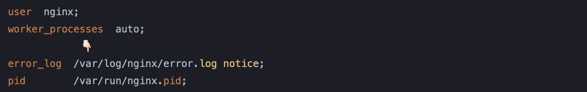
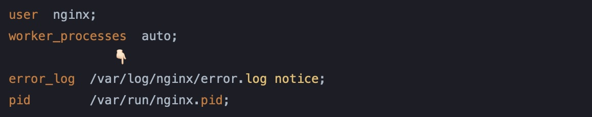
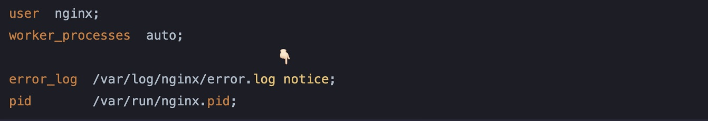
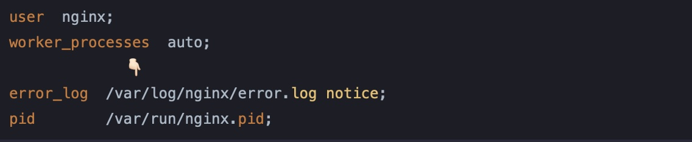
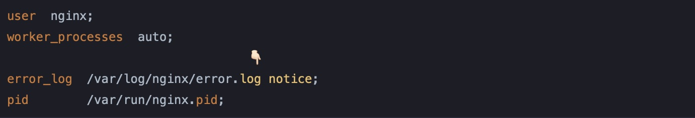
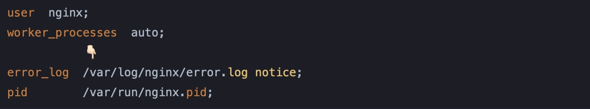
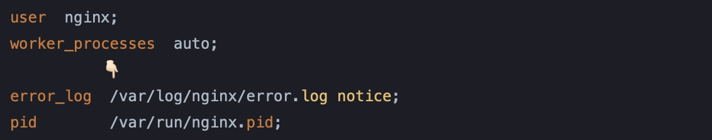
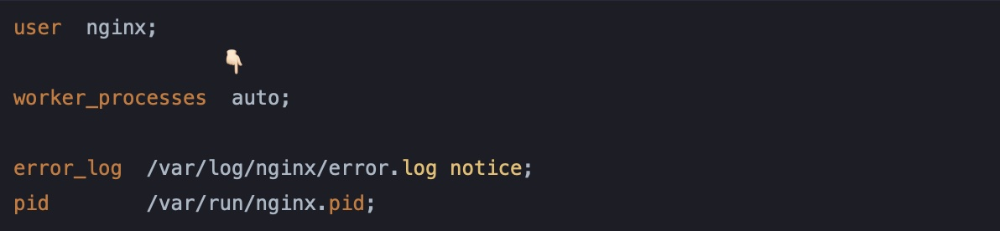
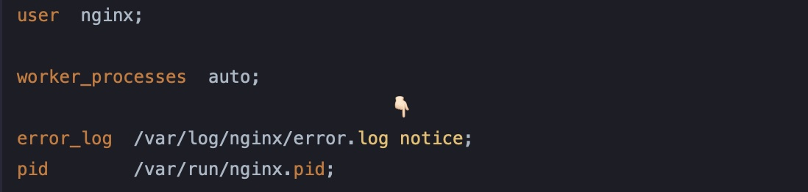

vim常见快捷键，分成一下几个版本：

1. [插入操作](#1)
2. [光标跳转](#2)
3. [行跳转](#3)
4. [复制和粘贴](#4)
5. [删除和剪切](#5)
6. [撤销和取消撤销](#6)
7. [查找和替换](#7)


<p id="1"></p>


## 插入操作

有以下命令：

- `i` & `I`(shift + i)
- `a` & `A` (shift + a)
- `o` & `O` (shift + o)

下面文本为例， 👇🏻 表示光标位置

```
a123456
# 光标在3位置
  👇🏻
b123456

c123456
```

使用不同命令，插入的位置不同

1️⃣ `i` & `I`(shift + i):

```
# insert before cursor 在光标前插入
i

# 插入位置在 3 之前
# 即
  👇🏻
b12 3456

# insert before the line 在行头插入
# 按 shift + i
I

# 在行头位置插入
# 即
👇🏻
  b123456
```

2️⃣ `a` & `A` (shift + a)

```bash
# insert after cursor 在光标后插入
a

# 插入位置在 3 之后
# 即
   👇🏻
b123 456

# insert after the line 在行尾部插入
# 按 shift + a
A

# 在行头位置插入
# 即
       👇🏻
 b123456
```

3️⃣ `o` & `O` (shift + o)

```bash
# append a new line below the current lint 在下一行位置插入
o

# 在b下一行插入
# 即
a123456

b123456
#新的一行位置插入
👇🏻

c123456

# append a new line below the current lint 在当前行的上一行位置插入
# 按 shift + a
O

# 在b上一行插入
# 即
a123456


👇🏻
# 新的一行位置插入
b123456

c123456
```


<p id="2"></p>


## 光标跳转

跳到行头和行尾, **这个和正则中的开头和结尾匹配一致**

```bash
# 按 shift + 6 跳到行头
^

# shift + 4 跳到行尾
$
```

`h, j , k , l`:

- `h`: 向左移动 ⬅️
- `j`: 向下移动 ⬇️
- `k`: 向上移动 ⬆️
- `l`: 向右移动 ➡️

`w, e, b` & `W, E, B`:

- `w`: 移动到下一个单词的词首，大写 `W` 以空格为界跳到单词词首
- `e`: 移动到下一个单词的词尾，大写 `E` 以空格为界跳到单词的词尾
- `b`: 移动到上一个单词词首，大写 `B` 以空格为界跳到单词词首

🌰：（👇🏻 表示光标位置）下面例子都以这里光标位置作为起始位置 `var` 中 `a` 位置



```nginx
user  nginx;
worker_processes  auto;
            👇🏻
error_log  /var/log/nginx/error.log notice;
pid        /var/run/nginx.pid;
```

1️⃣ 按 `w`: 跳到 `/` 位置，以单词作为划分




按 `W`:(shift + w) 跳到下一个单词的词首（以空格为分界），即这里的 `n`




2️⃣ 按 `e`: 跳到单词尾, 即 `r` 的位置




按 `E`: 跳到以空格为分界的词尾，即 `g` 的位置




3️⃣ 按 `b`: 跳到上一个单词词首 `v` 位置




按 `B`: 跳到上一个单词词首，以空格作为分界




🔥 另外和复制一样支持 `数字 + w | 数字 + W` 这种形式，一次性跳转几个单词：




按 `4W`: 跳转4个单词，到 `n` 位置




可以参考 

- [Vim 中如何快速移动光标？- @harttle.land](https://harttle.land/2015/11/07/vim-cursor.html)


<p id="3"></p>


##  行跳转

跳转之前可以先显示行数：

```bash
# 进入命令行模式（shift + :） 显示行号
set nu

# 取消显示行号
set nonu
```

下面是跳转操作：

```bash
# 跳到页头
g

# 跳到页尾
# shift + g 组合成大写的G
G

# 跳到指定行
# 比如跳到第20行
# 输入20 然后 shift + g
20G
```


<p id="4"></p>


##  复制粘贴

1️⃣ 复制一行：

```bash
yy
```

粘贴一行：

```bash
p
```

2️⃣ 复制多行：

```bash
# 数字 + yy
# 比如复制4行
# 4 + yy
4yy

# 然后p粘贴
p
```

3️⃣ 从光标位置复制到行尾：

比如下面一段文字，👇🏻表示光标的位置：

```bash
# Uncomment the 👇🏻following line to use hyphen-insensitive completion.
```

复制到行尾

```bash
y$
```

拷贝结果：

```bash
following line to use hyphen-insensitive completion.
```

4️⃣ 复制到单词尾部或头部或整个单词到空格位置：

```bash
   👇🏻 
# Uncomment the following line to use hyphen-insensitive completion.
```

```bash
# 拷贝到单词尾
yw
# 拷贝结果
comment

# 拷贝到单词头
yiw
# 拷贝结果
Unc

# 拷贝单词
yaw
# 拷贝结果
Uncomment
```


<p id="5"></p>


##  删除和剪切

这个操作基本上和上面的拷贝操作类似，本身是**剪切**的操作

1️⃣ 删除一行：

```bash
dd
```

2️⃣ 删除多行：

```bash
# 比如删除3行
3dd
```

3️⃣ 从光标位置删除到行尾（包含光标位置）：

🌰:

```bash
   👇🏻 
Uncomment the following line to use hyphen-insensitive completion.
```

```bash
d$
# 或者 D
# 按住 shift + d
D

# 删除后的结果
UNco
```

4️⃣ 单词删除操作：

```bash
# 删除单词到空格位置位置
dw
# 删除后的结果
Uncothe following line to use hyphen-insensitive completion.

# 删除光标所在的单词
diw
# 删除后的结果
 the following line to use hyphen-insensitive completion.
 
# 删除光标所在的位置字符
x
# 删除后的结果
# 光标指向的m被删除了
Uncoment the following line to use hyphen-insensitive completion.

# 替换光标所在字符
r
# 输入r后再输入想要替换的字符即可
```


<p id="6"></p>


## 撤销(undo)和反撤销(redo)操作

如果想要撤销可以使用 `u`  命令：

```bash
# 比如使用dd删除了一行
# 这时想要撤销，这可以使用u命令
u
```

反撤销命令 `ctrl + r`：

```bash
# 比如 上面的 u 不小心按了2次
# 直接撤销了2次，则可以使用 ctrl + r 回滚一次撤销
ctrl + r
```


<p id="7"></p>


## 查找和替换

在普通模式输入 `/parttern` 进行查找：

🌰：

```bash
# 查找包含 fig 字符的词
/PATH
```

有可能找到多个，上一个下一个跳转，使用 `N`(shift + n) 和  `n` ：

```bash
# 下一个匹配项
n

# 上一个匹配项
# 按 shift + n
N
```

对字符替换操作，语法：

- `:s/old/new`: 对光标所在行进行替换
- `:s/old/new/g`: 对光标所在行，所有匹配项都进行替换
- `:%s/old/new`: 对整个文件首个匹配项进行替换（和光标所在位置无关）
- `:%s/old/new/g`: 对整个文件所有匹配项都进行替换
- `:3,5s/old/new/g`: 对特定行范围类进行替换，这里是3-5行内的匹配项

🌰：

```bash
# android sdk
export ANDROID_SDK_ROOT=/Users/lucian/android-sdk-macosxx
# 光标位置
👇🏻
export PATH=${PATH}:${ANDROID_SDK_ROOT}/tool
export PATH=${PATH}:${ANDROID_SDK_ROOT}/platform-tools

# flutter
export PATH="$PATH:/Users/lucian/flutter/bin"
export PYENV_ROOT="$HOME/.pyenv"
export PATH="$PYENV_ROOT/bin:$PATH"
```

假设查找：

```bash
/PATH
```

1️⃣ 对光标所在行替换:

```bash
:s/PATH/NewPath
```

结果：

```bash
# android sdk
export ANDROID_SDK_ROOT=/Users/lucian/android-sdk-macosxx
# 光标位置首个匹配被替换
👇🏻
export NewPath=${PATH}:${ANDROID_SDK_ROOT}/tool
export PATH=${PATH}:${ANDROID_SDK_ROOT}/platform-tools

# flutter
export PATH="$PATH:/Users/lucian/flutter/bin"
export PYENV_ROOT="$HOME/.pyenv"
export PATH="$PYENV_ROOT/bin:$PATH"
```

2️⃣对光标所在行，所有匹配项都进行替换：

命令：`:s/PATH/NewPath/g`

```bash
# android sdk
export ANDROID_SDK_ROOT=/Users/lucian/android-sdk-macosxx
# 光标位置首个匹配被替换
👇🏻
export NewPath=${NewPath}:${ANDROID_SDK_ROOT}/tool
export PATH=${PATH}:${ANDROID_SDK_ROOT}/platform-tools

# flutter
export PATH="$PATH:/Users/lucian/flutter/bin"
export PYENV_ROOT="$HOME/.pyenv"
export PATH="$PYENV_ROOT/bin:$PATH"
```

3️⃣对整个文件都进行替换：

命令：`:%s/PATH/NewPath/g`

```bash
# android sdk
export ANDROID_SDK_ROOT=/Users/lucian/android-sdk-macosxx
# 光标位置首个匹配被替换
👇🏻
export NewPath=${NewPath}:${ANDROID_SDK_ROOT}/tool
export NewPath=${NewPath}:${ANDROID_SDK_ROOT}/platform-tools

# flutter
export NewPath="$NewPath:/Users/lucian/flutter/bin"
export PYENV_ROOT="$HOME/.pyenv"
export NewPath="$PYENV_ROOT/bin:$NewPath"
```

4️⃣对指定行内的匹配项进行替换：(4-6行)

命令：`:4,6s/PATH/NewPath/g`

```bash
# android sdk
export ANDROID_SDK_ROOT=/Users/lucian/android-sdk-macosxx
# 光标位置
👇🏻
export NewPath=${NewPath}:${ANDROID_SDK_ROOT}/tool
export NewPath=${NewPath}:${ANDROID_SDK_ROOT}/platform-tools

# flutter
export PATH="$PATH:/Users/lucian/flutter/bin"
export PYENV_ROOT="$HOME/.pyenv"
export PATH="$PYENV_ROOT/bin:$PATH"
```


