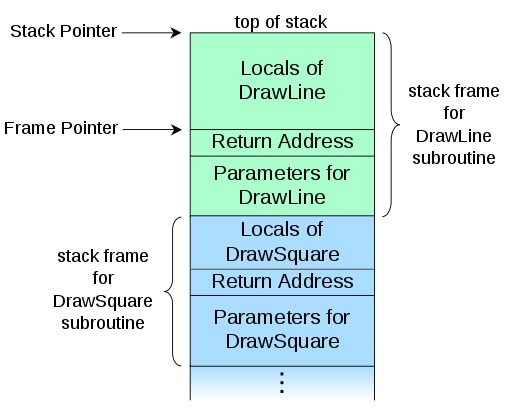
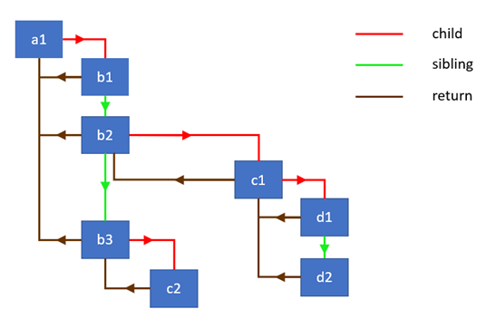

这篇文章主要探寻React新的一致性比对算法(reconciler)Fiber的工作流程，并比较浏览器调用栈和Fiber架构中栈的实现差异。

在React中，变化检测（Change Detection）的机制通常称之为一致性比对或者渲染，而Fiber是React中的最新实现方式。基于Fiber底层架构，它提供了实现很多有趣功能的能力，例如，执行非阻塞渲染，基于优先级应用更新，以及在背景中预渲染内容。这些功能在 [React 并发哲学](https://reactjs.org/docs/concurrent-mode-intro.html) 中也被称之为 **时间分片(Time Slicing)** (类比CPU的算法)。

除了解决开发者在应用中碰到的实际问题外，Fiber的内部实现机制在开发者的角度来看，也是帮助我们快速学习的很好资源。

如果你搜索 **“React Fiber”**， 你会发现大量文章，其中 [Notes by Andrew Clark](https://github.com/acdlite/react-fiber-architecture?source=post_page---------------------------) 的这篇质量很高。本文会借鉴这篇文章，并在Fiber的一些重要概念上提供更详尽的解释。阅读完本文后，你可以更好的理解[Link Clark - youtube](https://www.youtube.com/watch?v=ZCuYPiUIONs) 视频中的内容。

另外我写的 [React's Fiber internals](https://indepth.dev/posts/1008/inside-fiber-in-depth-overview-of-the-new-reconciliation-algorithm-in-react) 提供了更多的实现细节。


## 1. Fiber由来的背景原因

Fiber架构主要有2个阶段：

1. 渲染阶段（`reconciliation | render`）
2. 提交阶段（`commit`）

在源代码中一致性比对阶段（reconciliation）大部分是指渲染阶段，这个阶段是React遍历组件树并：

- 更新状态和属性
- 调用生命周期函数
- 从组件中取回子组件(children)
- 将之与先前的children进行比对
- 拟清哪些DOM需要进行更新

**上面的这些活动在Fiber内部被称之为 `work`**。需要执行的工作类型依赖于React元素的类型。例如：对于一个 **类组件** react需要实例化类，而 **函数组件** 是不需要的。这些活动正是Andrew所谈到的：

> 当处理UI时，如果同时执行太多的工作，可能会导致动画掉帧。

那么什么是 **一次性执行所有（all at once）** 工作呢？好吧，简单点讲，如果React同步的遍历整棵组件树，然后分别对组件执行工作（perform work），可能导致应用执行逻辑的时间超过 `16ms`, 这将导致肉眼可见的掉帧现象。

那么怎么解决呢？

新的浏览器和React Native实现了新的APIs来解决这个问题，这个新的API就是 [RequestIdleCallback](https://developers.google.com/web/updates/2015/08/using-requestidlecallback?source=post_page---------------------------), 它可用于将函数调用放置防御队列，然后在浏览器空闲时间再调用。使用方式：

```js
requestIdleCallback(deadline => {
  console.log(deadline.timeRemaining(), deadline.didTimeout)
})
```

如果打开浏览器console，执行上面的代码，chrome会打印 `49.9 false`。它表示我有 `49.9ms` 时间做任何我想做的工作，我还没有用完所分配的时间，否则 `deadline.didTimeout` 会打印 `true`。请记住，一旦浏览器有工作要做，`timeRemaining` 就会发生改变，因此需要经常检查这个值。

**因为 `requestIdleCallback` 有太多的限制，对平滑的UI渲染来说有点力不从心，因此React team [实现了他们自己版本的requestIdleCallback](https://github.com/facebook/react/blob/eeb817785c771362416fd87ea7d2a1a32dde9842/packages/scheduler/src/Scheduler.js?source=post_page---------------------------#L212-L222)**:

```js
requestIdleCallback(deadline => {
  // 当时间充裕时，对组件树的部分执行工作
  while ((deadline.timeRemaining() > 0 || deadline.didTimeout) && nextComponent) {
    nextComponent = performWork(nextComponent)
  }
})
```

我们对一个组件执行工作，然后返回下一个需要被处理的组件。这种模式能正常运行的前提条件是，不能以同步的方式处理整棵组件树。[React 15之前是采用的同步的方式](https://reactjs.org/docs/codebase-overview.html?source=post_page---------------------------#stack-reconciler)，Andrew也曾提到过这个问题：

> 为了使用这些APIs，你需要将渲染工作拆分为增量单元。

为了解决这个问题，**React必须重新实现这个算法，将之前依赖内置栈的同步递归遍历整棵组件树的形式更改为使用链表和指针异步模型。** 这也是Andrew写到的：

> 如果你依赖内置的调用栈，它会一直运行到栈到为空，**如果我们能够按照自己的意愿手动的中断栈，以及操控栈帧，那岂不是更好？** 这正是Fiber的目的，**Fiber是一个特意为React组件而重新实现的栈，你可以把单一的Fiber当作是一个虚拟的栈帧**。

这也是我将要解释的。


## 2. 关于栈（a word about the stack）

我假设你已经知晓调用栈的概念。这正是你使用浏览器调试工具打断点看到的。下面是来自Wikipedia的引用：

> 在计算机科学中，调用栈是一个堆栈数据结构，它存储了计算机程序的活动子程序的信息，使用调用栈的主要原因是，知晓每个活动子程序在结束调用之后的控制权返回点位置。调用栈由栈帧组成，每个栈帧都表示对还未结束的子程序的调用。例如，如果一个名为DrawLine的子程序目前正在运行，已经被DrawSquare的子程序调用，那么调用堆栈的顶部可能会像下图那样排列：



## 3. 栈和React有什么关联？（Why is the stack relevant to React?）

我们知道React在渲染阶段（reconciliation/render phase）遍历组件树，并对组件执行工作。之前reconciler算法使用同步递归模型实现，它依赖内置的调用栈便利组件树，[React 官方文档关于一致性比对](https://reactjs.org/docs/reconciliation.html?source=post_page---------------------------#recursing-on-children) 描述了这个过程，多次提到了递归：

> 默认情况下，当递归某个DOM节点的子节点，React会在对子节点列表迭代时，只要存在差异时，就会产生一个突变。

你可以这样认为： **每次递归调用都会同步的向栈中添加一个栈帧。** 假设组件树的结构如下：


在 `render` 函数中以对象的形式表示，你可以把他们当作是组件实例：

```js
const a1 = {name: 'a1'}
const b1 = {name: 'b1'};
const b2 = {name: 'b2'};
const b3 = {name: 'b3'};
const c1 = {name: 'c1'};
const c2 = {name: 'c2'};
const d1 = {name: 'd1'};
const d2 = {name: 'd2'};

a1.render = () => [b1, b2, b3];
b1.render = () => [];
b2.render = () => [c1];
b3.render = () => [c2];
c1.render = () => [d1, d2];
c2.render = () => [];
d1.render = () => [];
d2.render = () => [];
```

React需要迭代树，并对每个组件执行工作。简单点讲，需要做的工作就是记录当前组件名字，然后取回他们的子组件，下面具体讲讲递归。


## 4. 递归遍历（Recursive traversal）

递归组件树的主要函数叫 **`walk`**, 其粗略实现如下：

```js
walk(a1)

function walk(instance) {
  doWork(instance)
  const children = instance.render()
  children.forEach(walk)
}

function doWork(o) {
  console.log(o.name)
}
```

输出结果：

```bash
a1,b1,b2,c1,d1,d2,b3,c2
```

如果你对递归不熟悉，可以查看 [Dijkstra was right — **recursion should not be difficult** - Max Koretskyi](https://medium.com/angular-in-depth/learn-recursion-in-10-minutes-e3262ac08a1).

递归是很直白的一种方式，很适合用于树的迭代。但是正如我们发现的一样，它也有其局限性。**最大的局限性就是，我们无法将 `work` 拆分为增量单元，我们不能在特定组件上暂停工作，然后稍后再恢复执行。** React只能一直迭代到处理完所有组件，栈为空为止。


**那么React是怎么不使用递归实现遍历的算法的呢？它使用了单链表（`single linked list`）树遍历算法。这样使得暂停遍历和阻止栈增长成为了可能。**


## 5. 链表遍历（Linked list traversal）

我很幸运的找到了 Sebastian Markbåge 框出的算法： [gist](https://github.com/facebook/react/issues/7942?source=post_page---------------------------#issue-182373497)。为了实现该算法，我们需要使用一种拥有以下3个字段的数据结构：

- **`child`**: 指向第一个子节点
- **`sibling`**: 指向下一个兄弟节点
- **`return`**: 指向父节点

在React新的一致性比对算法中，拥有这3个字段的数据结构被称之为 **`Fiber`**。本质上，它是React元素持有需要被处理的工作队列的一种表示形式。

下面图表表示了使用链表，对象之间层级关系和关联：




下面我们先自定义一个node构造器：

```js
class Node {
  constructor(instance) {
    this.instance = instance
    this.child = null
    this.sibling = null
    this.return = null
  }
}
```

以及接受一个节点数组并将它们链接在一起的函数。我们要用它来链接 `render` 方法返回的子节点:

```js
function link(parent, elements) {
  if (elements === null) elements = []
  
  parent.child = elements.reduceRight((previous, current) => {
    const node = new Node(current)
    node.return = parent
    node.sibling = previous
    return node
  }, null)
  
  return parent.child
}
```

**这个函数从最后一个节点开始遍历节点数组，然后以一个单链表的形式将它们链接起来，它返回列表中第一个兄弟节点的引用**。下面是它运作的一个小示例：

```js
const children = [{name: 'b1'}, {name: 'b2'}]
const parent = new Node({name: 'a1'})
const child = link(parent, children)

// 下面2条语句都为true
child.instance.name === 'b1'
child.sibling.instance = children[1]
```

我们也实现了一个对节点执行工作的辅助函数。我们这里只是简单的打印一下组件名，同时取回组件的子节点，并将其链接在一起：

```js
function doWork(node) {
  console.log(node.instance.name)
  const children = node.instance.render()
  return link(node, children)
}
```

好吧，下面我们准备实现主遍历算法了。它是一种父节点优先，深度优先的实现方式：

```js
function walk(o) {
  let root = o
  let current = o
  
  while (true) {
    // 对节点执行工作 并取回children，然后将其link在一起
    let child = doWork(current)
    
    // 如果存在子节点，将其设置为current 激活的节点（active node）
    if (child) {
			current = child
      continue
		}
    
    // 如果我们返回到顶部 则退出函数
    if (current === root) {
      return
    }
    
    // 一直找到兄弟节点为止
    while (!current.sibling) {
      // 如果我们返回到顶部 则退出函数
      if (!current.return || current.return === root) {
        return
      }
      
      // 将父节点设置为当前激活的节点
      current = current.parent
    }
    
    
    // 如果找到了兄弟节点，则将其设置为激活节点
    current = current.sibling
  }
}
```

尽管这个实现不难理解，但是你还是需要实践一下才能真正掌握它。[在线运行 - stackblitz](https://stackblitz.com/edit/js-tle1wr?source=post_page---------------------------)，其主旨思想就是，我们不停的引用 `current` 节点，直到我们到达树分支的最底部为止，然后我们使用 `return` 指针返回它们共同的父节点。

如果我们查看这个实现的调用栈，我们将看到：


我们会发现，当我们遍历组件树时，栈不会增长。如果我们给 `doWork` 函数添加一个断点，我们将看到：


在浏览器中它看起来像一个 `callstack`.因此，使用这种算法，我们高效的实现了自己的调用栈，从而取代了浏览器的调用栈。这也是Andrew所描述的那样：

> Fiber是一个特意为React组件而重新实现的栈，你可以把单一的Fiber当作是一个虚拟的栈帧

因为我们通过不断的引用充当顶部栈帧的节点来控制整个栈:

```js
function walk(o) {
  let root = o
  let current = o
  
  while (true) {
    // ...
    current = child
    
    // ...
    current = current.return
    
    // ...
    current = current.sibling
  }
}
```

因此我们能随时暂停遍历，并在之后恢复。这正是我们想要达到的条件，以便能够使用新的 `requestIdleCallback` API。


## 6. Work Loop in React

下面就是React中 [work loop](https://github.com/facebook/react/blob/95a313ec0b957f71798a69d8e83408f40e76765b/packages/react-reconciler/src/ReactFiberScheduler.js?source=post_page---------------------------#L1118) 的实现：

```js
function workLoop(isYieldy) {
  if (!isYield) {
    // Flush work without yielding
    while (nextUnitOfWork !== null) {
      nextUnitOfWork = performUnitOfWork(nextUnitOfWork)
    }
  } else {
    // 异步的
    // Flush asynchronous work until the deadline runs out of time.
    while (nextUnitOfWork !== null && !shouldYield()) {
      nextUnitOfWork = performUnitOfWork(nextUnitOfWork)
    }
  }
}
```

如你所见，它和上面的算法映射得十分的完美，它保持 `nextUnitOfWork` 中对当前Fiber node的变量的引用，将其作为栈顶帧（top frame）。

该算法可以同步的遍历组件树，并且对树中的每个fiber节点执行工作（nextUnitOfWork），这通常用于由UI事件（click,input等）引起的所谓的交互式更新的情形。**它也可以异步的（`asynchrnously`）遍历组件树，检查在为Fiber node执行工作后是否还有剩余时间。** 函数 `shouldYield` 基于 [deadlineDidExpire](https://github.com/facebook/react/blob/95a313ec0b957f71798a69d8e83408f40e76765b/packages/react-reconciler/src/ReactFiberScheduler.js?source=post_page---------------------------#L1806) 和 [deadline](https://github.com/facebook/react/blob/95a313ec0b957f71798a69d8e83408f40e76765b/packages/react-reconciler/src/ReactFiberScheduler.js?source=post_page---------------------------#L1809) 变量返回结果，这2个变量在React对Fiber node执行工作时会不停的更新。


[perfomUnitOfWork 函数的深度解析在这里](https://indepth.dev/posts/1008/inside-fiber-in-depth-overview-of-the-new-reconciliation-algorithm-in-react)


原文链接：

- [The how and why on React’s usage of linked list in Fiber to walk the component’s tree - Max Koretskyi @in-depth-dev ](https://indepth.dev/posts/1007/the-how-and-why-on-reacts-usage-of-linked-list-in-fiber-to-walk-the-components-tree)

文中提到的扩展阅读链接：

1. [React Fiber Architecture - @github](https://github.com/acdlite/react-fiber-architecture?source=post_page---------------------------)
2. [Lin Clark - A Cartoon Intro to Fiber @youtube](https://www.youtube.com/watch?v=ZCuYPiUIONs&ab_channel=FacebookDevelopers)
3. [Inside Fiber:  in-depth overview of the new reconciliation algorithm in React @in-depth-dev ✨](https://indepth.dev/posts/1008/inside-fiber-in-depth-overview-of-the-new-reconciliation-algorithm-in-react)
4. [Using RequestIdleCallback - @google web docs](https://developers.google.com/web/updates/2015/08/using-requestidlecallback?source=post_page---------------------------)
5. [Dijkstra was right — **recursion should not be difficult** - Max Koretskyi](https://medium.com/angular-in-depth/learn-recursion-in-10-minutes-e3262ac08a1).
6. [Fiber Principles- sebmarkbage@github](https://github.com/facebook/react/issues/7942?source=post_page---------------------------#issue-182373497)


2021-03-14 11:42:02

