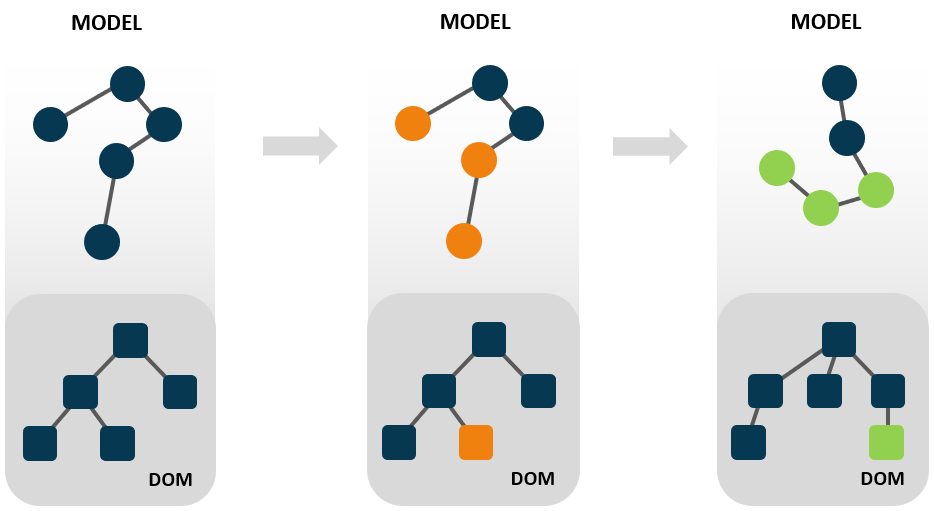
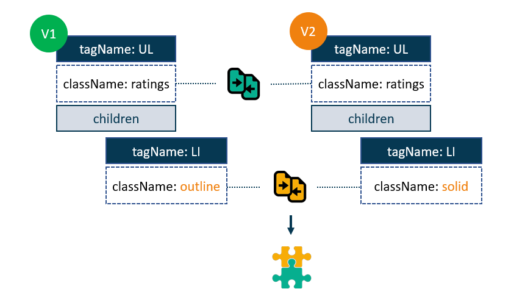

在追求成为一名开发者的过程中，我花费了大量时间在 [web逆向工程](https://indepth.dev/posts/1006/practical-application-of-reverse-engineering-guidelines-and-principles) 中，我基本上就是一名逆向工程上瘾者。最令我着迷的就是 **变化检测（`change detection`）**，你可以在大多数web应用中发现它的身影，它也是大多数流行web框架中不可或缺的一部分。高级组件都使用了变化检测，比如datagrids 或者有状态的jQUery插件。而且很有可能在你的应用程序的代码库中的某个地方潜伏着变化检测。

每个有理想的软件架构师必须对这一机制有充分的理解，我认为变化检测是一个架构中最重要的部分，因为它负责DOM更新等可见部分。它也是显著影响应用性能的领域。这篇文章将大大扩展你在这个领域的知识。

我先从变化检测的概况开始，然后我们自己动手实现一个很基础的变化检测机制。一旦我们掌握了变化检测的精髓，我们将更加深入的探索它在Angular和React中的实现细节。


## 1. 什么是变化检测（What's change detection?）

我们先从定义开始：

> 变化检测是一种被设计用来追踪应用状态变化，并在屏幕上渲染更新后的状态的一种机制。它确保用户界面始终和程序内部状态保持同步。

从定义中我们可以推断，变化检测主要包含2个部分：

1. 追踪变化（track changes）
2. 渲染（rendering）

我们先来看渲染部分。在任何应用程序中，渲染的过程都是将程序的内部状态投射到我们可以在屏幕上看到的东西。在web应用中，我们接收像对象，数组这些数据结构，然后以图片，按钮和其它可见元素形式得到这些数据的DOM表示形式，尽管实现渲染逻辑不是很简单，但是它是相当直白的。

当数据随着时间的推移伴随着变化，事情就变得更加复杂起来。现在的web应用是重交互的，这也意味着，应用状态随着用户的操作随时有可能发生变化。另外还有就是服务端数据发生了变化，客户端取回这些更新的数据，用户状态也会随之改变。

**当状态发生变化时，我们需要检测和反应这些变化**：



这看起来可能有点抽象，下面来看具体的例子。

### 1.1 评分组件（Rating Widget）

假设我们想实现一个评分组件（类似豆瓣打分）。屏幕上的实体星星数量表示当前评分。这个组件允许用户点击任意哪个星星重新进行打分操作：


为了追踪评分，我们需要将当前值存放在某个地方。下面我们定义一个私有属性 `_rating` 表示组件的状态：

```js
export class RatingsComponent {
  constructor() {
    this._rating = 1
  }
}
```

当我们更新组件状态时，我们需要将这一变化反馈在屏幕上。下面是渲染组件UI的DOM结构

```html
<ul class="ratings">
  <li class="star solid"></li>
  <li class="star solid"></li>
  <li class="star solid"></li>
  <li class="star outline"></li>
  <li class="star outline"></li>
</ul>
```

我使用 `solid & outline` css类渲染相应的星星图标。组件一开始全部是未选中状态。当状态变化时，相应的列表项变为实体星星。


### 1.2 初始化（Initialization）

首先我们需要创建所有必须的DOM节点。下面是我们的初始化逻辑，我们把它放在 `init` 方法中：

```js
export class RatingsComponent {
  // ...
  init(container) {
    this.list = document.createElement('li')
    this.list.classList.add('ratings')
    this.list.addEventListener('click', (e) => {
      this.rating = e.target.dataset.value
    })
    
    this.elements = [1, 2, 3, 4, 5].map(value => {
      const li = document.createElement('li')
      li.classList.add('star', 'outline')
      li.dataset.value = value
      this.lists.appendChild(li)
      return li
    })
    
    container.appendChild(this.lists)
  }
}
```


### 1.3 变化检测（Change Detection）

当 `rating` 属性发生变化时，我们需要发出通知。在我们这个简化版本的变化检测功能中，我们使用js提供的 [setter功能](https://developer.mozilla.org/en-US/docs/Web/JavaScript/Reference/Functions/set) 来完成。我们给 `rating` 属性定义一个setter，并且在其值发生变化时触发更新。DOM更新是通过改变列表项的类来实现的：

```js
export class RatingsComponent {
  // ...
  set rating(v) {
    this._rating = v
    
    // 触发DOM更新
    this.updateRatings()
  }
  
  get rating() {
    return this._rating
  }
  
  updateRatings() {
    this.elements.forEach((elm, idx) => {
			elm.classList.toggle('solid', this.rating > idx)
      elm.classList.toggle('outline', this.rating <= idx)
    })
  }
}
```

[stackblize - 在线运行上面的代码](https://stackblitz.com/edit/js-aufmae)。

现在看一看，为了实现这么个简单的组件我们所需要写的代码。如果是一个更加复杂的功能，代码量可能会指数上升。理想状态下，我们日常的开发中，我们只想关注应用逻辑自身，希望让别的东西帮助我们处理这些状态追踪和屏幕更新，这就是为什么框架那么受欢迎的原因了。


## 2. 框架（Frameworks）

框架帮助我们处理应用内部状态和UI间的同步工作。它们不仅帮我们减轻了这些负担，而且在状态追踪和DOM更新上做的非常的高效。

下面是我们在Angular和React中实现相同组件的方式。 从用户对UI的角度来看，模板是组件配置中最重要的一块。有趣的是，我们在这些框架中定义模板的方式也是类似的。


> Angular

```html
<ul class="rating" (click)="handleClick($event)">
    <li [className]="'star ' + (rating > 0 ? 'solid' : 'outline')"></li>
    <li [className]="'star ' + (rating > 1 ? 'solid' : 'outline')"></li>
    <li [className]="'star ' + (rating > 2 ? 'solid' : 'outline')"></li>
    <li [className]="'star ' + (rating > 3 ? 'solid' : 'outline')"></li>
    <li [className]="'star ' + (rating > 4 ? 'solid' : 'outline')"></li>
</ul>
```

> react

```html
<ul className="rating" onClick={handleClick}>
    <li className={'star ' + (rating > 0 ? 'solid' : 'outline')}></li>
    <li className={'star ' + (rating > 1 ? 'solid' : 'outline')}></li>
    <li className={'star ' + (rating > 2 ? 'solid' : 'outline')}></li>
    <li className={'star ' + (rating > 3 ? 'solid' : 'outline')}></li>
    <li className={'star ' + (rating > 4 ? 'solid' : 'outline')}></li>
</ul>
```

语法有些许不同，但是使用表达式表示DOM元素属性值的思想是一致的。上面的例子中，DOM属性 `className` 依赖于组件的 `rating` 属性。因此当rating发生变化时，表达式也会重新计算。如果一个变化被检测到了，那么 `className` 属性也应该被更新。

需要注意的是，事件监听不是Angular和React检测更新的一部分，它们通常会触发变化检测，但是不是这一过程中的一部分。


## 3. 变化检测的实现（Change detection implementation）

尽管用表达式作为DOM元素属性的想法在Angular和React中是一致的，但是其底层原理是完全不同的。下面来看看2个框架底层变化检测的实现方式。


### 3.1 Angular变化检测的实现

当编译器分析模板时，它会识别一个组件的属性，这些属性与DOM元素相关联。对于每一个这样的关联，编译器都会以指令的形式创建一个绑定。**绑定（`binding`）** 是Angular中变化检测的核心部分。它定义了一个组件的属性（通常用一些表达式包装）和DOM元素属性之间的关联。

**一旦创建了绑定，Angular就不再使用模板。变更检测机制会执行处理绑定的指令。这些指令的工作是检查带有组件属性的表达式的值是否发生了变化，必要时执行DOM更新**。

在我们的例子中，模版中的 `rating` 属性通过表达式绑定了 `className` 属性：

```html
[className]="'star ' + ((ctx.rating > 0) ? 'solid' : 'outline')"
```

对这部分模版，编译器产生用于设置绑定的指令，执行脏检测（dirty checks）和更新DOM。下面就是模版生成的代码：

```js
if (initialization) {
  elementStart(0, 'ul');
  	// ...
  	elementStart(1, 'li', ...);
   
		// 绑定到 className 属性上
		elementStyling();
    elementEnd();
  
  	// ...
  elementEnd();
                 
}

if (changeDetection) {
  // 检查表达式的值是否发生了变化
  // 如果变化了，则将绑定标记为dirty，然后更新该值
  elementStylingMap(1, ('star ' + ((ctx.rating > 0) ? 'solid' : 'outline')));
  elementStyleApply(1);
  //...
}
```

> 关于你在屏幕上看到的指令的一个简短说明：它们是名为 Ivy 的新编译器的输出。Angular以前的版本使用了完全相同的绑定和脏检查的想法，但它们的实现方式有些不同。

假设Angular为 `className` 创建了绑定，当前的绑定值如下:

```js
{ dirty: true, value: 'solid' }
```

第二条指令检查绑定是否为脏，如果是，则使用新的值来更新DOM。在我们的例子中，它将更新列表项的 `className` 属性。

**处理绑定，进行脏检查，更新DOM的相关部分，是Angular中变化检测的核心操作。**


### 3.2 React变化检测的实现

事实证明，React使用的是一种完全不同的方法。说实话，我在Angular中习惯了绑定，以至于花了不少时间才理解了React中的具体算法。正如你所猜测的那样，React并没有使用绑定。React中变化检测机制的核心部分是虚拟DOM比较。那么它是如何工作的呢？

所有的React组件都实现了返回JSX模板的 `render` 方法:

```jsx
export class RatingComponent extends ReactComponent {
    ...
    render() {
        return (
            <ul className="rating" onClick={handleClick}>
                <li className={'star ' + (rating > 0 ? 'solid' : 'outline')}></li>
                ...
            </ul>
        )
    }
}
```

在React中，一个模板被编译成一堆 `React.createElement` 函数调用。在下面的代码中，我使用 `el` 变量作为函数的别名:

```jsx
const el = React.createElement;

export class RatingComponent extends ReactComponent {
    ...
    render() {
        return el('ul', { className: 'ratings', onclick: handleClick}, [
                 el('li', { className: 'star ' + (rating > 0 ? 'solid' : 'outline') }),
                    ...
        ]);
    }
}
```

React.createElement函数的每一个都会创建一个数据结构，称为虚拟DOM节点。没有什么花哨的东西，它只是一个普通的JavaScript对象，用来描述一个HTML元素、它的属性和子代。当你对该函数进行多次调用时，它们会共同创建一个虚拟DOM树。所以，最终 `render`  方法会返回一个虚拟DOM树。

```jsx
export class RatingComponent extends React.Component {
  //...
  render() {
    return {
      tagName: 'UL',
      properties: { className: 'ratings' },
      children: [
        {tagName: 'LI', properties: {className: 'outline'}},
        //...
      ]
    }
  }
}
```

带有组件属性的表达式在调用 `render` 函数时被计算。虚拟DOM节点属性包含了计算后的表达式的结果。让我们想象一下，在我们的例子中，评级属性的值是 `0` 。 这意味着下面的表达式:

```js
{ className: rating > 0 ? 'solid' : 'outline' }
```



计算出的值为 `outline`, 这就是虚拟DOM中 `className` 属性的值，基于这个虚拟DOM树，React将创建具有CSS类outline的列表项元素。

现在假设rating已经更新为 `1` ，表达式为:

```js
{ className: rating > 0 ? 'solid' : 'outline' }
```

现在产生的结果是 `solid`. React运行变化检测，执行render函数，返回新版本的虚拟DOM树。 在这个虚拟DOM版本中，`className` 属性的值是 `solid`。

**非常重要的一点是，在每个变化检测周期中都会调用render函数，这意味着每次调用该函数时，都可能返回完全不同的虚拟DOM树。这意味着每次调用该函数时，都可能返回一个完全不同的虚拟DOM树。**

然后，它在两个虚拟DOM上运行一个 **diffing算法来** 获得它们之间的变化集。在我们的例子中，这将是列表项的className属性的差异。**一旦找到差异，算法就会产生一个补丁（`patch`）来更新相应的DOM节点。**在我们的例子中，这个补丁将用新的虚拟DOM中的值solid更新className属性。然后在下一个变化检测周期中，这个更新版本的虚拟DOM将被用于比较。

**从组件中获取新的虚拟DOM树，与之前版本的DOM树进行比较，生成补丁更新DOM的相关部分，并进行更新，是React中变化检测的核心操作。**


## 4. 变化检测什么时候运行呢？（When does change detection run?）

这是我们没有研究过的一个问题。为了全面了解变化检测，我们需要知道React什么时候调用 `render` 函数或者Angular执行处理绑定的指令。我认为，**启动变化检测的机制必须与检测变化和执行渲染的机制分开审查**。我们现在就来看看。


如果你想一想，可以有两种方式来启动变化检测:

1. 明确地告诉框架，某件事情发生了变化或者有可能发生变化，所以它应该运行变化检测。基本上，这种方式我们是手动启动变化检测
2. 依靠框架去知道什么时候有变化的可能性，自动运行变化检测。而这也是框架的不同之处。


### 4.1 React

在React中，我们总是手动初始化变化检测的过程。而我们通过调用 `setState` 函数来实现:

```jsx
export class RatingComponent extends React.Component {
    ...
    handleClick(event) {
        this.setState({rating: Number(event.target.dataset.value)})
    };
}
```

在React中没有办法自动触发变化检测。每个变化检测周期都是从调用 `setState` 函数开始的.


### 4.2 Angular

但在Angular中，我们有两种选择。我们可以使用Change Detector服务来手动运行变化检测:

```js
class RatingWidget {
  constructor(changeDetector) {
    this.cd = changeDetector
  }
  
  handleClick(event) {
    this.rating = Number(event.target.dataset.value)
    this.cd.detectChanges()
  }
}
```

但是，我们也可以依靠框架自动触发变化检测。通过这种方式，我们只需更新组件上的属性即可:

```js
class RatingWidget {
    handleClick(event) {
        this.rating = Number(event.target.dataset.value);
    };
}
```

但是Angular如何知道什么时候应该运行变化检测呢？

好吧，由于我们在模板中使用Angular提供的机制绑定到UI事件，它知道所有的UI事件监听器。这意味着它可以拦截一个事件监听器，并在应用代码执行完毕后安排变化检测运行。这是一个聪明的想法，但这个机制不能用来拦截所有异步事件。

由于我们没有使用Angular机制来绑定 `setTimeout` 这样的定时事件或 `XHR` 这样的网络事件，所以无法自动触发变化检测。

为了解决这个问题，Angular使用了一个名为 `zone.js` 的库。它对浏览器中所有的异步事件进行修补，然后可以在某个事件发生时通知Angular。与UI事件类似，Angular就可以等到应用代码执行完毕后，自动启动变更检测。


## 5. 总结

关于变化检测

React:

- 实现：虚拟DOM比较（⚠️ 这个是旧版本的React中的实现方式，现在React使用Fiber）
- 运行：通过 `setState` 方式手动出发重渲染

Angular:

- 实现：处理绑定，进行脏值检测
- 运行：通过 `ChangeDetector` 手动运行; 或者通过 `zone.js` 自动进行


原文链接：

- [indepth-dev: What every front-end developer should know about change detection in Angular and React](https://indepth.dev/posts/1064/what-every-front-end-developer-should-know-about-change-detection-in-angular-and-react#we%E2%80%99ve-learned-a-lot.-where-do-you-go-from-here?-check-out-the-following-articles!)


2021-03-11 16:29:35

