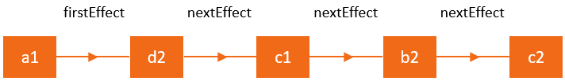

本文主要深入理解React新架构Fiber，学习新的一致性比对算法的2个主要阶段。详细的分析React时怎么更新状态和属性，以及处理子组件的。

React是一个用于构建UI的js库，其核心就是使用 [变化检测机制](https://indepth.dev/posts/1064/what-every-front-end-developer-should-know-about-change-detection-in-angular-and-react) 来追踪组件状态的变化，然后将更新的状态呈现到屏幕上。在React中，我们称这一过程为 **`reconciliation`**。当我们调用 `setState` 时，React会检查是否状态或者属性发生了变化，然后再决定对组件是否进行重渲染。

React官方文档，对 [Reconciliation](https://reactjs.org/docs/reconciliation.html) 机制进行了大致的描述：React元素的角色，生命周期方法，`render` 方法，以及对组件子组件应用的 `diffing` 算法。`render` 方法返回的不可变React元素树通常被称为 `virtual DOM`, 这个名词在早期帮助人们理解React，当同时也造成了很多困惑，现在React文档中已经不再使用这个名词了。在这篇文章中，我们坚持称之为React元素树。


除了React组件树外，React总是还有一颗内部实例树（组件，DOM节点等），用于保存状态。从 `React V16+` 起，React使用心得算法来实现这颗内部实例树，称之为 `Fiber`,  如果想要了解Fiber架构的优势，可以查看：

- [The how and why on React’s usage of linked list in Fiber](https://indepth.dev/the-how-and-why-on-reacts-usage-of-linked-list-in-fiber-to-walk-the-components-tree/)

在这篇文章中，我想对这个新的算法中的一些重要概念和数据结构提供一个深度的概述。一旦我们掌握了充足的背景知识，我们将探寻用于遍历和处理Fiber树的主要算法和函数。下篇文章，我们将展示React如何利用该算法执行初次渲染，以及处理状态和属性的更新的。之后，我们将对调度器(`scheduler`) 细节进行了解，以及子reconciliation处理，和构建 **`effects list`**（副作用链表） 的机制.

我希望你理解React并发内部运行的原理，本文使用的是 `React V16.6.0` 中的源码引用。


内容大纲：

1. 场景设置
2. 从React元素到Fiber节点
   1. React 元素
   2. Fiber 节点
   3. current Tree & workInProgress Tree
   4. 副作用(side-effects)
   5. 副作用链表(effects-list)
3. Fiber根节点: FiberRoot & HostRoot
   1. Fiber 节点数据结构和部分属性含义
4. reconciliation算法
   1. 渲染阶段
      1. work loop 的主要工作步骤
   2. 提交阶段： 对副作用链表进行操作
      1. 前置突变生命周期函数调用
      2. DOM更新
      3. 后置突变生命周期函数调用


## 1. 场景设置（Setting the background）

下面是本文中使用到的一个简单Demo，我们有一个按钮简单的增加number的值：

```jsx
class ClickCounter extends React.Component {
  constructor(props) {
    super(props)
    this.state = { count: 0 }
    this.handleClick = this.handleClick.bind(this)
  }
  
  handleClick() {
    this.setState((state) => {
      return { count: state.count + 1 }
    })
  }
  
  render() {
    return [
      <button key="1" onClick={this.handleClick}>Update counter</button>,
      <span key="2">{this.state.count}</span>
    ]
  }
}
```

可以看出，这个简单的示例在 `render`函数中 返回了2个子元素 `button & span`，当你点击按钮时，组件状态通过 `handleClick` 更新，导致的结果就是 `span` 元素里面的文字也更新了。


在执行 **`reconciliation`（一致性比对）** 时，React会存在很多活动。例如，首次渲染和状态更新时，React大致会执行：

1. 更新 `ClickCounter` 中 `state` 里面的 `count` 属性
2. 取回和比较 `ClickCounter` 的子元素及其属性
3. 更新 `span` 元素的属性

**另外，执行一致性比对时，还会调用 [生命周期方法](https://reactjs.org/docs/react-component.html#updating) 和 更新 [refs](https://reactjs.org/docs/refs-and-the-dom.html)。 所有这些活动，在Fiber架构中，都被称之为 `work`！** 工作的类型通常取决于React元素的类型。例如，对类组件（class component），React需要创建实例，而函数组件（functional component）则不需要。正如你所知，React中存在各种各样的元素，比如 **类组件和函数组件，host组件（DOM 节点）， portals等。** 这些React元素的类型都是作为 [createElement](https://github.com/facebook/react/blob/b87aabdfe1b7461e7331abb3601d9e6bb27544bc/packages/react/src/ReactElement.js#L171) 函数的第一个参数被传入，这个函数会被用在 `render` 函数中，用于创建元素。

在我们解释这些活动和主要的fiber算法前，我们先熟悉一下被React内部使用的数据结构。


## 2. 从React元素到Fiber节点（From React Element to Fiber Node）

`render` 函数返回的每个React元素都有一个UI表示形式，我们称之为 `view | template`。`ClickCounter` 组件的模版是：

```jsx
<button key="1" onClick={this.handleClick}>Update counter</button>
<span key="2">{this.state.count}</span>
```


### 2.1 React Element

一旦模版经过了JSX编译器，你就会得到一些React元素，这才是 `render` 函数真正返回的，不是HTML。因此我们不是必需使用JSX，`ClickCounter` 可重写为：

```jsx
class ClickCounter {
  // ...
  render() {
    return [
      React.createElement(
      	'button',
        {
          key: '1',
          onClick: this.onClick
        },
        'Update counter'
      ),
      React.createElement(
      	'span',
        {
          key: '2'
        },
        this.state.count
      ),
    ]
  }
}
```

`render` 中调用 `React.createElement` 方法会创建2个类似下面的数据结构：

```js
[
  {
    $$typeof: Symbol(react.element),
    type: 'button',
    key: '1',
    props: {
      children: 'Update counter',
      onClick: () => {...}
    }
  },
  {
    $$typeof: Symbol(react.element),
    type: 'span',
    key: '2',
    props: {
      children: 0
    }
  }
]
```

你会发现，React给这些对象添加了 [$$typeof](https://overreacted.io/why-do-react-elements-have-typeof-property/) 属性，用于表示独一无二的React元素，然后我们还有 `type & key & props` 属性来描述该元素，其值则是你传入 `React.createElement` 中的参数。注意React如果表示 `span & button` 节点中的文字内容的。以及点击事件处理如何成为 `button` 元素属性的一部分的。React元素还有其它的属性，比如 `ref`, 这不在本文讨论的范围内。

组件 `ClickCounter` 则没有任何属性或者key，因此其数据结构表示形式如下：

```js
{
  $$typeof: Symbol(react.element),
  key: null,
  props: {},
  ref: null,
  type: ClickCounter
}
```


### 2.2 Fiber Nodes

在 `reconciliation` 过程中，从 `render` 方法返回的数据将合并为 **fiber nodes 树**。每个React元素都一个一个相对应的 `fiber node`。**不同于React元素，fibers不会在每次的重渲染中重新创建，它们是持有组件状态和DOM的可变数据结构**。

之前我们已经提到过，根据不同类型的React元素，React会执行不同的活动。在我们示例中，对类组件 `ClickCounter` 它会调用生命周期方法和 `render` 方法，而对 `span` 这类宿主元素（DOM node）， 它会执行DOM突变操作。因此每个React元素都会被转换为 [相应的Fiber node类型](https://github.com/facebook/react/blob/769b1f270e1251d9dbdce0fcbd9e92e502d059b8/packages/shared/ReactWorkTags.js)，不同的类型会执行不同的work。

**你可以把fiber理解为表示要执行的work的一种数据结构，换句话说，一种工作单元(`a unit of work`), Fiber的架构也提供了一种追踪，调度，暂停和终止work的便利方式。**


当React元素首次被转换为fiber node时，React 会将元素中的数据传入 [createFiberFromTypeAndProps](https://github.com/facebook/react/blob/769b1f270e1251d9dbdce0fcbd9e92e502d059b8/packages/react-reconciler/src/ReactFiber.js#L414) 函数，来创建fiber。在后续的更新中，React会复用fiber node，而仅仅使用来自React元素中的数据更新必要的属性。React可能需要依据 `key` 属性来移动node在层级（`hierarchy`）中的位置，或者如果render中不再返回该元素时删除该node。


> 在 [ChildReconciler](https://github.com/facebook/react/blob/95a313ec0b957f71798a69d8e83408f40e76765b/packages/react-reconciler/src/ReactChildFiber.js#L239) 函数中，可查看所有的活动列表和React对现有的fiber nodes所执行的相对应的函数

因为React对每个React元素都层级一个fiber，因为我们拥有一个组件树，因此我们同样将获得一个 **fiber nodes树**。我们的实例会得到：


所有的fiber节点都通过 **链表** 使用 `child & sibling & return` 属性连接在一起，如果想了解具体实现细节，可查看：

-  [The how and why on React’s usage of linked list in Fiber](https://medium.com/dailyjs/the-how-and-why-on-reacts-usage-of-linked-list-in-fiber-67f1014d0eb7)


### 2.3 current and work-in-progress Trees

在首次渲染后，React会获得一个用于渲染UI的反应应用状态的fiber树。这个树通常被称之为 **`current Tree`(当前树)**。当React开始更新工作时，它会构建一颗 **`workInProgress Tree`**, 用来表示将更新到屏幕上的未来状态树。


所有在fiber上执行的工作都是在 `workInProgress` 树上进行的，每个已经存在的fiber节点都将创建一个备用节点(`alternate node`)用来组件 `workInProgress` 树。这些节点会使用 `render` 方法返回的React元素中的数据来创建，一旦更新被处理以及所有相关的工作完成，React将拥有一颗备用树，准备刷新到屏幕上。一旦这个  `workInProgress` 树渲染到屏幕上，则它将变为 `current` 树。


React的核心原则之一就是一致性，React总是一次性(in one go)的更新DOM - React不会显示部分的结果。  `workInProgress` 树充当草稿(`draft`)的角色, 并对用户是不可见的，这样React便可首先处理所有的组件，然后将变化刷新到屏幕上。

在源代码中，我们可以发现很多函数将 `current` 和  `workInProgress` 树作为参数，例如：

```js
function updateHostComponent(current, workInProgress, renderExpirationTime)
```

每个fiber node都使用 `alternate` 字段中持有对另一个树中相对应节点的引用。 `current` 树中的某个fiber node会指向  `workInProgress` 树中对应的节点，反之亦然。


### 2.4 副作用（side-effects）

我们可以把React中的组件当作一种函数，使用状态和属性来计算UI，即 **`UI = f(states, props)`**。**而突变DOM或者调用生命周期函数应该被认为是一种副作用，简单的称之为 `effect`**.

> 你很可能之前在React中执行数据获取，订阅或者手动改变DOM，我们称这些操作为 "副作用"（简称 "effect"）,因为它们能够影响到其它组件，并且不能在渲染期间完成。

你将会发现大多数状态和属性更新如何导致副作用的。因为应用副作用是一种类型的 `work`, fiber node是提供追踪副作用和更新的一种便利机制。**每个fiber node都可以拥有与之关联的副作用，它们通过 `effectTag` 字段被编码**。


所以Fiber中的副作用基本上定义了更新处理后需要为实例做的 [工作](https://github.com/facebook/react/blob/b87aabdfe1b7461e7331abb3601d9e6bb27544bc/packages/shared/ReactSideEffectTags.js)：

- 对宿主组件（DOM元素），工作主要是增加，更新或移除元素
- 对类组件，React可能需要更新refs和调用 `componentDidUpdate & componentDidMount` 生命周期函数
- 其它类型的副作用，对应不同类型的fibers


### 2.5 Effects list

React能快速的处理更新，是因为使用了一些高性能的技术。 **其中之一的技术是：构建一个用于快速迭代的由fiber nodes组成的线性链表**。迭代线性列表比树要快得多，**因为对没有副作用的fiber nodes 没有必要花费时间进行迭代**。

链表的目标就是标记哪些DOM更新或者有其它相关联的副作用fiber nodes。这个列表是 `finishedWork` 树的一个子集，并通过 `nextEffect` 属性进行链接，这点不同于 `current & workInProgress` 树中使用的 `child` 属性。


Dan 对副作用列表提供过一个比喻。它喜欢将其当作是一颗圣诞树，圣诞灯将所有的 `effectful nodes` 绑定在一起。为了可视化这个效果，我们假设下面fiber nodes 树中，高亮的是需要work的节点。例如，我们的更新导致 `c2` 倍插入到DOM中，`d2 & c1` 改变了他们的属性，而 `b2` 出发了一个生命周期函数。因此这些副作用列表可以链接起来，以便React跳过其它的节点：


你可以发现这些副作用如何链接在一起的。我们检查这些节点，React使用 `firstEffect` 指针表示链表的开始位置，因此上面的图可以表示为一个线性链表：




## 3. Root of the fiber tree

每个React应用都有一个或多个DOM节点充当容器，在我们示例中 `<div id="container">` 是容器：

```js
const domContainer = document.querySelector('#container')
ReactDOM.render(React.createElement(ClickCounter), domContainer)
```

我们对每一个这样的容器都创建一个 [fiber root](https://github.com/facebook/react/blob/0dc0ddc1ef5f90fe48b58f1a1ba753757961fc74/packages/react-reconciler/src/ReactFiberRoot.js#L31) 对象。你可以使用对DOM元素的引用来访问它：

```js
const fiberRoot = query('#container')._reactRootContainer._internalRoot
```

**这个fiber root也是React持有fiber tree引用的位置**，它被存在在 fiber root的 `current` 属性中：

```js
const hostRootFiberNode = fiberRoot.current
```

fiber树以一种特殊类型的fiber节点开始，这个类型就是 [HostRoot](https://github.com/facebook/react/blob/cbbc2b6c4d0d8519145560bd8183ecde55168b12/packages/shared/ReactWorkTags.js#L34)。它由内部创建，并扮演你最顶端组件的父组件。通过 `stateNode ` 属性，从 `HostRoot` fiber节点有一个链接返回到 `FiberRoot`：

```js
fiberRoot.current.stateNode === fiberRoot; // true
```

### 3.1 Fiber node 结构

下面我们看看从 `ClickCounter` 组件创建的 fiber节点的结构：

```json
{
  stateNode: new ClickCounter,
  type: ClickCounter,
  alternate: null,
  key: null,
  updateQueue: null,
  memoizedState: { count: 0 },
  pendingProps: {},
  memoizedProps: {},
  tag: 1,
  effectTag: 0,
  nextEffect: null
}
```

`span` DOM元素：

```json
{
  stateNode: new HTMLSpanElement,
  type: "span",
  alternate: null,
  key: "2",
  updateQueue: null,
  memoizedState: null,
  pendingProps: {children: 0},
  memoizedProps: {children: 0},
  tag: 5,
  effectTag: 0,
  nextEffect: null
}
```

fiber节点有很多属性，之前已经提到过了 `alternate & effectTag & nextEffect`,那么再看看其他属性的作用：

- **`stateNode`**: 保持对类组件实例或者DOM节点或者其他与Fiber节点相关联的React元素类型的引用，一般来说，这个属性用于持有关联fiber的局部状态
- **`type`**: 定义与此fiber相关联的函数或者类。对类组件来讲，它指向构造器函数；对DOM元素，它值特定的HTML标签，我经常使用这个属性来理解fiber节点是和什么元素相关联的
- **`tag`**: 定义 [fiber type](https://github.com/facebook/react/blob/769b1f270e1251d9dbdce0fcbd9e92e502d059b8/packages/shared/ReactWorkTags.js)。它被用于再一致性比对算法中，使用何种类型的work。正如之前提到的，根据React元素的类型，work的种类也会发生变化， [createFiberFromTypeAndProps](https://github.com/facebook/react/blob/769b1f270e1251d9dbdce0fcbd9e92e502d059b8/packages/react-reconciler/src/ReactFiber.js#L414) 函数将一个React元素转换为相应的Fiber节点类型。在我们的示例中 ，`ClickCounter` 的 `tag` 属性是 `1`, 表示它是一个 `ClassComponent`, 而 `span` 元素的 `tag` 属性是 `5`, 表示它是一个 `HostComponent`。
- **`updateQueue`**: 状态更新，回调和DOM更新队列
- **`memoizedState`**: fiber的状态，用于创建输出结果。当处理更新时，它反应当前渲染到屏幕上的状态
- **`memoizedProps`**: fiber的属性，用于在上一次渲染中创建输出的属性
- **`pendingProps`**: 从React 元素使用新的数据更新后的属性，将用于子组件或DOM元素中
- **`key`**:  一组子组件中的唯一标志符，用于帮助React分清楚那个列表项发生了变化（从列表中更新，增加或删除）。


你可以在 [ReactFiber.js - github](https://github.com/facebook/react/blob/6e4f7c788603dac7fccd227a4852c110b072fe16/packages/react-reconciler/src/ReactFiber.js#L78) 找到完整的fiber节点数据结构。我忽略了很多属性。特别，我跳过了 `child & sibling & return` 指针，我在 [The how and why on React’s usage of linked list in Fiber](https://indepth.dev/posts/1007/the-how-and-why-on-reacts-usage-of-linked-list-in-fiber-to-walk-the-components-tree) 有详细的说明。而 `expirationTime & childExpirationTime & mode` 是和 `Scheduler` 相关的属性。


## 4. 通用算法（General algorithm）

React主要执行2个阶段的工作：**渲染和提交**。

在第一个渲染阶段，React将更新应用于通过 `setState` 或 `React.render` 计划的组件，并找出需要在UI中进行更新的内容。如果是首次渲染，React对每个从 `render` 方法中返回的元素都创建一个新的fiber节点。在之后的更新中，fibers会对已存在的元素进行复用和更新。 **这个阶段的结果就是，产生一颗副作用标记的fiber nodes树。副作用就是下一个阶段 `commit` 阶段要完成的工作**  。 在提交阶段，React接收标记了副作用的fiber树，然后将其应用到实例中。React检查副作用链表，然后执行DOM更新以及其他对用户可见的更新。


**理解 渲染阶段 可以异步执行work是很重要的。** React在可用的时间内能处理一个或多个fiber 节点，然后停下来保存完成的工作并调用某些事件。然后从中断的地方继续。尽管有时候，React可能会丢弃完成的工作然后从头开始。使这种暂停变得可能的原因是，这一阶段的工作对用户是不可见的，比如DOM更新。

**相比之下， 提交阶段总是同步的。** 这是因为这一阶段执行的任务对用户都是可见的，比如DOM更新。这也是为什么React需要它一遍就做完的原因。


调用生命周期方法是一种由React执行的工作。一些方法在 渲染阶段被调用，而有些方法则在提交阶段调用。

渲染阶段：

- `[UNSAFE_]componentWillMount(已废弃)`
- `[UNSAFE_]componentWillReceiveProps(已废弃)`
- `getDerivedStateFromProps`
- `shouldComponentUpdate`
- `[UNSAFE_]componentWillUpdate(已废弃)`
- `render`

标记了 `[UNSAFE_]`的方法表示待遗弃的方法，`componentWillMount & componentWillReceiveProps & componentWillUpdate` 将在 `React V17` 中彻底被移除，但我们还是可以使用 `[UNSAFE_]` 版本。

因为，在渲染阶段不会产生任何副作用，比如DOM更新，React能异步的处理组件更新（有可能使用多线程）。然而，这些标记了 `[UNSAFE_]` 的生命周期函数经常被误用。开发者倾向于将副作用方法防止在这些函数中，这在新的异步渲染中可能出现问题。


提交阶段：

- `getSnapshotBeforeUpdate`
- `componentDidMount`
- `componentDidUpdate`
- `componentWillUnmount`

因为这些方法在提交阶段同步执行，它们被认为是包含副作用和操作DOM的地方。

下面我们看一下遍历树和执行工作的细节。


### 4.1 渲染阶段

一致性比对算法总是使用 [renderRoot](https://github.com/facebook/react/blob/95a313ec0b957f71798a69d8e83408f40e76765b/packages/react-reconciler/src/ReactFiberScheduler.js#L1132) 函数 从fiber树最顶端的 `HostRoot` fiber节点开始。然而，React会跳过已经处理过的fiber nodes，知道发现未完成工作的fiber node。例如，你在很深层级的组件中调用 `setState`, React会从最顶层开始，但是会很快的跳过那些父组件，直到到达 `setState` 被调用的组件。


### 4.1.1 work loop的主要步骤

所有的节点同时在 [workLoop](https://github.com/facebook/react/blob/f765f022534958bcf49120bf23bc1aa665e8f651/packages/react-reconciler/src/ReactFiberScheduler.js#L1136) 中被处理的，下面是loop的同步部分代码：

```js
function workLoop(isYieldy) {
  if (!isYieldy) {
    while (nextUnitOfWork !== null) {
      nextUnitOfWork = performUnitOfWork(nextUnitOfWork)
    }
  } else {
    // ...
  }
}
```

上面的代码中，`nextUnitOfWork` 持有对 `workInProcess` 中需要被处理的的fiber node的引用。当React遍历Fibers树时，它使用 `nextUnitOfWork` 这个变量来判断是否还有未完成的工作（unfinished work）。再当前fiber被处理后，这个变量要么包含指向fiber树中下一个fiber node要么为null。如果未null，则React将退出work loop，并准备提交这些变化。

有一下4个主要的函数用于遍历fiber 树和初始化或者完成工作：

1. [performUnitOfWork](https://github.com/facebook/react/blob/95a313ec0b957f71798a69d8e83408f40e76765b/packages/react-reconciler/src/ReactFiberScheduler.js#L1056)
2. [beginWork](https://github.com/facebook/react/blob/cbbc2b6c4d0d8519145560bd8183ecde55168b12/packages/react-reconciler/src/ReactFiberBeginWork.js#L1489)
3. [completeUnitOfWork](https://github.com/facebook/react/blob/95a313ec0b957f71798a69d8e83408f40e76765b/packages/react-reconciler/src/ReactFiberScheduler.js#L879)
4. [completeWork](https://github.com/facebook/react/blob/cbbc2b6c4d0d8519145560bd8183ecde55168b12/packages/react-reconciler/src/ReactFiberCompleteWork.js#L532)

为了演示它们是如何使用的，可以看一下以下遍历fiber树的动画。我已经最简化了它们的实现方式。每个函数都接收一个 待处理的 `fiber` 节点，当React向下迭代树的时候，你可以发现当前激活的fiber节点也发生了改变。可以很清晰的发现该算法： **首先完成子节点的工作，然后再完成父节点的工作**。


因此上面的例子中完成的顺序为：

1. b1
2. d1 -> d2 -> c1 -> b2
3. c2 -> b3
4. a1

当 `a1` 完成时，整个工作也完成了。可以查看 [stackblitz - walk tree](https://stackblitz.com/edit/js-ntqfil?file=index.js)

我们先从 `performUnitOfWork & beginWork` 这2个函数开始：

```js
function performUnitOfWork(workInProgress) {
  let next = beginWork(workInProgress)
  if (next === null) {
    next = completeUnitOfWork(workInProgress)
  }
  return next
}

function beginWork(workInProgress) {
  console.log(`work performed for ` + workInProgress)
  return workInProgress.child
}
```

`performUnitOfWork` 函数接收一个来自 `workInProgress` 中的 fiber node，并通过调用 `beginWork` 开始工作。这个函数将开启所有需要对该fiber node执行工作相关的活动。为了演示目的，我这里简单的打印了fiber的名字，来表示工作完成了。 **`beginWork` 总是返回一个指向下一个loop中待处理的fiber node或者 `null`**。

如果存在下一个节点，则在 `workLoop` 函数中将其赋值给 `nextUnitOfWork` 变量；如果没有子节点，则React知道它已经到达该分支的最底端，因此完成当前节点上的任务。 **一旦节点work完成，它需要对兄弟节点执行工作，最后回溯到父节点上执行work**，完成工作是通过 `completeUnitOfWork` 函数完成的：

```js
function completeUnitOfWork(workInProgress) {
  while (true) {
    let returnFiber = workInProgress.return
    let siblingFiber = workInProgress.sibling
    
    nextUnitOfWork = completeWork(workInProgress)
    
    if (siblingFiber !== null) {
      // 如果存在兄弟节点，则返回它，并对该兄弟节点执行work
      return siblingFiber
    } else if (returnFiber !== null) {
      // 如果在returnFiber中没有更多的work要做
      // 则继续循环，去完成父节点中的任务
      workInProgress = returnFiber
      continue
    } else {
     	// 我们到达根节点
      return null
    }
  }
}

function completeWork(workInProgress) {
  console.log(`work complete for ` + workInProgress)
  return null
}
```

你可以发现，这个函数是一个很大的 `while` 循环♻️。

1. React在 `workInProgress` 节点没有更多子节点时进入该函数。
2. 在完成对当前fiber节点的工作后，它会检查是否存在兄弟节点，如果存在，React退出该函数并返回兄弟节点的指针
3. 然后将其赋值给 `nextUnitOfWork` 变量，然后React开始对兄弟节点执行工作。 **重要的是要了解，React目前仅完成了之前的兄弟姐妹的工作。尚未完成父节点的工作**
4. 只有完成了所有的子节点和兄弟节点中的任务后，才开始回溯完成父节点中的任务

从实现中你可以看到，`performUnitOfWork` 和 `completeUnitOfWork` 都主要用于迭代目的，而主要活动发生在 `beginWork`和 `completeWork` 函数中。

在本系列的以下文章中，随着React进入beginWork和completeWork函数，我们将了解ClickCounter组件和span节点将发生什么


### 4.2 提交阶段

这个阶段由 [completeRoot](https://github.com/facebook/react/blob/95a313ec0b957f71798a69d8e83408f40e76765b/packages/react-reconciler/src/ReactFiberScheduler.js#L2306) 函数开始。这也是React更新DOM和调用前置和后置突变生命周期方法的地方。

当React进入这个阶段，React中存在2个树(`current tree & workInProgress tree`)和副作用链表(`effect list`). `current Tree` 表示当前渲染在屏幕上的状态表示。然后在渲染阶段回你构建一颗备用树(`workInProgress Tree`),这棵树🌲在远吗中称之为 `finishedWork | workInProgress`， 表示将刷新到屏幕上的状态树。备用树和 `current tree` 一样使用 `child & sibling` 指针进行链接。

然后，存在一颗副作用链表：它是 `finishedWork` 树的节点子集，使用 `nextEffect` 指针链接。 **记住，副作用链表是渲染阶段的结果，渲染阶段的目的就是决定那些节点需要被插入，更新或者删除，还有哪些组件需要调用生命周期方法， 这正是副作用链表要告诉我们的。** 


**副作用链表这也正是在提交阶段需要被遍历的节点子集！！！**


> 处于调试目的， `current tree` 可以通过fiber root的 `current` 属性访问到。`finishedWork Tree`  可以在 `current tree` 中的 `HostFiber` 节点的 `alternate` 属性获取到

提交阶段运行的主要函数是 [commitRoot](https://github.com/facebook/react/blob/95a313ec0b957f71798a69d8e83408f40e76765b/packages/react-reconciler/src/ReactFiberScheduler.js#L523) 函数，简单点讲，它做了如下工作：

1. 对那些标记了`Snapshot` 副作用的节点， 调用 `getSnapshotBeforeUpdate` 生命周期函数
2. 对那些标记了`Deletion` 副作用的节点， 调用 `componentWillUnmount` 生命周期函数
3. 执行所有的DOM插入，更新和删除操作
4. 将 `finishedWork` 树设置为 `current tree`
5. 对那些标记了`Placement` 副作用的节点， 调用 `componentWillUnmount` 生命周期函数
6. 对那些标记了`Update` 副作用的节点， 调用 `componentDidUpdate` 生命周期函数


在调用了前置突变方法 `getSnapshotBeforeUpdate` 后，React提交树中所有的的副作用。它用2遍完成这些任务：

1. 第一遍，执行DOM 宿主的插入，更新，删除和 **ref卸载**；React将 `finishedWork` 树赋值给 `FiberRoot`，是 `workInProgress Tree` 变为 `current tree`. 这些都是在第一遍提交阶段之后完成，因此在 `componentWillUnmount` 中先前的树仍旧是 `current tree`；但是在提交阶段的第二遍之前， 在 `componentDidMount/Update` 中，`finishedWrok` 树已经变成了 `current tree`
2. 第二遍，React调用所有其他的生命周期方法，和 `ref` 回调。这些方法作为单独的过程执行，因此整个树中的所有放置，更新和删除操作均已被调用

下面是上面描述过程的代码gist：

```js
function commitRoot(root, finishedWork) {
  commitBeforeMutationLifecycles()
  commitAllHostEffects()
  root.current = finishedWork
  commitAllLifeCycles()
}
```

上面所有的子函数，都实现了迭代副作用链表的循环和检查副作用类型。当发现与功能目的有关的副作用时，将其应用。


#### 4.2.1 前置突变生命周期方法(Pre-mutation lifecycle methods)

下面是迭代副作用链表和检查是否该节点标记了 `Snapshot` 副作用的函数gist：

```js
function commitBeforeMutationLifecycles() {
  while (nextEffect !== null) {
    const effectTag = nextEffect.effectTag
    if (effectTag & Snapshot) {
      const current = nextEffect.alternate
      commitBeforeMutationLifeCycles(current, nextEffect)
    }
    nextEffect = nextEffect.nextEffect
  }
}
```

对于类组件，这个副作用相当于调用 `getSnapshotBeforeUpdate` 生命周期方法


#### 4.2.2 DOM 更新

[commitAllHostEffects](https://github.com/facebook/react/blob/95a313ec0b957f71798a69d8e83408f40e76765b/packages/react-reconciler/src/ReactFiberScheduler.js#L376) 函数用于执行DOM更新，这个函数简单的定义了对节点需要执行的操作类型：

```js
function commitAllHostEffects() {
  switch (primaryEffectTag) {
    case Placement: {
      commitPlacement(nextEffect)
      //...
    }
    case PlacementAndUpdate: {
      commitPlacement(nextEffect)
      commitWork(current, nextEffect)
      //...
    }
    case Update: {
      commitWork(current, nextEffect)
      // ...
    }
    case Deletion: {
      commitDeletion(nextEffect)
    }
  }
}
```

有趣的是，React会在 `commitDeletion` 函数中调用 `componentWillUnmount` 方法作为删除操作的一部分。


#### 4.2.3 后置声明周期

[commitAllLifecycles](https://github.com/facebook/react/blob/95a313ec0b957f71798a69d8e83408f40e76765b/packages/react-reconciler/src/ReactFiberScheduler.js#L465) 函数是React调用剩余 `ComponentDidUpdate & ComponentDidMount` 生命周期的地方。


终于完成了。后面会出更多关于调度器，子组件一致性比对过程以及effect-list是如何构建的等文章。

后续文章：

- [In-depth explation of state and props update in React](https://indepth.dev/posts/1009/in-depth-explanation-of-state-and-props-update-in-react)


原文链接：

- [Inside Fiber: in-depth overview of the new reconciliation algorithm in React - Max Koretskyi@In-depth-dev](https://indepth.dev/posts/1008/inside-fiber-in-depth-overview-of-the-new-reconciliation-algorithm-in-react)


本文扩展链接：

- [Why Do React Elements Have a $$typeof Property? - Dan](https://overreacted.io/why-do-react-elements-have-typeof-property/)
-  [The how and why on React’s usage of linked list in Fiber](https://medium.com/dailyjs/the-how-and-why-on-reacts-usage-of-linked-list-in-fiber-67f1014d0eb7)


2021-03-14 20:31:23

