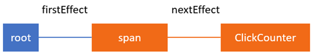

这篇文章使用一个简单的父子组件的场景，父组件向子组件传递属性时，React Fiber架构内部是如何处理的。

在 [Inside Fiber: in-depth overview of the new reconciliation algorithm in React](https://indepth.dev/posts/1008/inside-fiber-in-depth-overview-of-the-new-reconciliation-algorithm-in-react) 这篇文章中，我们打下了了解更细细节的前置知识的基础，介绍了主要的数据结构，特别是Fiber Nodes, current tree & workInProgress tree,副作用和副作用链表等知识。并且概况了主算法，解释了 `render & commit` 阶段的差异。

在上文的基础例子中，为了展示React如何在提交阶段添加副作用来调用 `componentDidUpdate` 方法的，我们添加 `componentDidUpdate` 生命周期函数：

```jsx
class ClickCounter extends React.Component {
  constructor(props) {
    super(props)
    this.state = { count: 0 }
    this.handleClick = this.handleClick.bind(this)
  }
  
  componentDidUpdate() {}
  
  handleClick() {
    this.setState((state) => ryay{
      return { count: state.count + 1 }
    })
  }
  
  render() {
    return [
      <button key="1" onClick={this.handleClick}>Update counter</button>,
      <span key="2">{this.state.count}</span>
    ]
  }
}
```

**本文我想展示React如何处理状态更新和构建副作用链表的。我们将了解 `render & commit` 阶段中高阶函数的调用细节。**

特别的，我们将了解 [completeWork](https://github.com/facebook/react/blob/cbbc2b6c4d0d8519145560bd8183ecde55168b12/packages/react-reconciler/src/ReactFiberCompleteWork.js#L532) 函数在React中是如何使用的：

- 更新 `ClickCounter` 组件的 `state` 中的 `count` 属性
- 调用 `render` 方法获取子元素列表，并执行比对
- 更新 `span` 元素中的属性

以及， [CommitRoot](https://github.com/facebook/react/blob/95a313ec0b957f71798a69d8e83408f40e76765b/packages/react-reconciler/src/ReactFiberScheduler.js#L523) 函数：

- 更新 `span` 元素的 `textContent` 属性
- 调用 `componentDidUpdate` 生命周期函数

在深入了解这些细节之前，我们先看一看，当 `setState` 通过点击事件被调用时，React是如何调用工作的。

## 1. 调度更新（Scheduling updates）

当我们点击按钮，`click` 事件被触发，React执行执行我们楚然道button属性中的回调，我们这个示例仅仅只增加 `counter` 并更新状态：

```jsx
class ClickCounter extends React.Component {
	// ...
  handleClick() {
    this.setState((state) => {
      return { count: state.count + 1 }
    })
  }
}
```

每个组件都有一个 **`updater`** 充当组件和React核心之间的桥梁。它允许 `setState` 由不同的库实现，比如ReactDOM,ReactNative,Server side 渲染以及测试工具等。

这篇文章，我们将看一下 `updater` 对象在 ReactDOM 中的实现，ReactDOM使用了Fiber reconciler。 对 `ClickCounter` 组件而言，它是一个 [classComponentUpdater](https://github.com/facebook/react/blob/6938dcaacbffb901df27782b7821836961a5b68d/packages/react-reconciler/src/ReactFiberClassComponent.js#L186)。它负责取回Fiber实例，将更新加入队列，以及调度工作。

当更新排队时，基本上它们只是添加到Fiber节点上的更新队列中进行处理。我们这个示例中，相当于 `ClickCounter` 组件以Fiber Node表示形式为：

```json
{
  stateNode: new ClickCounter,
  type: ClickCounter,
  updateQueue: {
    baseState: {count: 0},
    firstUpdate: {
      next: {
        payload: (state) => { return {count: state.count + 1}}
      }
    },
    //...
  },
  //...
}
```

可以看出 `updateQueue.firstUpdate.next.payload` 正是我们在 `ClickCounter` 组件中传给 `setState` 的回调函数。它表示在渲染阶段第一次更新需要处理的work。

## 2. 渲染阶段：对ClickCounter Fiber Node处理更新

这篇文章中的 [work loop](https://indepth.dev/posts/1008/inside-fiber-in-depth-overview-of-the-new-reconciliation-algorithm-in-react) 部分解释了 `nextUnitOfWork` 这个全局变量的角色，特别强调的是，这个变量持有来自 `workInProgress` 树中有工作待处理的Fiber节点的引用。当React遍历Fiber树时，React利用这个变量查看是否还有未完成的工作。

我们先假设 `setState` 方法被调用了，React将 `setState` 中的回调函数添加到`ClickCounter` 组件生成的Fiber节点 `updateQueue` 中，然后开始调度工作。

React进入渲染阶段，它开始使用 [renderRoot](https://github.com/facebook/react/blob/95a313ec0b957f71798a69d8e83408f40e76765b/packages/react-reconciler/src/ReactFiberScheduler.js#L1132) 函数从最顶端的 `HostRoot` Fiber节点开始遍历，然而，它会跳过已经处理完的Fiber nodes，直到找到还有工作未完成的fiber node。我们这个示例中，只有一个Fiber节点还有工作未完成，即 `ClickCounter` fiber节点。

所有工作都在此Fiber节点的克隆副本上执行，并存储在 `alternate` 字段中。如果备用节点还未创建，在处理更新前，React会在 [createWorkInProgress](https://github.com/facebook/react/blob/769b1f270e1251d9dbdce0fcbd9e92e502d059b8/packages/react-reconciler/src/ReactFiber.js#L326) 函数中创建一个副本。我们假设 `nextUnitOfWork` 持有对备用的 `ClickCounter` Fiber节点的引用。


### 2.1 beginWork

首先，我们的Fiber进入 [beginWork](https://github.com/facebook/react/blob/cbbc2b6c4d0d8519145560bd8183ecde55168b12/packages/react-reconciler/src/ReactFiberBeginWork.js#L1489) 函数。（ps: 因为这个函数对每个fiber节点都会执行，因此如果你想了解渲染阶段，你可以把断点放着这里，我经常这样做，并检查fiber节点的类型来确定所需的节点）

`beginWork` 基本上就是一个很大的 `switch` 语句，通过Fiber节点上的 `tag` 来决定要执行的工作类型，然后使用对应的函数执行工作。在我们的示例中，`ClickCounter` 是一个类组件，因此下面switch分支将被使用：

```js
function beginWork(current$$1, workInProgress, ...) {
  // ...
  switch (workInProgress.tag) {
      // ...
    case FunctionalComponent: {},
    case ClassComponent: {
    	// ...
      return updateClassComponent(current$$1, workInProgress, ...)
    },
    case ...                          
  }
}
```

因此我们会进入 [updateClassComponent](https://github.com/facebook/react/blob/1034e26fe5e42ba07492a736da7bdf5bf2108bc6/packages/react-reconciler/src/ReactFiberBeginWork.js#L428) 函数中。如果该组件是首次渲染该组件，则React会创建一个实例并挂载该组件，如果组件是恢复工作或者更新，则对其进行更新操作：

```js
function updateClassComponent(current, workInProgress, Component, ...) {
  // ...
  const instance = workInProgress.stateNode,
  let shouldUpdate
  if (instance === null) {
  	// ...
  	// 在第一遍中，我们可能需要构建该实例
  	constructClassInstance(workInProgress, Component, ...)
  	mountClassInstance(workInProgress, Component, ...)
  	shoudldUpdate = true
  } else if (current === null) {
  	// 如果是恢复工作，则复用之前已创建号的实例
  	shouldUpdate = resumeMountClassInstance(workInProgress, Component, ...)
  } else {
  	shouldUpdate = updateClassInstance(current, workInProgress, ...)
  }
  return finishClassComponent(current, workInProgress, Component, shouldUpdate, ...)
}
```

### 2.2 处理更新

我们已经存在 `ClickCounter`组件实例了，因此我们会进入 [updateClassInstance](https://github.com/facebook/react/blob/6938dcaacbffb901df27782b7821836961a5b68d/packages/react-reconciler/src/ReactFiberClassComponent.js#L976) 函数中。这也是React对类组件执行工作最多的地方。下面是在这个函数中最重要的一些操作，按照调用顺序排列：

1. 调用 `UNSAFE_componentWillReceiveProps()` （注意该生命周期已废弃）
2. 处理 `updateQueue` 中的更新，并产生新的状态
3. 调用 `getDerivedStateFromProps` 函数，传入新的状态，并获得返回结果
4. 调用 `shouldComponentUpdate`, 确认组件想更新；如果返回 `false`, 则跳过整个渲染阶段，包括组件及其子组件中对 `render` 函数的调用；如果返回 `true`, 则处理该更新
5. 调用 `UNSAFE_componentWillUpdate()`  （注意该生命周期已废弃）
6. 添加一个副作用，用于触发 `componentDidUpdate` （尽管调用 `componentDidUpdate` 的副作用在渲染阶段添加，但是会在提交阶段执行）
7. 更新组件实例上的 `state & props`

在调用`render` 方法之前， `state & props` 应更新到组件实例上，因为 `render` 方法的输出通常取决于 `state & props`。如果我们不这样做，那么每次返回的输出结果都一样。

下面是 [updateClassInstance](https://github.com/facebook/react/blob/6938dcaacbffb901df27782b7821836961a5b68d/packages/react-reconciler/src/ReactFiberClassComponent.js#L976) 函数的实现简化版本：

```js
function updateClassInstance(current, workInProgress, ctor, newProps, ...) {
	const instance = workInProgress.stateNode
	
	const oldProps = workInProgress.memoizedProps
	instance.props = oldProps
	
	if (oldProps !== newProps) {
		callComponentWillReceiveProps(workInProgress, instance, newProps, nextContext)
	}
	
	let updateQueue = workInProgress.updateQueue
	if (updateQueue !== null) {
		processUpdateQueue(workInProgress, updateQueue, ...)
		newState = workInProgress.memoizedState
	}
	
	applyDerivedStateFromProps(workInProgress, ...)
	newState = workInProgress.memoizedState
	
	const shouldUpdate = checkShouldComponentUpdate(
		workInProgress, ctor, oldProps, newProps, oldState, newState, nextContext
	)
	
	if (shouldUpdate) {
		instance.componentWillUpdate(newProps, newState, nextContext)
		// 添加tags
		workInProgress.effectTag |= Update
		workInProgress.effectTag |= Snapshot
	}
	
	instance.props = newProps
	instance.state = newState
	
	return shouldUpdate
}
```

我移除了一些辅助性的代码。例如，在调用生命周期方法前或添加副作用触发生命周期之前，React会使用了 `typeof` 检查组件是否实现某个方法。例如，下面就是React在添加副作用之前检查组件是否实现了 `componentDidUpdate`：

```js
if (typeof instance.componentDidUpdate === 'function') {
  workInProgress.effectTag |= Update
}
```

好吧，现在我们已经知道了渲染阶段对 `ClickCounter` Fiber节点执行的操作了，下面我们看看这些操作是如何改变Fiber节点上的值的。当React开始工作，`ClickCounter` 组件的Fiber节点看起来是下面这种结构：

```json
{
  effectTag: 0,
  elementType: class ClickCounter,
  firstEffect: null,
  memoizedState: {count: 0},
  type: class ClickCounter,
  stateNode: {
    state: {count: 0}
  },
  updateQueue: {
    baseState: {count: 0},
    firstUpdate: {
      next: {
        payload: (state, props) => {}
      }
    },
    //...
  }
  //...
}
```

执行完工作后，得到下面的Fiber节点：

```json
{
  effectTag: 4,
  elementType: class ClickCounter,
  firstEffect: null,
  memoizedState: {count: 1},
  type: class ClickCounter,
  stateNode: {
    state: {count: 1}
  },
  updateQueue: {
    baseState: {count: 1},
    firstUpdate: null,
    //...
  }
  //...
}
```

可以对比一下他们之间的差异。

更新之后，`memoizedState & baseState & updateQueue` 中属性 `count` 的值变为 `1`,React同事会更新 `ClickCounter` 组件实例中的状态。

此时，队列中不存在更新了，因此 `firstUpdate` 变为 `null`，同时重要的是，我们改变了 `effectTag` 属性，从 `0 -> 4`，二进制形式就是 `0b100`, 它表示设置第3个位，对应的正是 [Effect tag](https://github.com/facebook/react/blob/b87aabdfe1b7461e7331abb3601d9e6bb27544bc/packages/shared/ReactSideEffectTags.js) 中的 `Update`:

```js
export const Update = 0b00000000100;
```

总结一下，当在 `ClickCounteer` Fiber节点在执行工作时，React会调用前置突变生命周期，更新状态和定义相关的副作用。


### 2.3 ClickCounter Fiber节点的子节点的一致性比对

一旦上面的步骤完成，React就会进入 [finishClassComponent](https://github.com/facebook/react/blob/340bfd9393e8173adca5380e6587e1ea1a23cefa/packages/react-reconciler/src/ReactFiberBeginWork.js#L355) 方法。这时React调用组件实例上的 `render` 方法，并将其 `differing` 算法应用到组件返回的子代上。[React docs中关于diffing算法的介绍](https://reactjs.org/docs/reconciliation.html#the-diffing-algorithm)：

> 当比较2个相同类型的React DOM元素时，React会查看2者的属性，保留相同的底层DOM节点，只更新变化的属性。

我们更深入一点，发现实际上React比较的是React元素对应的Fiber节点。但是现在我不想继续深入谈这个问题，因为关于子节点的一致性比对是很复杂的。（你可以自己先看看 [reconcileChildrenArray](https://github.com/facebook/react/blob/95a313ec0b957f71798a69d8e83408f40e76765b/packages/react-reconciler/src/ReactChildFiber.js#L732) 函数了解一下）。

目前为止，有2件很重要的事我们需要去理解：

1. 当React进入 `child reconciliation` 过程时，它会对 `render` 方法中返回的子元素创建或者更新其对应Fiber节点。`finishClassComponent` 会返回对当前Fiber节点中第一个子Fiber节点的引用，然后将其赋值给 `nextUnitOfWork`, 并在之后的work loop中处理它
2. **更新子节点上的属性是处理父节点工作中的一部分**，为此，它使用从 `render` 方法返回的React元素的数据

例如，下面就是在 `child reconciliation` 之前的 `span` 元素对应的fiber节点部分数据结构：

```json
{
  stateNode: new HTMLSpanElement,
  type: "span",
  key: "2",
  memoizedProps: {children: 0},
  pendingProps: {children: 0}
}
```

你可以看到，`children` 属性在 `memoizedProps & pendingProps` 中都是 `0`。下面是 `render` 函数中返回的 `span` 元素：

```json
{
  $$typeof: Symbol(react.element),
  key: "2",
  props: {children: 1},
  ref: null,
  type: "span"
}
```

不难发现，在Fiber节点和返回的React 元素之间存在差异。**在用于创建备用Fiber节点的 [createWorkInProgress](https://github.com/facebook/react/blob/769b1f270e1251d9dbdce0fcbd9e92e502d059b8/packages/react-reconciler/src/ReactFiber.js#L326) 函数内部，React将更新后的React元素的属性拷贝到fiber节点中**。


因此，在React完成对 `ClickCounter` 组件子组件的一致性比对后， `span` fiber节点将得到更新后的 `pendingProps`,它将匹配 `span` React元素中的值：

```json
{
  stateNode: new HTMLSpanElement,
  type: "span",
  key: "2",
  memoizedProps: {children: 0},
  pendingProps: {children: 1}
  // ...
}
```

之后，当React对 `span` Fiber节点执行工作时，React将这些属性值拷贝到 `memoizedProps` 中，并给更新的DOM添加副作用。

这就是React在渲染阶段对 `ClickCounter` fiber节点所做的一切。因为 `button` 是 `ClickCounter` 组件的第一个子元素，它将赋值给 `nextUnitOfWork` 变量。由于它不存在work，因此React会移动到它的兄弟节点上，这里正是 `span` 元素对应的fiber节点。根据 [Inside Fiber: in-depth overview of the new reconciliation algorithm in React](https://indepth.dev/posts/1008/inside-fiber-in-depth-overview-of-the-new-reconciliation-algorithm-in-react) 这篇文章我们可知，刚描述的过程发生在 `completeunitOfWork` 函数中。


### 2.4 处理Span fiber节点上的更新

由于 `nextUnitOfWork` 现在指向备用的 `span` fiber节点，React便开始对其工作，和 `ClickCounter` fiber节点一样，工作从  [beginWork](https://github.com/facebook/react/blob/cbbc2b6c4d0d8519145560bd8183ecde55168b12/packages/react-reconciler/src/ReactFiberBeginWork.js#L1489) 函数开始。

因为 `span` 节点是一个 `HostComponent` 类型，因此 `switch` 语句中执行的分支是：

```js
function beginWork(current, workInProgress, ...) {
  // ...
  switch (workInProgress.tag) {
  	case FunctionalComponent: {}
  	case ClassComponent: {}
  	case HostComponent:
  		return updateHostComponent(current, workInProgress, ...)
  	case ...
  }
}
```

React将调用 [updateHostComponent](https://github.com/facebook/react/blob/cbbc2b6c4d0d8519145560bd8183ecde55168b12/packages/react-reconciler/src/ReactFiberBeginWork.js#L686) 函数，类似于上面我们知道对于 `ClassComponent` 类型，将调用  [updateClassComponent](https://github.com/facebook/react/blob/1034e26fe5e42ba07492a736da7bdf5bf2108bc6/packages/react-reconciler/src/ReactFiberBeginWork.js#L428) 函数，不同类型调用不同类型的函数处理，可以在 [ReactFiberBeginWork.js](https://github.com/facebook/react/blob/1034e26fe5e42ba07492a736da7bdf5bf2108bc6/packages/react-reconciler/src/ReactFiberBeginWork.js) 中找到所有的类型。


#### 2.4.1 对span fiber节点的子节点进行调和

对于 `span` fiber节点，没有什么在 `updateHostComponent` 中发生。


#### 2.4.2 完成Span fiber节点上的工作

一旦 `beginWork` 结束，则节点将进入 `completeWork` 函数。但是在此之前，React需要更新span fiber节点的 `memoizedProps` 属性。你可能记得，当协调 `ClickCounter` 组件的子节点时，React更新了 `span` 节点中的 `pendingProps` 属性：

```json
{
  stateNode: new HTMLSpanElement,
  type: "span",
  key: "2",
  memoizedProps: {children: 0},
  pendingProps: {children: 1}
}
```

因此，一旦`span` fiber节点的 `beginWork` 结束，React会将 `pendingProps` 更新到匹配的 `memoizedProps`:

```js
function performUnitOfWork(workInProgress) {
  // ...
  next = beginWork(current, workInProgres, nextRenderExpirationTime)
  workInProgress.memoizedProps = workInProgress.pendingProps
  // ...
}
```

接着便调用 `completeWork` 方法，它基本上是和 `beginWork` 一样的一个很大的 `switch` 语句：

```js
function completeWork(current, workInProgress, ...) {
  // ...
  switch (workInProgress.tag) {
  	case FunctionalComponent: {}
  	case ClassComponent: {}
  	case HostComponent: {
  		// ...
  		updateHostComponent(current, workInProgress, ...)
  	}
  	case ....
  }
}
```

因为 `span` fiber节点 是 `HostComponent` 类型，它会调用 [updateHostComponent](https://github.com/facebook/react/blob/cbbc2b6c4d0d8519145560bd8183ecde55168b12/packages/react-reconciler/src/ReactFiberBeginWork.js#L686) 函数。这个函数基本上执行以下操作：

1. 准备DOM更新
2. 将更新添加到 `span` fiber节点的 `updateQueue` 中
3. 添加副作用更新DOM

在这些操作执行前， `span` fiber节点类似下面结构：

```json
{
  stateNode: new HTMLSpanElement,
  type: "span",
  effectTag: 0,
  updateQueue: null
  //...
}
```

当执行完上面的函数后：

```json
{
  stateNode: new HTMLSpanElement,
  type: "span",
  effectTag: 4,
  updateQueue: ["children", "1"]
  //...
}
```

注意前后 `effectTag & updateQueue` 属性的差异:

- `effectTag` 从 `0 -> 4`, 表示 `Update` 副作用标志。这也是React在提交阶段唯一需要做的事。
- `updateQueue` 则保存用于更新的数据

一旦React处理了 `ClickCounter` 及其子节点，就意味着渲染阶段结束。就可以将 `FiberRoot` 中的 `finishedWork` 赋值成这颗完整的备用树🌲了。这也是将刷新到屏幕上的新树，它可以在渲染阶段结束后立即处理，也可以在稍后React被浏览器分配时间之后接收。


### 2.5 副作用链表（Effects list）

我们这个示例中， `span` 和 `ClickCounter` 组件都有副作用，React将向 `Span`  Fiber节点添加一个链接到 `HostFiber` 的`firstEffect` 属性。

React在 [completeUnitOfWork](https://github.com/facebook/react/blob/d5e1bf07d086e4fc1998653331adecddcd0f5274/packages/react-reconciler/src/ReactFiberScheduler.js#L999) 函数中构建这个副作用链表，下面的图表表示，这是一棵具有有副作用的Fiber树 ，该副作用可以更新span节点的文本并在 `ClickCounter` 上调用钩子，如下所示：


下面就是该线性副作用链表图：




## 3. 提交阶段

这个阶段由 [completeRoot](https://github.com/facebook/react/blob/95a313ec0b957f71798a69d8e83408f40e76765b/packages/react-reconciler/src/ReactFiberScheduler.js#L2306) 函数开始。在其开始工作前，它将 `FiberRoot` 上的 `finishedWork` 属性设置为 `null`:

```js
root.finishedWork = null
```

不同于第一阶段的渲染阶段，提交阶段总是同步执行的，因此它可以安全的更新 `HostRoot` 表明提交阶段的工作开始了。

提交阶段是React更新DOM和调用后置突变生命周期函数 `componentDidUpdate` 的地方。为了达成这一目标，React会检查在渲染阶段中生成的 **副作用链表(effects-list)** 并应用它。

对 `span` 和 `ClickCounter` fiber节点，在渲染阶段中，我们定义了以下副作用：

```js
{ type: ClickCounter, effectTag: 5 }
{ type: 'span', effectTag: 4 }
```

`ClickCounter` fiber节点的 `effectTag` 是 `5`（或者`ob101`）, 表示 `Update` 工作，对类组件而言基本会移交到 `componentDidMount` 生命周期函数中。最低有效位也被设置为信号表示该fiber节点在渲染阶段已完成所有工作。


`span` fiber节点的  `effectTag` 是 `4`（或者`ob100`），定义了对 Host 组件的DOM更新工作。就 `span` 元素而言，React将更新这个元素的 `textContent`。


### 3.1 应用副作用

下面我们看看React是怎么应用这些副作用的。应用副作用的函数是 [commitRoot](https://github.com/facebook/react/blob/95a313ec0b957f71798a69d8e83408f40e76765b/packages/react-reconciler/src/ReactFiberScheduler.js#L523) 函数，它主要由3个子函数组成：

```js
function commitRoot(root, finishedWork) {
  commitBeforeMutationLifeCycles()
  commitAllHostEffects()
  root.current = finishedWork
  commitAllLifeCycles()
}
```

每个子函数都实现了一个循环，用于迭代副作用链表以及检查副作用的类型，当发现与功能目的有关的副作用时，将其应用。在我们这个例子中，它会调用 `ClickCounter` 组件中的 `componentDidUpdate` 生命周期函数，和更新 `span` 元素中的文字。


### 3.2 调用前置突变函数

第一个子函数 [commitBeforeMutationLifeCycles](https://github.com/facebook/react/blob/fefa1269e2a67fa5ef0992d5cc1d6114b7948b7e/packages/react-reconciler/src/ReactFiberCommitWork.js#L183) 会寻找 [Snapshot](https://github.com/facebook/react/blob/b87aabdfe1b7461e7331abb3601d9e6bb27544bc/packages/shared/ReactSideEffectTags.js#L25) 副作用，如果找到便会调用 `getSnapshotBeforeUpdate` 方法。因为我们在 `ClickCounter` 组件上并没有实现该生命周期，因此在渲染阶段，React并不会添加这个副作用。因此，这个例子中 `commitBeforeMutationLifeCycles` 什么都不会做。


### 3.3 DOM更新

接着我们进入 [commitAllHostEffects](https://github.com/facebook/react/blob/95a313ec0b957f71798a69d8e83408f40e76765b/packages/react-reconciler/src/ReactFiberScheduler.js#L376) 函数。这里会将 `span` 元素的文字从 `0` 改变成 `1`。对 `ClickCounter` fiber节点，这个函数什么也没做，因为`ClickCounter` fiber节点对应的类组件没有任何DOM更新。

这个函数的主旨是，选择正确的副作用类型，然后应用相应的操作。我们这个例子中，我们需要更新 `span` 元素中的文字，因此我们会执行 `Update` 分支：

```js
function updateHostEffects() {
	switch (primaryEffectTag) {
		case Placement: {}
		case PlacementAndUpdate: {}
		case Update: {
			var current = nextEffect.alternative
			commitWork(current, nextEffect)
			break
		}
		case Deletion: {}
	}
}
```

通过进一步进入 `commitWork` 函数，我们最终会进入 [updateDOMProperties](https://github.com/facebook/react/blob/8a8d973d3cc5623676a84f87af66ef9259c3937c/packages/react-dom/src/client/ReactDOMComponent.js#L326) 函数。它采用在渲染阶段添加到Fiber节点上的 `updateQueue` 有效负载，并更新 `span` 元素上的 `textContent` 属性：

```js
function updateDOMProperties(domElement, updatePayload, ...) {
	for (let i = 0; i < updatePayload.length; i += 2) {
		const propKey = updatePayload[i]
		const propValue = updatePayload(i + 1)
		if (propKey === STYLE) {
      //...
    }
		else if (propKey === DANGEROUSLY_SET_INNER_HTML) {
      //...
    }
		else if (propKey === CHILDREN) {
			setTextContent(domElement, propValue)
		} else {
      // ...
    }
	}
}
```

在DOM更新应用后，React将 `finishedWork` 赋值给 `HostRoot` （在 [commitRoot](https://github.com/facebook/react/blob/95a313ec0b957f71798a69d8e83408f40e76765b/packages/react-reconciler/src/ReactFiberScheduler.js#L523) 函数中）。将这颗备用树设置为current tree：

```js
root.current = finishedWork
```

### 3.4 调用后置突变函数

最后剩下的一个函数就是 [commitAllLifeCycles](https://github.com/facebook/react/blob/d5e1bf07d086e4fc1998653331adecddcd0f5274/packages/react-reconciler/src/ReactFiberScheduler.js#L479) 了。这里用于调用后置突变生命周期函数，在渲染阶段，React 会将 `Update` 副作用添加到 `ClickCounter` 组件上，这是 `commitAllLifeCycles` 寻找的副作用标签中的某一个，然后调用 `componentDidUpdate` 方法：

```js
function commitAllLifeCycles(finishedRoot, ...) {
	while (nextEffect !== null) {
		const effectTag = nextEffect.effectTag
		
		if (effectTag & (Update | Callback)) {
			const current = nextEffect.alternate
			commitLifeCycles(finishedRoot, current, nextEffect, ...)
		}
		
		if (effectTag & Ref) {
			commitAttachRef(nextEffect)
		}
		
		nextEffect = nextEffect.nextEffect
	}
}
```

这个函数也会更新 [refs](https://reactjs.org/docs/refs-and-the-dom.html)，我们这个例子中不存在 `ref`, 因此会跳过。这个函数也会调用 [commitLifeCycles](https://github.com/facebook/react/blob/e58ecda9a2381735f2c326ee99a1ffa6486321ab/packages/react-reconciler/src/ReactFiberCommitWork.js#L351) 函数：

```js
function commitLifeCycles(finishedRoot, current, ...) {
	// ...
	switch (finishedWork.tag) {
		case FunctionalComponent: {}
		case ClassComponent: {
			const instance = finishedWork.stateNode
			if (finishedWork.effectTag & Update) {
				if (current === null) {
					// 首次创建组件
					instance.componentDidMount()
				} else {
          // ...
          instance.componentDidUpdate
				}
			}
		}
		case HostComponent: {}
		case ....
	}
}
```

可以看出，这个函数在组件第一次渲染时，会调用 `componentDidMount` 生命周期方法。


## 4. 总结

文中提到的源码部分：

1.  [classComponentUpdater](https://github.com/facebook/react/blob/6938dcaacbffb901df27782b7821836961a5b68d/packages/react-reconciler/src/ReactFiberClassComponent.js#L186)： 组件和React核心之间的桥梁，它是一种 `updater`；取回Fiber实例，将更新加入队列，以及调度工作
2. 渲染阶段：
   1.  [renderRoot](https://github.com/facebook/react/blob/95a313ec0b957f71798a69d8e83408f40e76765b/packages/react-reconciler/src/ReactFiberScheduler.js#L1132) ：渲染阶段的入口函数。它从最顶端的 `HostRoot` Fiber节点开始遍历，然而，它会跳过已经处理完的Fiber nodes，直到找到还有工作未完成的fiber node。
   2. [createWorkInProgress](https://github.com/facebook/react/blob/769b1f270e1251d9dbdce0fcbd9e92e502d059b8/packages/react-reconciler/src/ReactFiber.js#L326) : 创建Fiber节点副本。所有工作都在此Fiber节点的克隆副本上执行
   3.  [beginWork](https://github.com/facebook/react/blob/cbbc2b6c4d0d8519145560bd8183ecde55168b12/packages/react-reconciler/src/ReactFiberBeginWork.js#L1489)：通过Fiber节点上的 `tag` 来决定要执行的工作类型，然后使用对应的函数执行工作
      1. [updateClassComponent](https://github.com/facebook/react/blob/1034e26fe5e42ba07492a736da7bdf5bf2108bc6/packages/react-reconciler/src/ReactFiberBeginWork.js#L428) ：对类组件执行这个函数
         1.  [updateClassInstance](https://github.com/facebook/react/blob/6938dcaacbffb901df27782b7821836961a5b68d/packages/react-reconciler/src/ReactFiberClassComponent.js#L976) ：**用于处理更新**，对类组件执行更多的工作
      2. [updateHostComponent](https://github.com/facebook/react/blob/cbbc2b6c4d0d8519145560bd8183ecde55168b12/packages/react-reconciler/src/ReactFiberBeginWork.js#L686) ：对DOM元素执行这个函数
   4.  [finishClassComponent](https://github.com/facebook/react/blob/340bfd9393e8173adca5380e6587e1ea1a23cefa/packages/react-reconciler/src/ReactFiberBeginWork.js#L355) ：React调用组件实例上的 `render` 方法，并将其 `differing` 算法应用到组件返回的子代上
   5. [completeUnitOfWork](https://github.com/facebook/react/blob/d5e1bf07d086e4fc1998653331adecddcd0f5274/packages/react-reconciler/src/ReactFiberScheduler.js#L999) ：会创建一条副作用线性链表
3. 提交阶段：
   1. [completeRoot](https://github.com/facebook/react/blob/95a313ec0b957f71798a69d8e83408f40e76765b/packages/react-reconciler/src/ReactFiberScheduler.js#L2306) ：提交阶段的主入口函数
   2. [commitBeforeMutationLifeCycles](https://github.com/facebook/react/blob/fefa1269e2a67fa5ef0992d5cc1d6114b7948b7e/packages/react-reconciler/src/ReactFiberCommitWork.js#L183)  ： 调用前置突变生命周期函数
   3. [commitAllHostEffects](https://github.com/facebook/react/blob/95a313ec0b957f71798a69d8e83408f40e76765b/packages/react-reconciler/src/ReactFiberScheduler.js#L376) ： 更新DOM节点
   4. [commitAllLifeCycles](https://github.com/facebook/react/blob/d5e1bf07d086e4fc1998653331adecddcd0f5274/packages/react-reconciler/src/ReactFiberScheduler.js#L479) ： 调用后置突变生命周期函数
      1. [commitLifeCycles](https://github.com/facebook/react/blob/e58ecda9a2381735f2c326ee99a1ffa6486321ab/packages/react-reconciler/src/ReactFiberCommitWork.js#L351)
4. [EffectTags](https://github.com/facebook/react/blob/b87aabdfe1b7461e7331abb3601d9e6bb27544bc/packages/shared/ReactSideEffectTags.js)


PS: 这篇文章可以说十分细节的探寻了整个更新过程的源码，非常直白。如果想学习源码，则可以从 `beginWork` 函数开始一步一步的调试.


原文链接：

- [In-depth explanation of state and props update in React - Max Koretskyi@in-depth-dev](https://indepth.dev/posts/1009/in-depth-explanation-of-state-and-props-update-in-react)

2021-03-16 11:22

