Next.js即将发布至2016年以来最新的特性：

- **嵌套布局(`Nested Layouts`)**: 使用嵌套路由构建复杂应用
- **服务端组件优化(`Designed for Server Components`)**: 优化子树导航
- **提升数据获取(`Improved Data Fetching`)**: 对获取layouts，采用并行，避免waterfalls
- **使用React18 新特性(`Using React18 Features`)**：streaming, Transitions & Suspense
- **客户端和服务端路由(`Client & Server Routing`)**：服务端路由表现出 `SPA`  风格路由
- **渐渐式更新(`100% incrementally adoptable`)**: 不存在破坏式更新
- **高级路由规范(`Advanced Routing Conventions`)**: Offscreen stashing(离屏存储？)，即时过渡（instant transitions）等

新的Nextjs路由在React18新特性基础上构建，提供默认选项和规范，以便使用这些新特性。


## 1️⃣ 时间轴

这篇RFC分为2篇文章部分：

1. Part1️⃣（即本文）: 新路由系统概况，如何与React服务端组件和数据获取集成
2. Part2️⃣: 高级路由示例，Nextjs如何使用 `Suspense` 提供 streaming 和 选择性水合功能


## 2️⃣ 动机

从社区收集了很多反馈，关于当前路由系统的限制，我们发现：

- 创建Layouts的开发体验可以进一步提升。对嵌套路由的创建，路由间的共享，导航时保存状态这些功能，提供更简单的方式
- 很多Nextjs应用都是Dashboards或consoles，更高级的路由系统正好适合


## 3️⃣ 术语

这篇RFC介绍新的路由规范和语法。以下术语基于React和标准网络平台：

- **`Tree`**: 可视化层级结构的规范。比如，组件树是父子组件和文件夹结构
- **`Subtree`**: 树的一部分，从根（first） 到 叶子 （last）

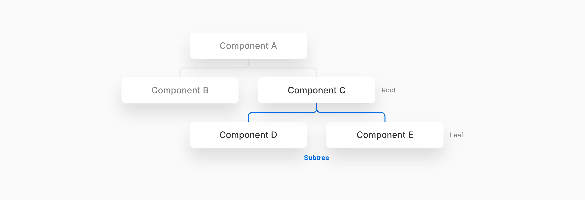


- **`URL Path`**: URL 域名后的那部分
- `URL Segment`: `/` 隔开的部分


## 4️⃣ 当前路由运作方式

目前，NextJS使用文件系统，将 `Pages` 目录中的文件夹和文件通过URLs方式进行映射。每个页面文件导出一个React组件，并给予文件名创建相关联的 `Route`, 比如：

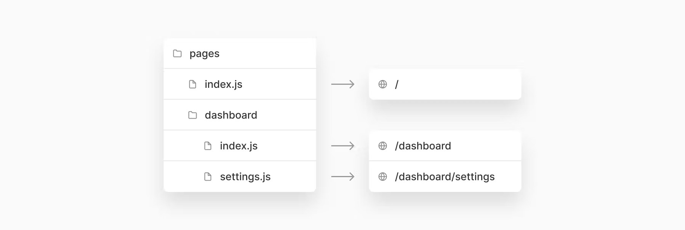


- **动态路由（`Dynamic Routes`）**: NextJS支持动态路由（包括捕获所有变种），使用方式 `[param].js | [...param].js | [[...param]].js`
- **布局（`Layouts`）**: NextJS提供了简单的给予组件的布局，每个页面布局使用 [组件属性模式](https://nextjs.org/docs/basic-features/layouts#per-page-layouts)，单一全局布局使用 [custom app](https://nextjs.org/docs/basic-features/layouts#single-shared-layout-with-custom-app)
- **数据获取（`Data Fetching`）**: Next使用 [getStaticProps](https://nextjs.org/docs/basic-features/data-fetching/get-static-props) + [getServerSideProps](https://nextjs.org/docs/basic-features/data-fetching/get-server-side-props) 提供页面（root）级别的数据获取。这些方法可以用于决定页面是否是静态生成的还是服务端渲染的。另外支持 [ISR](https://nextjs.org/docs/basic-features/data-fetching/incremental-static-regeneration) 创建和更新静态页面
- **渲染（`Rendering`）**: Next提供了3种渲染选项： [静态生成](https://nextjs.org/learn/foundations/how-nextjs-works/rendering) & [服务端渲染](https://nextjs.org/learn/foundations/how-nextjs-works/rendering) & [客户端渲染](https://nextjs.org/learn/foundations/how-nextjs-works/rendering)，除非使用阻塞式数据获取（`getServerSideProps`）, 默认使用静态生成页面


## 5️⃣ App文件夹介绍

为了避免破坏式更新，新特性将渐渐式被采用，推荐使用新的目录 `app`

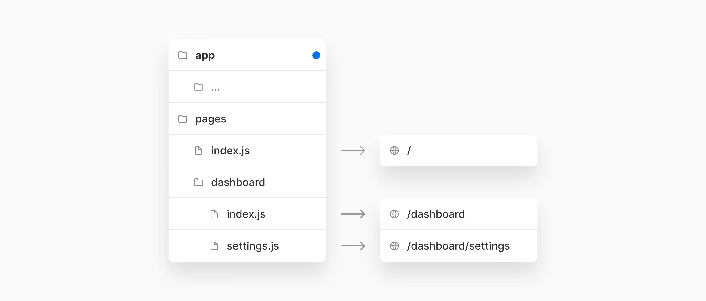


`app` 文件夹可以和 `pages` 目录同时存在，使用新特性就在 `app` 目录中创建，为了兼容就在 `pages` 目录，可以慢慢将 `pages` 中文件迁移到 `app` 目录中。


## 6️⃣ 定义路由

可以在 `app` 目录中使用 **文件夹结构** 定义路由。`Route` 是嵌套文件夹的一个路径，层级结构是 `root folder` 到 最后一个 `leaf folder`

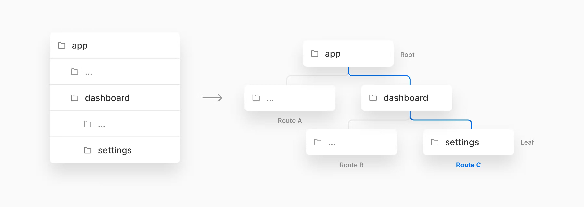


例如，可以在 `app` 目录下嵌套2个新文件夹的方式创建一个新的 `/dashboard/settings` 路由

🚨注意：

- 新的路由系统，使用 **文件夹** 定义路由，文件定义UI，规范文件名有 `layout.js` & `page.js` & `loading.js`
- 这样可以让你将项目文件集中放置在app目录中（`UI Components` & 测试文件，stories 等等）。当前版本只能通过 [pageExtensions配置](https://nextjs.org/docs/api-reference/next.config.js/custom-page-extensions#including-non-page-files-in-the-pages-directory) 方式实现


### 路由Segments

子树中的每个文件夹都是表示一个 `route segment`。每个路由分段都映射 `URL path` 中相应的分段

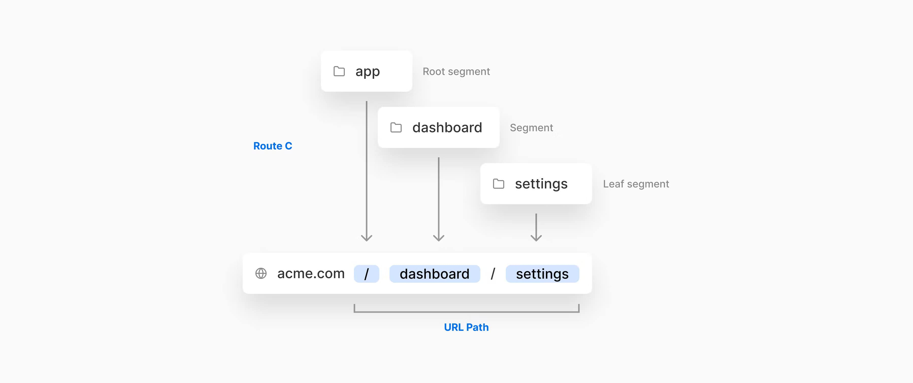


例如， `/dashboard/settings` 路由由3个分段组成：

1. `/` 根分段
2. `dashboard` 分段
3. `settings` 分段


## 7️⃣ Layouts

🎉 **新的文件规范: `layout.js`**

现在使用文件夹定义应用路由。但是空文件夹自身没有任何效果。下面让我们讨论一下如何使用新的文件约定来定义呈现这些路由的UI。

`Layout` 是子树中不同分段共享的UI。Layouts不会影响 `URL paths`，在相恋分段间导航时也不会重渲染（React状态能够保存下来）😎。


布局可以从 `layout.js` 文件导出React组件。组件接收 `children` 属性包裹segments部分。


2种类型layouts:

1. **`Root Layout`**: 作用于所有路由
2. **`Regular Layout`**: 作用于特定路由

可以嵌套2个或多个layouts形成 **嵌套layouts**。


### Root Layout

可以在 `app` 目录添加 `layout.js` 文件创建根layout，作用于应用所有路由：


🚨 注意

1. 根layout取代 `_app.js` 中自定义App和 `_document.js` 中的自定义Document
2. 可以使用root layout自定义初始document外壳，比如 `html & body` 标签
3. 可以在 root layout & other layouts 中使用数据获取的方法


### Regular Layout

即在指定的文件夹中添加 `layout.js`, 只给该路由添加布局

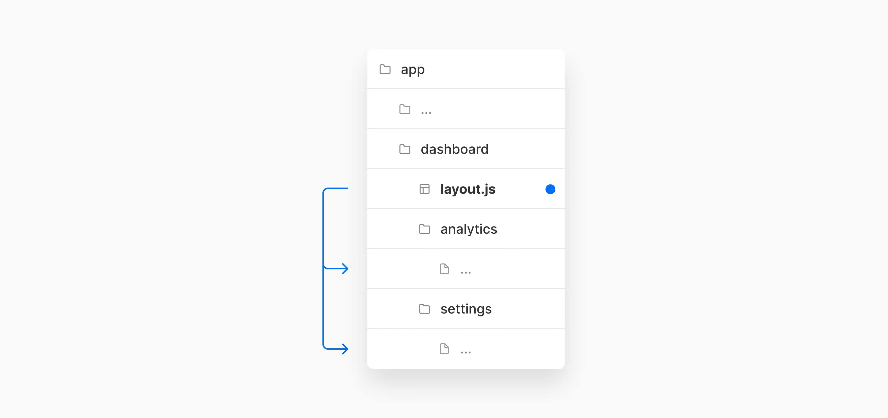


如图，将 `layout.js` 放在 `dashboard` 文件夹，则该布局只对 `dashboard` 路由分段有效。


### 嵌套Layouts

Layouts默认支持嵌套

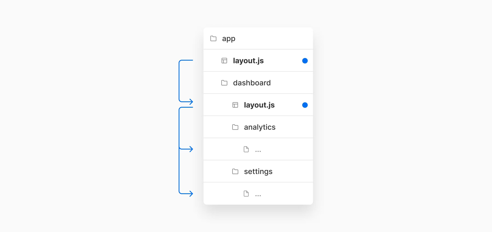


比如，上面存在根布局 `app/layout.js` 和 `dashboard/layout.js`,  dashboard 布局将嵌套在根布局中，对所有的 `dashboard/*` 分段路由有效。

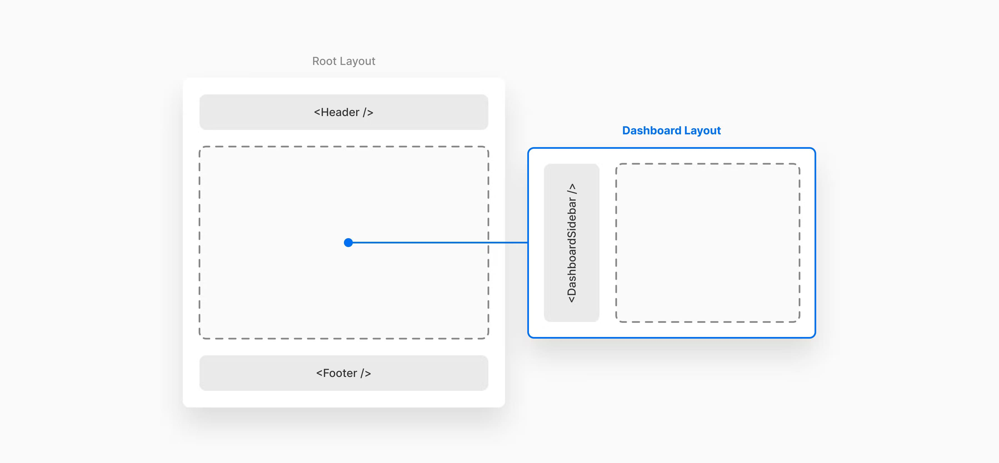


## 8️⃣ Pages

🎉 **新的文件规范： `page.js`**

page是对路由分段唯一的UI。在文件夹中创建 `page.js`


比如，为了给 `/dashboard/*` 路由创建页面，可以在对应的文件夹中添加 `page.js`。 当用户访问 `/dashboard/settings` 时，Next.js将在dashboard布局中渲染 `page.js` 文件内容。

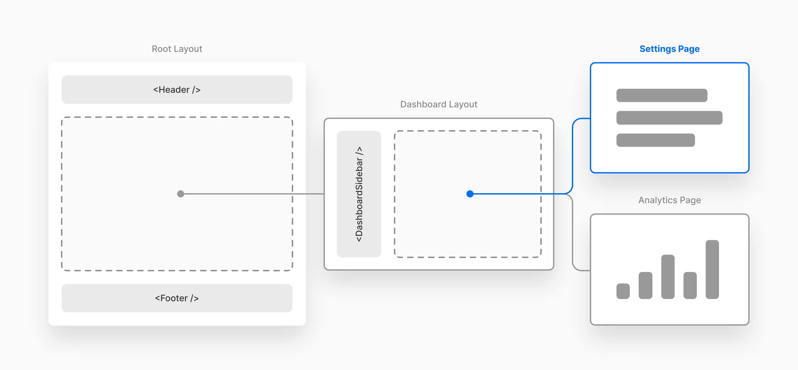


也可以直接在dashboard创建 `page.js`, dashboard的layout也会对该page生效

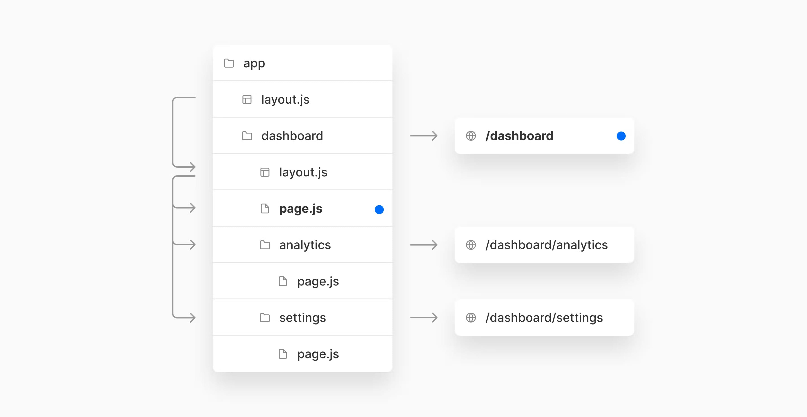


这个路由由2个分段组成：

1. `/` 根分段
2. `dashboard` 分段

🚨 **要是一个路由有效，则需要再其叶子分段存在 `page.js`, 否则该路由会抛出错误❌**


### 布局和页面行为

- `js|jsx|ts|tsx` 后缀扩展可用于 `Pages & Layouts`
- Page组件默认从 `page.js` 导出
- Layout组件默认从 `layout.js` 导出
- Layout组件必须接收 `children` 属性

如果一个布局组件被渲染，则其 `children` 属性将渲染子布局或者page。


> 基本示例

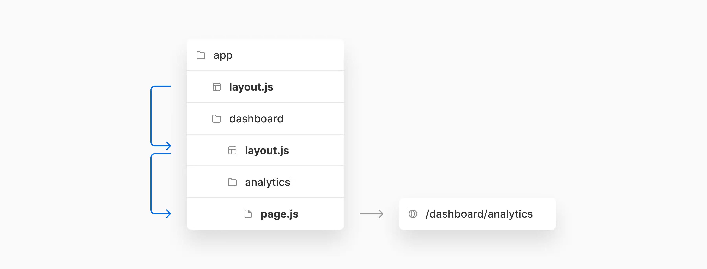


`app/layout.js`

```jsx
// Root Layout 
// 对所有路由都有效
export default function RootLayout({ children }) {
  return (
  	<html>
      <Header />
      {children}
      <Footer />
    </html>
  )
}
```

`app/dashboard/layout.js`

```jsx
// Regular Layout
// 对 app/dashboard/* 路由分段有效
export default function DashboardLayout({ children }) {
  return (
  	<>
    	<DashboardSiderbar />
    	{children}
    </>
  )
}
```

`app/dashboard/analytics/page.js`

```jsx
// Page Component
// app/dashboard/analytics分段
export default function AnalyticsPage() {
  return (
  	<main>...</main>
  )
}
```

上面的布局和page最终将渲染为如下组件层级结构：

```html
<RootLayout>
  <Header />
  <DashboardLayout>
    <DahboardSidebar />
    <AnalyticsPage>
      <main>...</main>
    </AnalyticsPage>
  </DashboardLayout>
  <Footer />
</RootLayout>
```


## 9️⃣ React服务端组件

💡 如果你对React服务端组件不了解，可以查看 [React Server Components RFC](https://github.com/josephsavona/rfcs/blob/server-components/text/0000-server-components.md)

新的路由系统内部利用到了React这些功能，比如 `Streaming， Suspense & Transitions`，这些功能都是React服务端组件构建基石。


### 服务端组件是新的默认

`app` 和 `pages` 目录之间最大的变化时，默认情况下，`app` 目录中的文件将以服务端组件形式被渲染。这使得，从 `pages` 目录迁移到 `app` 目录时，自动采用服务端组件。


### 渲染环境和组件类型

🚨React 引入了新的组件（模块）类型： `Server & Client & Shared` 组件，参考资料：

- [Capabilities & Constraints of Server and Client Components](https://github.com/josephsavona/rfcs/blob/server-components/text/0000-server-components.md#capabilities--constraints-of-server-and-client-components)
- [Server Module Conventions RFC](https://github.com/reactjs/rfcs/blob/235f27c12aa893efd2378ec3c4a9b0b221641861/text/0000-server-module-conventions.md#js-serverjs-clientjs)

这样你可以使用新的React规范更精细的控制哪些组件打包成客户端JS bundle。[这里是github rfc上讨论如何定义客户端组件和服务端组件规范](https://github.com/reactjs/rfcs/pull/189#issuecomment-1116482278)。

现在值得注意的是，`app` 允许将路由中的组件（布局和页面）渲染在服务器、客户端或两者上。😎


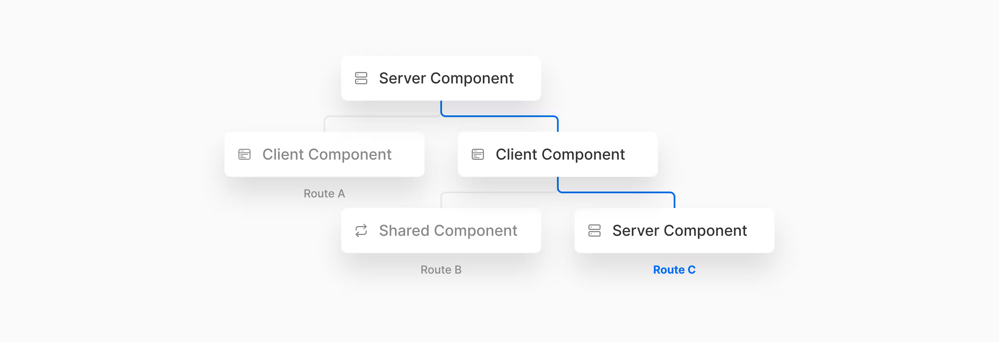


这和 `pages` 目录有所不同，`pages` 目录在没有数据获取需求时会静态的生成。在 `pages` 中，通过使用Next.js数据获取方法(`getStaticProps`、`getServerSideProps`)或从客户端获取数据，你可以灵活的决定 **什么时候（构建时或者运行时）** 和 **在哪里（服务端，客户端或者组合）** 渲染页面。


然而，在 `app` 目录中，**渲染环境和数据获取方法解耦，而是在组件级别进行设置🤩**。你仍需要遵循 [客户端和服务端约束](https://github.com/reactjs/rfcs/blob/235f27c12aa893efd2378ec3c4a9b0b221641861/text/0000-server-module-conventions.md#js-serverjs-clientjs) （比如，你不能在page或者layout中使用 `getServerSideProps`, 因为它们属于客户端组件）。


### 使用 children 属性交叉客户端和服务端组件

在React中，在客户端组件中导入服务端组件是存在限制的，因为服务端组件可能需要只能运行在服务端的代，码，比如数据库或文件系统功能。

🌰 导入服务端组件不能正常工作：

```jsx
import ServerComponent from './ServerComponent.js'

export default function ClientComponent {
  return (
  	<>
    	<ServerComponent />
    </>
  )
}
```

然后，**服务端组件可以作为客户端的child进行传递，你可以将其包装到另一个服务端组件中** 🌰：

```jsx
// ClientComponent.js
export default function ClientComponent({ children }) {
  return (
  	<>
    	<h1>Client Component</h1>
    	{children}
    </>
  )
}

// ServerComponent.js
export default function ServerComponent() {
  return (
    <>
    	<h1>Server Component</h1>
    </>
  )
}

// page.js
// 可以在服务端组件中导入 客户端组件和服务端组件
// 因为这个组件在服务端被渲染
import ClientComponent from './ClientComponent.js'
import ServerComponent from './ServerComponent.js'

export default function ServerComponentPage() {
  return (
  	<>
    	<ClientComponent>
      	<ServerComponent />
    	</ClientComponent>
    </>
  )
}
```

通过这种模式，React知道它需要在向客户端发送结果（不包含任何服务端代码）之前，在服务端渲染 `ServerComponent`。从客户端的角度看，它的子元素已经被渲染了。😎


在Layouts中，这种模式通过 `children` 属性实现，因此你不需要创建额外的包装组件。


🌰 `ClientLayout` 组件将接受 `ServerPage` 组件作为其子元素：

```jsx
// Dashboard Layout 是一个客户端组件
// app/dashboard/layout.js
export default function ClientLayout({ children }) {
  // 可以使用 useState/useEffect
  return (
    <>
     <h1>Layout</h1>
 		{children}
    </>
  )
}

// 这个Page是 服务端组件，将传入 Dashboard Layout
// app/dashboard/settings/page.js
export default function ServerPage() {
  return (
    <>
    	<h1>Page</h1>
    </>
  )
}
```

🎉 在客户端组件中渲染服务端组件是一种重要的组合模式。这是我们需要学习的一种高优先级模式，也是我们决定使用 `children` 属性的原因。


## 🔟 数据获取

可以在 `layout.js` 文件中使用获取数据方法，这点不同于 `pages` 目录，pages目录只能在页面级别使用获取数据方法。

因为布局可以嵌套，这意味着在多段路由中进行数据的获取。😎


### 在Layouts中获取数据

可以在 `layout.js` 中使用 `getStaticProps | getServerSideProps` 方法获取数据。

🌰：一个博客layout可以使用 `getStaticProps` 从CMS获取分类，用于生成sidebar组件

```jsx
// app/blog/layout.js
export async function getStaticProps() {
  const categories = await getCategoriesFromCMS()
  
  return {
    props: {
      props: { categories }
    }
  }
}

export default function BlogLayout({ categories, children }) {
  return (
    <>
	    <BlogSidebar categories={categories} />
    	{children}
    </>
  )
}
```


### 一个路由多个数据获取方法

可以再路由多个分段（segments）获取数据。比如，一个获取数据的 `layout.js`, 其 包装的 `page.js` 也可以获取自己的数据。

以上面博客例子，一个单一的post页面可以使用 `getStaticProps & getStaticPaths` 从CMS获取博文数据：

```jsx
// app/blog/[slug]/page.js
export async function getStaticPaths() {
  const posts = await getPostSlugsFromCMS()
  
  return {
    paths: posts.map(post => ({
      params: { slug: post.slug }
    }))
  }
}

export async function getStaticProps({ params }) {
  const post = await getPostFromCMS(params.slug)
  
  return {
    props: { post }
  }
}

export default function BlogPostPage({ post }) {
  return <Post post={post} />
}
```

因为 `app/blog/layout.js` & `app/blog/[slug]/page.js` 都使用了 `getStaticProps`, Nextjs将会静态生成整个 `/blog/[slug]` 路由，在打包时作为 **服务端组件**，从而减少客户端js大小和更快的水合。


静态生成的路由进一步改进了这一点，因为客户端导航会重用缓存（服务器组件数据）并且不会重新计算工作，从而减少 CPU 时间，因为正在渲染服务器组件的快照。


### 行为和优先级（Behavior and Priority）

Nextjs获取数据方法（`getServerSideProps & getStaticProps`） 只能用于 `app` 目录中的服务端组件。单一路由不同分段获取数据的不同方法将相互影响。


某个segment使用 `getServerSideProps` 会影响其它使用 `getStaticProps` 的分段。因为对于 `getServerSideProps` 分段已经向服务器发送了一个请求，该服务器也会渲染任何 `getStaticProps` 分段。Nextjs会重用构建时获取的数据，因此数据仍然是静态的。对在 `next build` 已经生成的属性，nextjs会按需渲染每个请求。


在一个segment中使用带有 `revalidate` (ISR) 的 `getStaticProps` 会影响在其他段中带有 `revalidate` 的 `getStaticProps`。

🤔 在未来，这可能会被优化，允许一个路由全量数据获取。


## 1️⃣1️⃣ 数据获取和服务端组件渲染

服务器端路由、React 服务器组件、Suspense 和 Streaming 的组合对 Next.js 中的数据获取和渲染有一些影响：


### 并行获取

Next.js 将急切地并行启动数据获取以最小化瀑布。比如，如果数据获取是 **顺序的**，路由中每个嵌套segment，只有前一个segment获取数据完成，才能进行下一个。而 **并行** 数据获取，每个segment都能同时获取数据。


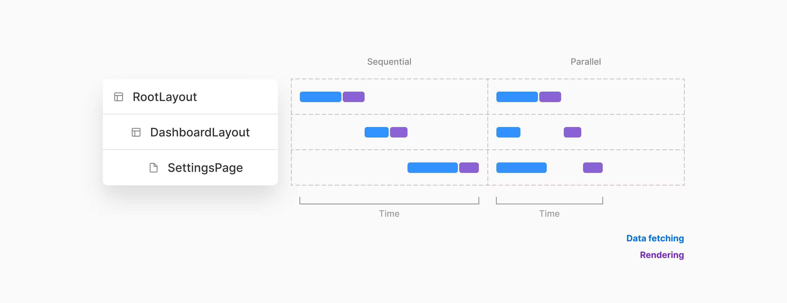


因为渲染可能依赖上下文（Context）,一旦数据获取完成并且父组件已经完成渲染，各segment将立刻开始渲染。

🤔未来，利用 `Suspense` 可以立刻开始渲染，即时数据没有完全加载。如果数据在可访问时，Suspense将被触发。React将在请求完成之前开始乐观地渲染服务端组件，并在请求resolve时插入插槽中（slot）。


### 部分获取和渲染

当在兄弟路由segments之间导航时，Next.js值获取和渲染对应segment部分。**不会重新获取和渲染其余部分**。这意味着在一个共享布局的page，当用户在兄弟页面导航时，布局得以保存😎，只渲染变化部分。

这对服务端组件特别有用，否则每次导航都导致整个页面在服务器上重渲染，而不是仅在服务端渲染页面更改部分，这减少了数据传送量和执行时间，从而提升性能。


🌰：如果用户从 `/analytics` 导航到 `/settings` 页面，React只重渲染页面中segments变化部分，保留布局。

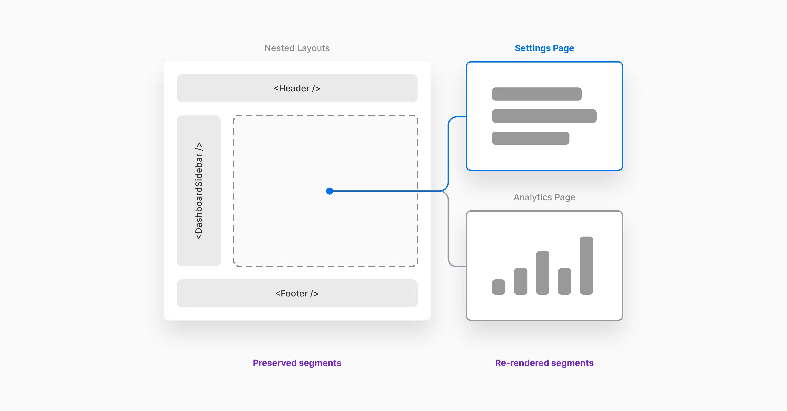


🚨有可能强制重渲染树更高层级的数据。这正在讨论中


## 总结

对于未来Nextjs layouts,routing和数据获取功能，我们感到很兴奋，下一章RFC,我们将讨论：

- `Instant Loading States`: 使用服务端路由，渲染和数据获取在导航完成前都发生服务端。因此显示Loading UI显得特别重要，避免产生未响应的感觉。我们建议对即时加载状态的框架级支持 - 内联和全局加载指示器和骨架屏。
- `Offscreens Stashing(离屏存储) with Instant Back/Forward`: React计划添加新的 `<Offscreen />` 组件用于不在屏幕渲染也能存储React tree和状态。利用这个组件，就有可能将已经访问的路由和预渲染的路由进行存储。在这些路由间向前或向后导航，都能立即响应和恢复之前存储的状态。
- `Parallel Routes`: 如果在一个页面中存在2个或以上tab bars，则应该可以有两个或多个可以独立导航的并行嵌套布局，在概念上类似于 `<iframe />`
- `Intercepting Routes(拦截路由)`: 拦截路由有时很有用。URL 通常会导致 UI 的不同部分，但在此上下文中访问时不会。例如，可以扩展和内联呈现的推文或模态照片查看器，而不是独立的画廊。
- `Streaming & Selective Hydration`: 我们将分享更多关于以服务器为中心的路由、React 服务器组件、Suspense 和流式传输如何结合以启用新的路由范式的详细信息，通过减少发送给客户端的内容并将工作分解为更小的块来提高性能

[RFC讨论地址- @github](https://github.com/vercel/next.js/discussions/37136)


原文链接：

- [Layouts RFC - @Nextjs.org](https://nextjs.org/blog/layouts-rfc?utm_source=next-site&utm_medium=banner&utm_campaign=next-website)


2022年06月16日10:05:26