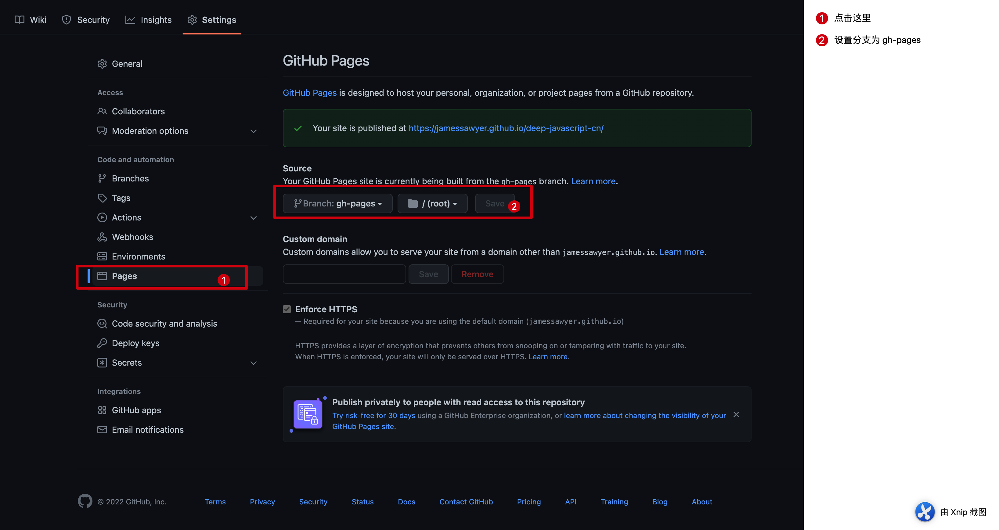

如果希望使用GitHub Actions部署到 `gh-pages` 上，一定要注意的事项。

## 1. 设置 workflows
这个可以按照官网上去完成，配置如下：
```yaml
name: Deploy

on:
  push:
    branches: [ "main" ]
  pull_request:
    branches: [ "main" ]
  workflow_dispatch:

jobs:
  deploy:
    runs-on: ubuntu-latest
    steps:
      - uses: actions/checkout@v2
      - uses: actions/setup-node@v3
        with:
          node-version: 16
          cache: yarn
      - run: yarn install --frozen-lockfile

      - name: Build
        run: yarn docs:build

      - name: Deploy
        uses: peaceiris/actions-gh-pages@v3
        with:
          github_token: ${{ secrets.GITHUB_TOKEN }}
          publish_dir: docs/.vitepress/dist
```
如果使用 `pnmp`，可以使用下面配置：
```yaml
name: Deploy

on:
  push:
    branches: [ "main" ]
  pull_request:
    branches: [ "main" ]
  workflow_dispatch:

jobs:
  deploy:
    runs-on: ubuntu-latest
    steps:
      - uses: actions/checkout@v3
      - uses: pnpm/action-setup@v2.2.2
        with:
          version: latest
          run_install: |
            -args: [--frozen-lockfile. --strict-peer-dependencies]
      - uses: actions/setup-node@v3
        with:
          node-version: 16
          cache: pnpm
      - run: pnpm install

      - name: Build
        run: pnpm run docs:build

      - name: Deploy
        uses: peaceiris/actions-gh-pages@v3
        with:
          github_token: ${{ secrets.GITHUB_TOKEN }}
          publish_dir: docs/.vitepress/dist
```

## 2. 设置GitHub Page source
如图：



## 3. 最重要的一步

因为我的 gh-pages 地址是 `jamessawyer.github.io/deep-javascript-cn`，一开始我的 `.vitepress/config.js` 配置如下：
```js
export default {
  title: 'Deep JavaScript',
  description: 'A book in the depths of JavaScript',
  lastUpdated: true,
  // base: '/deep-javascript-cn/', // 🚨一开始没写这一行
  themeConfig: {
    editLink: {
      text: '在GitHub编辑此页',
      pattern: 'https://github.com/jamessawyer/deep-javascript-cn/edit/main/docs/:path'
    },
    sidebar: [
      {
        text: '2.类型，值，和变量',
        collapsible: true,
        items: [
          {
            text: '2.⚡JS中的类型强转',
            link: '/2/Type-coercion-in-JavaScript',
          },
          {
            text: '3.⚡环境-变量的幕后',
            link: '/2/Environments-under-the-hood-of-variables'
          }
        ]
      },
      {
        text: '3.处理数据',
        collapsible: true,
        items: []
      },
      {
        text: '4.OOP：对象属性特性',
        collapsible: true,
        items:[]
      },
      {
        text: '5.OOP技术',
        collapsible: true,
        items: [
          {
            text: '属性特性介绍',
            link: '/5/Property-attributes-an-Introduction'
          }
        ]
      },
      {
        text: '6.正则表达式',
        collapsible: true,
        items: []
      },
      {
        text: '7.其它话题：元编程',
        collapsible: true,
        items: []
      }
    ]
  },
  markdown: {
    // lineNumbers: true, // 是否显示行号
    // options for markdown-it-toc-done-right
    toc: { level: [1, 2] },
  }
}
```
github actions构建之后怎么都找不到一些css资源，后面看到如下文档：

- [config - base](https://vitepress.vuejs.org/config/app-configs.html#base)

最后添加上 `base` 字段，完美解决这个问题：
```js
export default {
  // ...
  base: '/deep-javascript-cn/',
  //...
}
```
