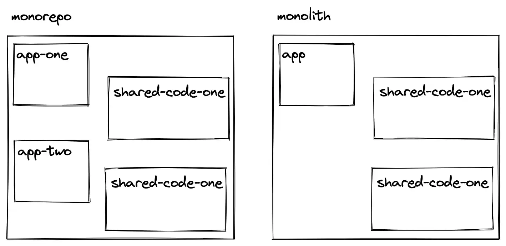
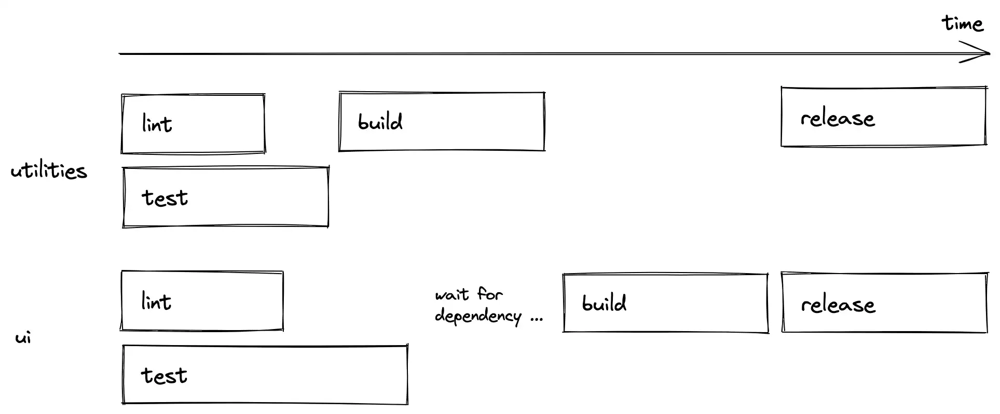
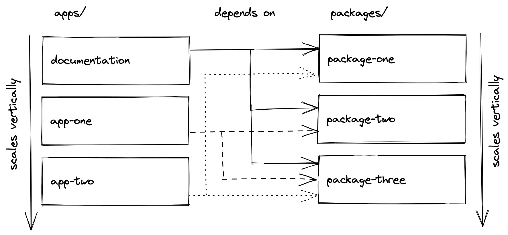
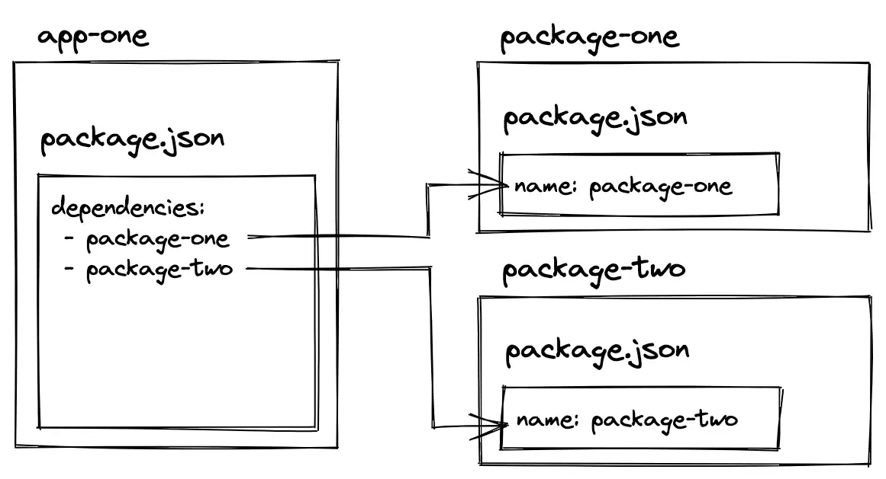
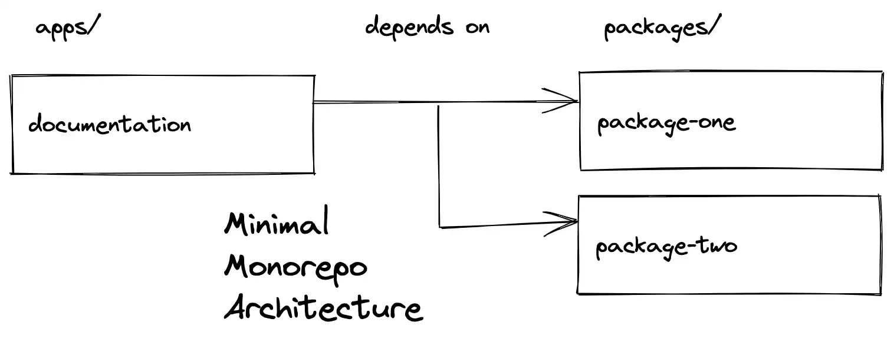
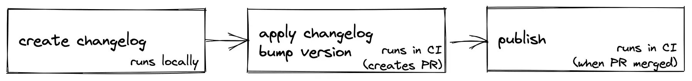
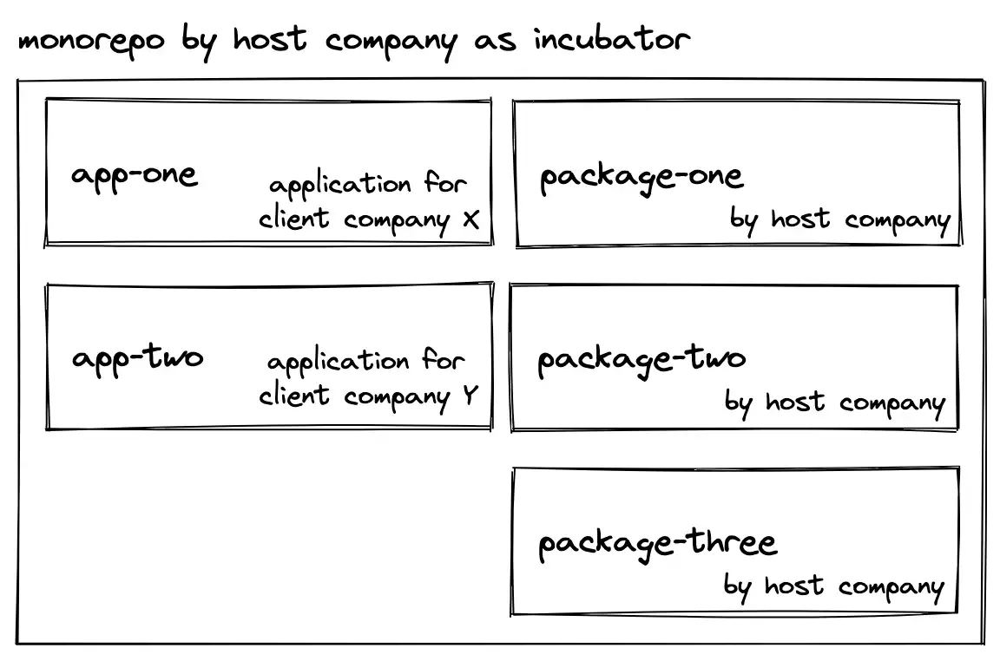

这是一篇关于js|ts Monorepos综合性的文章。通过这篇文章可以学习以下话题：

- 什么是Monorepo？
- Monorepo架构项目结构怎么组织？
- 如何创建一个Monorepo？
- 创建Monorepo架构使用哪些工具？
- 如何对Monorepo执行版本控制？
- 如何对monorepo创建CI管线？
- 如何将应用从monorepo中解耦出来？

下面以React框架在monorepo中创建 **apps & 共享packages（`UI`组件）**，当然Angular|Vue也一样。文章目录

1. [什么是monorepo？](#1)
2. [为什么要使用monorepo？](#2)
3. [🤩 Monorepo项目结构](#3)
4. [如何创建一个Monorepo？](#4)
5. [Monorepos中的workspaces](#5)
6. [Monorepo工具](#6)
7. [Monorepos中的文档](#7)
8. [Monorepos vs Polyrepos Git控制差异](#8)
9. [Monorepos持续集成](#9)
10. [Monorepo架构](#10)
11. [示例：Monorepos 作为孵化器](#11)
12. [Monorepos 问答](#12)


<p id="1"></p>


## 1️⃣ 什么是Monorepo？

📚 Monorepo是一个项目中包含多个小的项目，这些小的项目可以是单独的应用或者可复用的包（比如，工具函数或组件），这种项目融合的方式可追溯到2000年，当时称之为 `codebase`。

monorepo的名字来自 `mono`(单一) + `repo`(仓库)。repo来自版本控制系统（比如git），仓库之间存在：`n:n` 关系（polyrepo）或者 `n:1` 关系（monorepo）。

monorepo经常被误解为单体（`monolith`）。但是，在单体应用中，所有的小的项目结合成一个大的项目。对比之前，monorepo可以将小的项目结合为多个项目。



Monorepo对于大型的代码库很流行，在大型公司（比如Google）中应用比较多。

**但是现在，monorepos 对于任何具有多个应用程序和一组共享（内部）包的代码库变得很流行了。**


<p id="2"></p>


## 2️⃣ 为什么使用Monorepo？

monorepo对大型代码库有2个主要优势：

1. 共享包（`shared packages`）能被本地多个应用使用，而不需要使用远程的仓库（`registry`,比如npm）。开发体验提升巨大，因为在相同的代码库中，因此不需要通过第三方更新依赖。当共享包更新后，依赖共享包的所有应用都会立即更新。
2. 提升代码库之间的合作。不同项目团队修改代码，不再需要在多个仓库之间切换项目。重构更简单


<p id="3"></p>


## 3️⃣ 🤩Monorepo项目结构

monorepo可以包含多个应用（这里使用 `apps`），每个应用都可以访问共享包。请注意，下面结构已经是一个主观的monorepo项目结构：

```
- apps/   # 多个应用
--- app-one
--- app-two
- packages/  # 多个共享包
--- package-one
--- package-two
--- package-three
```

一个包（`package`）就是一个文件夹，它可以包含UI组件或工具库（`utilities`）或者配置信息（`ESLint, TypeScript`）

🌰：

```
- apps/
--- app-one
--- app-two
- packages/
--- ui
--- utilities
--- eslint-config
--- ts-config
```

**一个包可能依赖另一个包。** 例如：`UI` 包可能依赖 `utilities` 包中的函数，即UI包依赖utilities包。`ui & utilities` 包也可能使用 `*-config` 包中的配置，对 `*-config` 包进行依赖。


**应用（`apps`）之间一般不会相互依赖，一般应用可能会对packages中的包进行依赖**。如果包之间相互依赖，monorepo管线（`Monorepo Tools`） 可能出现下面情景：*假设 `ui` 包依赖 `utilities` 包， 先构建 `utilities` 包，然后再构建 `ui` 包*。




我们这里讨论的是 `js & ts`, 只有 `ts` 应用可能会依赖共享的 `ts-config` 包。


💡apps中的应用也可以完全不依赖共享包，应用可能选择在应用内实现UI组件，工具函数或者配置等。但当应用使用到了 `packages` 下的包作为依赖时，必须在 `package.json` 中进行依赖引入：

```json
{
  "dependencies": {
    "ui": "*",
    "utilities": "*",
    "eslint-config": "*"
  },
}
```

apps中的应用可以是 `SSR`, 也可以是 `CSR`。

👩🏻‍🏫 **换句话说，apps中的应用不知道自己是在一个monorepo中，它们只用定义依赖即可。monorepo（workspace in monorepo）决定依赖是来自默认的monorepo还是远程npm registry。**

*相反，应用可以脱离monorepo，单独被使用。只需要将本地依赖（比如 `ui | utilities | eslint-config`）发布到npm registry, 然后将应用的依赖更换为npm registry上的依赖即可。* 因为当应用作为单独应用使用时，不存在monorepo中的共享依赖了。


<p id="4"></p>


## 4️⃣ 🌰如何创建一个Monorepo

下面进入实战例子，本教程以react作为演示，但是monorepo是与框架无关的。本例子不会从头开始创建，而是以一个脚手架作为起点。

[起始项目地址](https://github.com/bigstair-monorepo/monorepo)

```sh
git clone https://github.com/bigstair-monorepo/monorepo.git
```

这里使用 `yarn`，不仅用于安装依赖，还用于 `workspaces` 声明。在 `workspaces in monorepos` 小节可以查看其它workspaces工具。继续教程：

```sh
cd monorepo
yarn install
```

项目目录结构如下：

```
- apps/
--- docs
- packages/
--- bigstair-core
--- bigstair-map
--- eslint-config-bigstair
--- ts-config-bigstair
```

这里 `apps` 包含一个 `docs` 应用，用于提供文档。后面我们会在 `docs` 项目旁集成真正的实际项目。

另外这里还有4个包在 `packages` 目录中：

- 2个包用于共享UI: `bigstair-core` & `bigstair-map`
- 2个包用于共享配置：`eslint-config-bigstair` & `ts-config-bigstair`

这里我们虚构了一个 `bigstair` 的公司，在之后的 `Versioning with Monorepos` 中，会发现这个名字很重要。下面着重看看实际的应用和实际的共享包：

```
- apps/
--- docs
- packages/
--- core
--- map
```

`core & map` 包被 `docs` 应用依赖。假设 `core` 包包含基础的组件，比如buttons|dropdowns|dialogs等，而 `map` 包包含一个可复用的且复杂的Map组件。站在app的角度，这些包就像解决不同问题的libs。可以看出 **packages文件夹和apps文件夹一样可以垂直扩展**。

下面运行一下这个monorepo。之后我们会在 `monorepo tools` 中知道下面命令，为什么可以允许我们启动apps文件夹中嵌套的应用：

```sh
yarn dev
```

启动后，你会发现storybook会显示来自 `core & map` 包中的组件。查看这些packages中的源码，可以看到组件的实现细节：

```tsx
import * as React from 'react';

export interface ButtonProps {
  children: React.ReactNode;
}

export function Button(props: ButtonProps) {
  return <button>{props.children}</button>;
}

Button.displayName = 'Button';
```

💡另外，可以发现这2个packages中的 `package.json` 文件都定义了一个 `name` 属性，而这个属性作为了 `apps/docs` 应用的依赖：

```json
// apps/docs/package.json
"dependencies": {
  "@bigstair/core": "*",
  "@bigstair/map": "*",
  "react": "18.0.0",
  "react-dom": "18.0.0"
},
```

最后，查看 `docs` 应用的实现细节，可以看到monorepo中引入依赖的方式和引入第三方包的方式一样：😎

```tsx
import { Button } from '@bigstair/core';
```

**这也进一步论证了，apps中的应用自己是不知道自己是在monorepo中的，如果不是monorepo，直接安装npm registry上的依赖即可。**


<p id="5"></p>


## 5️⃣ Monorepos中的 workspaces

👩🏻‍🏫 我们例子中，**monorepo由多个 `apps/packages` 组件**。*在幕后，有个称之为 `workspaces` 的工具，允许我们创建这样的目录结构，允许 `apps` 使用 `packages` 作为依赖。*

这里我们使用 [yarn workspaces](https://yarnpkg.com/features/workspaces/)，你也可以使用 [npm workspaces](https://docs.npmjs.com/cli/v7/using-npm/workspaces/) 或者 [pnpm workspaces](https://pnpm.io/workspaces)。

yarn workspaces定义在整个项目最外层的 `package.json` 文件中：

```json
"workspaces": [
  "package/*",
  "apps/*"
]
```

因为我们已经知道，我们项目有多个 apps & packages，因此这里使用通配符的方式指向文件路径。这样，在 `apps|packages` 中的每个文件夹都会被选出来。配置好后，`apps` 中的应用如果想包含 `packages` 中的包，直接使用该package `package.json` 文件中定义的 `name` 属性即可。


实际项目中，多个apps可以选择本地packages作为依赖。目前为止，我们只使用了 `docs` 应用引用packages。实际apps和packages关系可能如下：




下面我们再引入2个apps:

```sh
cd apps
# 添加2个新的apps
git clone https://github.com/bigstair-monorepo/app-vite-js.git
git clone https://github.com/bigstair-monorepo/app-vite-ts.git

cd ..
yarn install
```

`yarn install` 的2个作用：

1. `apps` 中的新引用需要安装依赖：💡 包含 `packages` 中的依赖 + npm registry依赖
2. 添加了2个新的apps，apps和packages之间可能存在新的依赖关系，通过yarn install解决这些依赖关系，才能使workspaces协同工作


接着使用 `yarn dev`，可以发现 `apps` 中的3个应用都会启动。

上面2个clone的react项目都使用到了Vite，他们之间的差异在于依赖的不同：

```json
"dependencies": {
  "@bigstair/core": "*",
  "@bigstair/map": "*",
  ...
}
```

之后，他们只是像我们之前在文档中一样使用共享组件:

```jsx
import { Button } from '@bigstair/core';
```

👩🏻‍🏫 因为我们在monorepo设置环境中，更具体点讲是在workspace环境中，使得项目之间（`apps & packages`）存在某种连接，**首先会从 workspaces中查询依赖，如果找不到，再去npm registry安装依赖。**




如你所见，任何js或ts应用都可以在 `apps` 目录以这种方式启动。你可以尝试创建自己的应用，定义 `packages` 作为依赖， `yarn install` ,使用来自 `workspaces` 中定义的共享包。

至此，你可以看到一个全局的 `package.json` 和各个 `apps | packages` 中本地的 `package.json`。顶层的package.json定义workspaces和可用于各个workspace中的全局依赖（比如：`eslint & prettier`）。相比之下，嵌套的package.json文件指定以该项目所需的依赖即可。


<p id="6"></p>


## 6️⃣ monorepo工具

你已经看到了，workspaces是如何允许我们创建一个monorepo项目结构。然而，workspaces允许开发者在monorepo中将不同projects进行链接，一个精细的monorepo工具用来提升开发体验。你使用下面命令已经体验了其中的一个开发体验提升：

```sh
yarn dev
```

在顶层文件目录中执行这个命令会启动 monorepo 中的所有项目，这些项目的 package.json 文件中有一个 `dev` 命令。这也适用于下面命令：

```sh
yarn lint
yarn build
yarn clean
```

如果你查看顶层的 `package.json` 文件，你会发现很多脚本：

```json
"scripts": {
  "dev": "turbo run dev",
  "lint": "turbo run lint",
  "build": "turbo run build",
  "clean": "turbo run clean",
  ...
},
"devDependencies": {
  ...
  "turbo": "latest"
}
```


一个叫 [turporepo](https://turborepo.org/) 的工具允许我们执行这些命令。另外可选的工具有 [learn](https://lerna.js.org/) & [Nx](https://nx.dev/)。turporepo有几个配置项，允许我们已并行的（默认），按顺序的，或者过滤的方式执行这些命令：

```json
"script": {
  "dev": "turbo run dev --filter=\"docs\"",
  ...
}
```

另外，你可以创建一个 `turbo.json` 的文件对所有命令定义monorepo管线。比如，如果一个包依赖workspace中的另一个包，则可以定义build命令管线，让前一个包等待后一个包构建成功。😎


另外，Turborepo拥有本地和远程文件缓存的高级功能。你可以随时不使用本地缓存，更多功能可以查看turborepo文档。


<p id="7"></p>


## 7️⃣ monorepos中的文档

因为许多 monorepos 带有访问一组共享包的应用程序，所以拥有一个用于文档目的的专用应用程序也可以访问这些包已经是完美的架构。



我们对 monorepo 的初始设置已经附带了一个docs应用程序，它使用 Storybook 来记录包的所有 UI 组件。但是，如果共享包不是 UI 组件，你可能需要其他工具来记录概念、使用或 API。🤔

从这个“最小的monorepo架构”，它带有共享包，共享包的文档，以及monorepo架构通过重用文档中的包来工作的概念证明，正如我们在 `Workspace in Monorepos` 部分所做的那样，可以通过向其添加更多apps或包来扩展结构。


<p id="8"></p>


## 8️⃣ 😎Monorepos中的版本

应用版本可能不是那么直白，尤其是monorepo中的那些共享包，这些共享包可能最终放到线上（比如npm registry）。包的管理存在很多的挑战：

- 包之间可能存在相互依赖
- 不止要管理一个包
- 包还可能存在嵌套的现象，一个package包含其它packages
- 每个包还有自己独立的changelog和发布过程

在monorepo中，`packages` 表现得像依赖，因为 `apps` 在workspace中使用这些packages，而不是npm registry。但是，假如某个app不想使用package中最近的版本，则可以定义一个更具体的版本：

```json
"dependencies": {
  "@bigstair/core": "1.0.0",
  "@bigstair/map": "1.0.0",
  ...
}
```

这种情况下，如果workspace中的package版本不同于具体版本，install命令将不再使用workspace package而是registry上的版本。**因此在开发monorepos时，我们需要一种方式创建版本，changelogs，和发布packages**🤔。

[changesets](https://github.com/changesets/changesets) 是一个在多仓库中管理多包（比如monorepo）的一个比较流行的工具。上面我们的monorepo中已经安装了changesets，并在最上层的package.json中定义了3个命令：

```json
"scripts": {
  "changeset-create": "changeset",
  "changeset-apply": "changeset version",
  "release": "turbo run build && changeset publish"
}
```

💡具有版本的packages将包含发布到registry的过程。如果你想跟着项目走，恶意执行下面的步骤：

- 在npm registry上创建一个组织（organization）,这样你就可以发布packages了
- 在命令行中登录npm
- 在源码中将你的组织名替换 `bigstair`
- 使用 `yarn install & yarn dev` 验证上面更改没有问题

在package版本控制之前的另一个前置需求是：我们需要先更改packages中的某个package。进入某个UI package，更改组件的源码。之后，任务是将更改后的版本反映在发布到 npm 的新版本中。


1. 运行 `yarn changeset-create` 命令，这会对你更改的package创建一个changelog。会出现一个CLI prompt，让你选择一个package，然后选择semver变化（`major | minor | patch`），再写入真正的changlog。之后，如果你使用 `git status` 检测你的仓库，你可以看到更改的源代码和最新创建的changlog文件。**如果你的package依赖其它的packages，则链接的packages也会获得版本提升。**
2. 如果changelog文件没问题，运行 `yarn changeset-apply`，这会对实际的package应用changelog和版本。你可以使用 `git status & git diff` 再次确认有没有什么问题
3. 如果一切ok，则使用 `yarn release` 命令将更新发布到npm，发布后，就可以去npm上查看发布的新版本了。

基本上，这就是你本地版本管理，接下来看看持续集成和发布步骤。


<p id="9"></p>


## 9️⃣ Monorepos持续集成

一个Monorepo的持续集成（`CI`）的复杂性取决于在 GitHub 等版本控制平台上管理的存储库数量。在我们的示例中，所有的 `packages` 都在相同的仓库（它们本身就是monorepo的一部分）。因此我们只需要关注这一个仓库的CI即可，这一节都是关于packages的发布，

本例monorepo已经使用GitHub Actions 用于CI。打开 `.github/workflows.release.yml` 文件，下面是该workflow内容：

```yaml
name: Release

on:
  push:
    branches:
      - main

concurrency: ${{ github.workflow }}-${{ github.ref }}

jobs:
  release:
    name: Release
    runs-on: ubuntu-latest
    steps:
      - name: Checkout Repository
        uses: actions/checkout@v2
        with:
          fetch-depth: 0

      - name: Setup Node.js 16.x
        uses: actions/setup-node@v2
        with:
          node-version: 16.x

      - name: Install Dependencies
        run: yarn install

      - name: Create Release Pull Request or Publish to npm
        id: changesets
        uses: changesets/action@v1
        with:
          publish: yarn release
        env:
          GITHUB_TOKEN: ${{ secrets.GITHUB_TOKEN }}
          NPM_TOKEN: ${{ secrets.NPM_TOKEN }}
```


🚨如果你在自己的GitHub账户上使用这个workflow，则需要创建 `NPM_TOKEN` 变量，另外，你还需要对你的组织和仓库开启 *Allow GitHub Actions to create and approve pull requests* 。




接着例子进行演示，改变packages中的某个组件，然后：

- `yarn changeset-create` 创建一个本地changelog和版本更改
- 将你的更改（源代码变更 + changelog） 推送到GitHub
- 在GitHub上，CI将接管你的monorepo packages，如果CI成功，会创建一个新的PR，该PR包含版本变更和changelog。一旦PR合并，CI会再次运行，将新版本发布到npm上。


<p id="10"></p>


## 🔟 Monorepo架构

现在，Monorepos 变得越来越流行，因为它们允许你将源代码拆分为多个 `packages/apps`（主观化的 monorepo 结构），同时仍然能够在一个地方管理所有内容。推动monorepo的第一个因素是 `Workspaces` 的出现。这里使用的是yarn workspace，你还可以选择npm workspaces 或 pnpm workspaces。


第2个推动monorepo的因素是，monorepos工具的出现，比如一个命令全局运行多个命令，和编排命令（比如 `Turborepo` 的管线），本地或者远程缓存执行过的命令。Turborepo是个很好用的工具，但你还可以选择Lerna或者Nx。


如果monorepo还使用了Git，则还可以将一个仓库分成多个仓库（polyrepo）。在我们演示示例中，我们使用 `.gitignore` 文件，将 `app-vite-js` & `app-vite-ts` 添加到忽略列表中，你也可以使用其它的方式。


在版本管理方面，`Changesets` 是一个创建changelogs，版本管理，和发布的monorepo工具。它是 monorepo 空间中语义释放的替代方案。


总结，`Workspaces + Turborepo + Changesets` 是管理和版本化，扩展monorepo应用的最佳搭档。🎉


<p id="11"></p>


## 1️⃣1️⃣ 示例：Monorepo作为孵化器

**monorepo的目标**： 能使用共享包的形式对不同应用提供共享能力，极大提升开发体验


上面提到开发体验，因为对monorepo来讲，很重要的一点是：无需从 npm 安装包，我们只需在 monorepo 范围内更改它们并查看应用程序中反映的更改。否则，在调整 UI 库时，我们将不得不经历整个发布 + 安装周期。





一个公司的孵化和孵化过程分为两个连续的部分，我将在下面进行探讨。

**Incubating孵化**： 当新客户加入 monorepo 时，我们/他们通过 git 创建一个存储库，我们将其克隆到我们的 monorepo 中。在那里，我们可以从 monorepo 中选择共享包作为依赖项。由于共享包的强制版本控制，客户端可以随时将存储库克隆为独立项目（无需依赖 monorepo），同时能够从npm registry上安装所有依赖项。

**Hatching**：一旦客户下线，我们会为其项目的 package.json 中的所有依赖项设置最终版本。从那里，升级软件包是他们的责任。因此，如果客户决定升级其中一个，我们会自动生成内部包的变更日志。


<p id="12"></p>


## 1️⃣2️⃣ Monorepo问答

- **是否存在同时针对前端和后端的monorepos？**： 在使用前端和后端时，它们通常通过 API 松散耦合。但是，前端和后端仍然可以在各个方面使用共享包（类型安全的 API 接口、实用程序函数、服务器端组件）。因此，完全有可能同时拥有一个 CSR React 应用程序、一个 SSR React 应用程序（例如 Next.js）和一个 Express 应用程序
- **Monorepo和巨石单体一样么？**：不！monorepo 可以生成一个单体应用程序，但是更有可能并排的应用程序共享公司的域或一组包，但不是一个独立的应用程序（单体的定义）。最后，只需要跨多个项目共享代码。
- **是否存在针对微前端的monorepos？**： 这我也不太清楚。但是，绝对有可能在 monorepo 中并排创建面向用户的应用程序和面向管理员的应用程序，开发人员可以在其中决定是否将两者拼接为一个整体，或者它们是否是不同（子）域（例如 my-application.com 和 admin.my-application.com）上的独立应用程序。


原文链接：

- [Monorepos in JavaScript & TypeScript - robinwieruch](https://www.robinwieruch.de/javascript-monorepos/#how-to-create-a-monorepo)
- [项目GitHub地址](https://github.com/bigstair-monorepo)
- [🔥 Building a Design System Monorepo with Turborepo - Lee Robinson](https://leerob.io/blog/turborepo-design-system-monorepo#compilation) 最佳实践

相关链接：

- [pnpm workspaces](https://pnpm.io/workspaces)
- [turporepo](https://turborepo.org/)
- [changesets](https://github.com/changesets/changesets)


2022年06月27日10:39:19

