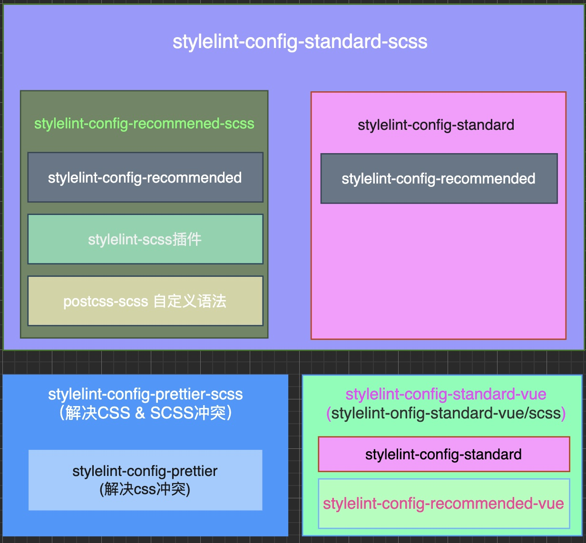

[stylelint](https://stylelint.io/) 相关插件，扩展，自定义语法介绍，包含Vue3 stylelint配置

1. `stylelint-scss` 插件，不直接使用 🙅‍♂️
2. `stylelint-config-standard-scss` 扩展， SCSS项目推荐使用 👍
3. `stylelint-config-recommended-scss` 扩展，一般不直接使用，直接使用上面的 `stylelint-config-standard-scss` 🤔
4. `stylelint-config-prettier` 扩展，解决与prettier CSS配置冲突，CSS项目中使用
5. `stylelint-config-prettier-scss` 扩展，解决stylelint与 prettier CSS & SCSS冲突，SCSS项目推荐使用 👍
6. `stylelint-config-standard-vue` 扩展，VUE配置相关的扩展（需安装 `postcss-html`）,自身是 `stylelint-config-standard` + `stylelint-config-recommended-vue` 组合，VUE项目推荐使用，如果是SCSS则使用 `stylelint-config-standard-vue/scss` 👍
7. `styllint-config-html` 扩展，对HTMl或类HTML(比如VUE,Sevelt,PHP)进行校验
8. `stylelint-order` 插件，不直接使用，一般使用对其进行封装后的扩展 🙅‍♂️
   1. [stylelint-config-idiomatic-order](https://www.npmjs.com/package/stylelint-config-idiomatic-order) 👍
   2. [stylelint-config-recess-order](https://www.npmjs.com/package/stylelint-config-recess-order)



## 1️⃣ stylelint-scss

类型： `plugins`

作用：SCSS相关的校验规则集合

文档：[stylelint-scss](https://www.npmjs.com/package/stylelint-scss)

👩🏻‍🏫： 一般不直接安装使用

stylelint自身也支持scss语法和其它预处理器语法。这个插件引入了一些用于校验SCSS的一些特定规则，比如 **有限制的 `nesting`**, 规定 `@rules` 的写法，而stylelint则更专注于标准的CSS。

`stylelint-scss` 的规则是只针对 SCSS的，因此它也可以和其它语法的插件一起使用，比如 `Less | PostCSS` 语法。


> 安装

📚  `stylelint-config-standard-scss` 这个扩展内部使用到了这个插件，推荐使用这个扩展，而不是直接使用这个插件

```sh
npm i -D stylelint stylelint-scss
```

使用：

```js
module.exports = {
 plugins: ['stylelint-scss'],
 rules: {
   // ...规则
 }
}
```

支持的规则分类：

- `@-each`
- `@-else`
- `@-extend`
- `@-function`
- `@-if`
- `@-import`
- `@-mixin`
- `@-rule`
- `@-use`
- `$-variable`
- `%-placeholder`
- `Comment`
- `Function`
- `Map`
- `Media Feature`
- `Operator`
- `Selector`
- `Partial`


## 2️⃣ 🚀 stylelint-config-standard-scss

类型： `extends`

作用：标准的共享SCSS配置

文档：[stylelint-config-standard-scss](https://www.npmjs.com/package/stylelint-config-standard-scss)

👩🏻‍🏫： 这个配置是对 `stylelint-config-standard` + `stylelint-config-recommended-scss` 这2个配置的扩展，因此装了这个就不需要再装这2个扩展了


> 安装和使用

```sh
npm i -D stylelint-config-standard-scss
```

使用：

```js
module.exports = {
  extends: 'stylelint-config-standard-scss',
  rules: {
    // 覆盖extends中的规则
  }
}
```


##✨ stylelint-config-standard 

类型： `extends`

作用：标准的共享stylelint配置，开启通用的规则，和CSS样式指南，一般会将这个作为基础的配置项

文档：[stylelint-config-standard](https://www.npmjs.com/package/stylelint-config-standard)

👩🏻‍🏫：这个配置是对 `style-config-recommended` 的扩展


> 安装和使用

```sh
npm i -D stylelint-config-standard
```

使用：

```js
module.exports = {
  extends: 'stylelint-config-standard',
  rules: {
    //...
  }
}
```

定义了一些很常用的规则：

- `at-rule-no-unknown` -> `ignoreAtRules`
- `numnber-leading-zero` 
- `number-max-precision`
- `unit-allowed-list`

等等


## 3️⃣ ✨ stylelint-config-recommended-scss

类型： `extends`

作用：扩展了 `stylelint-config-recommended` 配置 + `stylelint-scss` 插件 + `postcss-scss` 自定义语法

文档：[stylelint-config-recommended-scss](https://www.npmjs.com/package/stylelint-config-recommended-scss)

👩🏻‍🏫：这个配置被上面提到的 `stylelint-config-standard-scss` 扩展，因此这个扩展一般不直接使用，而是使用 `stylelint-config-standard-scss` 扩展


> 安装和使用

```sh
npm i -D stylelint-config-recommended-scss
```

使用：

```js
module.exports = {
  extends: 'stylelint-config-recommended-scss',
  rules: {
    //...
  }
}
```


2️⃣ 👇🏻介绍 `prettier` 相关的配置：

## stylelint-config-prettier

类型： `extends`

作用：关闭所有和Prettier冲突的 `CSS` 规则，这样便于和prettier和谐使用

文档：[stylelint-config-prettier](https://www.npmjs.com/package/stylelint-config-prettier)

👩🏻‍🏫：将其放在扩展的最后面


> 安装和使用

```sh
npm i -D stylelint-config-prettier
```

使用：

```js
module.exports = {
  extends: [
    'stylelint-config-standard-scss',
    'stylelint-config-prettier'
  ]
}
```

😎辅助检测stylelint规则和prettier规则是否存在冲突：

```json
{
  "scripts": {
    "stylelint-check": "stylelint-config-prettier-check"
  }
}
```

然后：

```sh
npm run stylelint-check
```


## 4️⃣ 🚀 stylelint-config-prettier-scss

类型： `extends`

作用：关闭所有和Prettier冲突的 `CSS & SCSS` 规则，这样便于和prettier和谐使用

文档：[stylelint-config-prettier](https://www.npmjs.com/package/stylelint-config-prettier)

👩🏻‍🏫：这个扩展继承自 `stylelint-config-prettier`， 因此如果对SCSS进行校验的话，直接使用这个扩展即可😎， 将其放在扩展的最后面


> 安装和使用

```sh
npm i -D stylelint-config-prettier-scss
```

使用：

```js
module.exports = {
  extends: [
    'stylelint-config-standard-scss',
    'stylelint-config-prettier-scss'
  ]
}
```

😎辅助检测stylelint规则和prettier规则是否存在冲突：

```json
{
  "scripts": {
    "stylelint-check": "stylelint-config-prettier-scss-check"
  }
}
```

然后：

```sh
npm run stylelint-check
```


3️⃣ 下面介绍 `vue` 相关的：


## stylelint-config-standard-vue

类型：`extends`

作用：vue的样式配置

文档：[stylelint-config-standard-vue](https://www.npmjs.com/package/stylelint-config-standard-vue)

👩🏻‍🏫：`stylelint-config-standard` + `stylelint-config-recommended-vue` 扩展


> 安装和使用

```sh
npm i -D postcss-html stylelint-config-standard-vue
```

使用：

```js
module.exports = {
  extends: [
    'stylelint-config-standard-vue'
  ]
}
```

🚨这个值开启了对 `.vue` 文件的校验。

如果不想规则被覆盖，指向开启 `parser`，请使用 [stylelint-config-html](https://www.npmjs.com/package/stylelint-config-html)：

```js
module.exports = {
  extends: [
    'stylelint-config-html/vue'
  ]
}
```

如果需要对 `SCSS` 进行校验，则还需要安装 `stylelint-config-standard-scss`:

```js
module.exports = {
  extends: [
    'stylelint-config-standard-scss',
    'stylelint-config-standard-vue/scss'
  ]
}
```

覆盖配置：

```js
module.exports = {
  extends: [
    'stylelint-config-standard-scss',
    'stylelint-config-standard-vue/scss',
    'stylelint-config-prettier-scss'
  ],
  overrides: [
    {
      files: ['*.vue', '**/*.vue'],
      rules: {
        'unit-allowed-list': ['em', 'rem', 's']
      }
    }
  ]
}
```

设置 `.vscode/settings.json`:

```json
{
  "stylelint.validate": [
    "vue"
  ]
}
```


4️⃣其它

## 5️⃣ stylelint-config-html

类型：`extends`

作用：对HTML和类HTML文件样式进行配置，可以校验 `HTML | XML | Vue | Svelte | PHP`

文档：[stylelint-config-html](https://www.npmjs.com/package/stylelint-config-html)

👩🏻‍🏫：这个扩展打包了 `postcss-html` (自定义语法)


> 安装和使用

```sh
npm i -D postcss-html stylelint-config-html
```

使用：`.stylelintrc.js`

```js
module.exports = {
  extends: [
    'stylelint-config-html'
  ]
}
```

对特定语言进行解析：

```js
module.exports = {
  extends: [
    'stylelint-config-html/html',
    'stylelint-config-html/vue',
    'stylelint-config-html/xml',
    'stylelint-config-html/svelte',
    'stylelint-config-html/php'
  ]
}
```


## 6️⃣ stylelint-order

类型：`plugins`

作用：css属性顺序相关的校验规则，每个规则都支持自动修复（`stylelint --fix`）

文档：[stylelint-order](https://www.npmjs.com/package/stylelint-order)

👩🏻‍🏫：定义属性出现的顺序


> 安装和使用

```sh
npm i -D stylelint stylelint-ordder
```

使用：

```js
module.exports = {
  plugins: ['stylelint-order'],
  rules: {
    'order/order': [
      'custom-properties',
      'declarations'
    ],
    'order/properties-order': [
      'width',
      'height'
    ],
    'order/alphabetical-order': [
      //...
    ]
  }
}
```

下面扩展内部都使用到了这个插件：

- [stylelint-config-recess-order](https://www.npmjs.com/package/stylelint-config-recess-order)
- [stylelint-config-idiomatic-order](https://www.npmjs.com/package/stylelint-config-idiomatic-order): 依据 [idiomatic-css](https://github.com/necolas/idiomatic-css#declaration-order) 进行排序 🚀
- [stylelint-config-hudochenkov/order](https://www.npmjs.com/package/stylelint-config-hudochenkov)： hudochenkov自定义的排序规则
- [stylelint-config-property-sort-smacss](https://github.com/cahamilton/stylelint-config-property-sort-order-smacss) 

### stylelint-config-recess-order

类型：`extends`

文档：[stylelint-config-recess-order](https://www.npmjs.com/package/stylelint-config-recess-order)

作用：对css进行排序，排序规则使用 [recess](https://www.npmjs.com/package/recess)


>  安装和使用

```sh
npm i -D stylelint stylelint-config-recess-order
```

使用：

```js
module.exports = {
  extends: [
    //...
    'stylelint-config-recess-order'
  ]
}
```


## 7️⃣ postcss-html

作用：解析HTML或者类HTML

文档：[postcss-html](https://www.npmjs.com/package/postcss-html)

如果解析其它语法：

- SCSS：[postcss-scss](https://www.npmjs.com/package/postcss-scss) 不编译SCSS，只是简单的解析 `mixins` 作为自定义的 `at-rules`, 将 `variables` 解析为属性，这样PostCSS插件就可以将SCSS源代码与CSS一起转换
- SASS: [postcss-sass](https://www.npmjs.com/package/postcss-sass)
- LESS: [postcss-less](https://www.npmjs.com/package/postcss-less)


## 7️⃣ 🎉 Vue + SCSS 项目 stylelint 配置

```sh
npm i -D stylelint postcss postcss-html autoprefixer \
	stylelint \
	stylelint-config-standard-scss \
  stylelint-config-standard-vue \
  stylelint-config-prettier-scss \
  stylelint-config-idiomatic-order
```

`.stylelintrc.js` 配置：

```js
module.exports = {
  extends: [
    'stylelint-config-idiomatic-order',
    'stylelint-config-standard-scss',
    'stylelint-config-standard-vue/scss',
    'stylelint-config-prettier-scss'
  ],
  customSystax: 'postcss-html',
  rules: {
    'function-no-unknown': null,
    'selector-class-pattern': null,
    'selector-pseudo-class-no-unknown': [
      true,
      {
        ignorePseudoClasses: ['deep', 'global'],
      },
    ],
    'selector-pseudo-element-no-unknown': [
      true,
      {
        ignorePseudoElements: ['v-deep', 'v-global', 'v-slotted'],
      },
    ],
    'at-rule-no-unknown': [
      true,
      {
        ignoreAtRules: ['forward'],
      },
    ],
    'no-empty-source': null,
    'string-quotes': null,
    'named-grid-areas-no-invalid': null,
    'unicode-bom': 'never',
    'no-descending-specificity': null,
    'font-family-no-missing-generic-family-keyword': null,
    'declaration-colon-space-after': 'always-single-line',
    'declaration-colon-space-before': 'never',
    'rule-empty-line-before': [
      'always',
      {
        ignore: ['after-comment', 'first-nested'],
      },
    ],
    'unit-no-unknown': [true, { ignoreUnits: ['rpx'] }],
  },
  'keyframes-name-pattern': null,
  overrides: [
    {
      "files": ["*.scss", "**/*.scss"],
      "customSyntax": "postcss-scss"
    },
  ]
}
```

`postcss.config.js`: 

```js
module.exports = {
  plugins: [autoprefixer()],
}
```

`package.json`: 

```json
"scripts": {
  // ...
    "stylelint": "stylelint --fix '**/*.{vue,scss,css,sass}'",
  // 或者下面的方式 添加缓存
  "stylelint": "stylelint --fix '**/*.{vue,scss,css,sass}' --cache ./.stylelintcache --cache-location 'node_module/stylelint'",
    "stylelint-check": "stylelint-config-prettier-scss-check",
    
  },
```


`.stylelintignore`:

```bash
node_modules
dist/
public/
*.ts
*.js
*.json
*.md

.*ignore
.*rc.js
package.json
pnpm*
```

`.lintstagedrc.js`:

```js
module.exports = {
  'src/**/*.{vue,ts,js,json,jsx,tsx}': [
    'eslint --fix .',
    'git add .'
  ],
  'src/**/*.{vue,ts,js,jsx,tsx,json,css,scss,md}': [
    'prettier --write .',
    'git add .',
  ],
}
```


`.vscode/extensions.json`:

```json
{
  "recommendations": [
    "Vue.volar", 
    "stylelint.vscode-stylelint",
    "dbaeumer.vscode-eslint",
    "esbenp.prettier-vscode"
  ]
}
```

`.vscode/settings.json`:

```json
{
  "vetur.format.enable": false,
  "vetur.validation.script": false,
  "vetur.validation.style": false,
  "vetur.validation.template": false,
  "editor.codeActionsOnSave": {
    "source.fixAll": true
  },
  "stylelint.validate": [
    "vue",
    "css",
    "scss",
    "sass",
    "less",
    "postcss"
  ],
  "eslint.validate": ["javascript", "javascriptreact", "typescript"],
  "eslint.alwaysShowStatus": true
}
```

## 总结

配置之间的关系：

1. `stylelint-config-standard-scss` = `stylelint-config-recommended-scss` + `stylelint-config-standard`
2. `stylelint-config-recommended-scss` = `stylelint-config-recommended` + `stylelint-scss`（插件） + `postcss-scss`（自定义语法）
3. `stylelint-config-standard ` = `stylelint-config-recommended` + 其它
4. `stylelint-config-prettier-scss`（解决CSS + SCSS冲突） = `stylelint-config-prettier`（只解决CSS冲突）+ 其它


`Vue` 相关配置：

1. `stylelint-config-standard-vue` = `stylelint-config-standard` + `stylelint-config-recommended-vue` 
   - `SCSS`：`style-config-standard-vue/scss`


💡 可以看出一般都是  `standard` 对 `recommended` 进行进一步的扩展