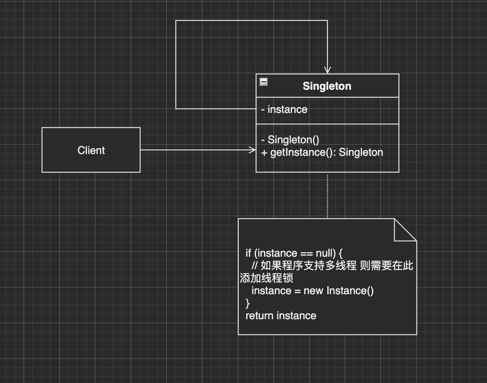

**单例模式** 是一种创建型设计模式， 让你能够保证一个类只有一个实例， 并提供一个访问该实例的全局节点。比如线程池、全局缓存、浏览器中的 window 对象等。

优点：

1. 可以保证一个类只有一个实例
2. 获得了一个指向该实例的全局访问节点
3. 仅在首次请求单例对象时对其进行初始化

缺点：

1. 违反了_单一职责原则_。 该模式同时解决了两个问题（1.保证一个类只有一个实例；2.为实例提供一个全局节点）
2. 该模式在多线程环境下需要进行特殊处理， 避免多个线程多次创建单例对象



一般创建方式：

```js
var Singleton = function(name) {
  this.name = name
}

Singleton.prototype.getName = function() {
  console.log(this.name)
}

Singleton.getInstance = (function() {
  var instance = null
  return function(name) {
    if (!instance) {
      instance = new Singleton(name)
    }
    return instance
  }
})()

var a = Singleton.getInstance('a')
var b = Singleton.getInstance('b')
console.log(a === b) // true=
```

这种方式创建单例，在js中并不算好，因为这增加了这个类的不透明性，使用者必须知道这个类是单例，并且使用 `getInstance()` 方法来创建单例。

JS中还有以下几种实现方式：

## 1. 透明的单例模式

用户从创建对象的时候，可以像使用其他任何普通对象一样。这里所谓透明，是指通过 `new` 的方式创建单例。

比如下面 `CreateDiv` 单例，它的作用是负责在页面中创建唯一的div节点：

```js
var CreateDiv = (function() {
  var instance
  
  var CreateDiv = function(html) {
    if (instance) {
      return instance
    }
    this.html = html
    this.init()
    return instance = this
  }
  
  CreateDiv.prototype.init = function() {
    var div = document.createElement('div')
    div.innerHTML = this.html
    document.body.appendChild(div)
  }
  
  return CreateDiv
})()

var a = new CreateDiv('a')
var b = new CreateDiv('b')
console.log(a === b) // true
```

上面写法的缺点：

1. 使用自执行的匿名函数（IIFE） 和 闭包， 并且让匿名函数立即返回真正的 **Singleton** 构造方法，程序阅读起来比较复杂
2. `CreateDiv` 构造函数实际负责2件事：创建对象和执行初始化 `init` 方法，违背 **单一职责原则**


## 2. 代理模式实现单例

通过引入代理类的方式可以解决上面的问题：

首先在 `CreateDiv` 构造函数中，把负责管理单例的代码移除出去，使其成为一个普通的创建div的类, 然后引入 **代理类**

```js
var CreateDiv = function(html) {
	this.html = html
  this.init()
}

CreateDiv.prototype.init = function() {
  var div = document.createElement('div')
  div.innerHTML = this.html
  document.body.appendChild(div)
}

// 代理类
var ProxySingletonCreateDiv = (function() {
  var instance
  return function(html) {
    if (!instance) {
      instance = new CreateDiv(html)
    }
    return instance
  }
})()

var a = new ProxySingletonCreateDiv('a')
var b = new ProxySingletonCreateDiv('b')
console.log(a === b) // true
```

现在把负责管理单例的逻辑移到了代理类 `ProxySingletonCreateDiv` 中，这样 **CreateDiv 普通 + ProxySingletonCreateDiv 组合达到单例的效果**（这个例子也是 **缓存代理的应用之一**）


## 3. 惰性单例

比如一个全局的Modal框，只有点击按钮的时候才将其添加到DOM文档中，添加之后，再次点击不是重新创建，而是使用之前创建好的之后又隐藏的那个modal框：

```html
<button id="btn">
  显示modal
</button>
```

惰性加载：

```js
// 利用闭包 + 高阶函数 + IIFE
var createLoginLayer = (function() {
  var div;
  return function() {
    if (!div) {
      div = document.createElement('div')
      div.innnerHTML = '登录Modal'
      div.style.display = 'none'
      document.body.appendChild(div)
    }
    return div
  }
})()

document.getElementById('btn').onclick = function() {
  var loginLayer = createLoginLayer()
  loginLayer.style.display = 'block'
}
```

缺点：

1. 违反单一职责，创建对象和管理单例的逻辑都放在了 `createLoginLayer` 对象内部
2. 无法复用，比如想要创建一个唯一的 `iframe`，几乎要将上面的代码重写一遍


## 4. ✨✨✨ 通用的惰性单例

为了解决上面的问题，我们需要把 **不变的部分隔离出来**，管理单例的逻辑其实完全可以抽象出来：用一个变量来判断是否已经创建过对象了，如果是，则下次直接返回该对象即可：

⚡️⚡️⚡️

```js
// 闭包 + 高阶函数 + apply
// result用来保存fn的计算结果，因为result在闭包中，因此它不会被销毁
var getSingleton = function(fn) {
  var result
  return function() {
    return result || (result = fn.apply(this, arguments))
  }
}
```

其余的业务逻辑部分：

比如创建一个div

```js
var createLoginLayer = function() {
  var div = document.createElement('div')
  div.innnerHTML = '登录Modal'
  div.style.display = 'none'
  document.body.appendChild(div)
  return div
}

var createSingleLoginLayer = getSingleton(createLoginLayer)
document.getElementById('btn').onclick = function() {
  var loginLayer = createSingleLoginLayer()
  loginLayer.style.display = 'block'
}
```

再比如创建一个iframe：

```js
var createIframe = function() {
  var iframe = document.createElement('iframe')
  document.body.appendChild(iframe)
  return iframe
}

var createSingleIframe = getSingleton(createIframe)
document.getElementById('btn').onclick = function() {
  var loginLayer = createSingleIframe()
  loginLayer.src = 'http://www.google.com'
}
```

**上面将创建实例对象的职责和管理单例的职责分开**。

 🌈🌈🌈

单例对象除了创建对象外，还可以让对象只绑定一次事件：

```js
var count = 0

var bindEvent = getSingleton(function() {
  count++
  document.getElementById('btn').onclick = function() {
    console.log('click')
  }
  console.log(`count: ${count}`)
  return true
})

var render = function() {
  console.log('开始渲染列表')
  bindEvent()
}
render()
render()
render()

// 打印
"render"
"count: 1"
"render"
"render"
```

可以看到，render函数和bindEvent函数都分别执行了3次，但是button实际上只被绑定了一个事件


总结：

1. 单例模式是一种简单但非常实 用的模式，特别是惰性单例技术，在合适的时候才创建对象，并且只创建唯一的一个
2. 将创建对象和管理单例的职责被分布在两个不同的方法中，这两个方法组合起来才具有单例模式的威力


扩展链接：

1. [singleton - design patterns@refactoring guru](https://refactoringguru.cn/design-patterns/singleton)


2020/12/29  20:21:17

