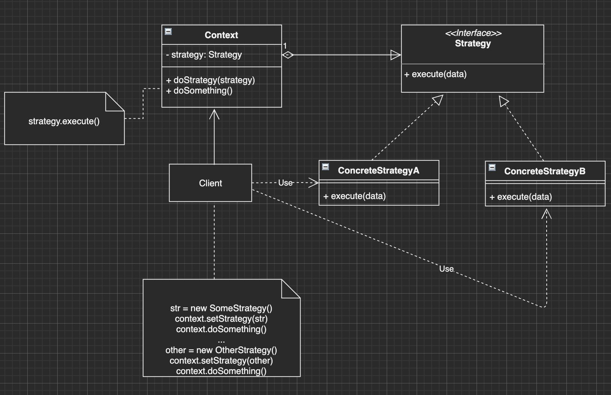

**策略模式** 是一种行为设计模式， 它能让你定义一系列算法， 并将每种算法分别放入独立的类中， 以使算法的对象能够相互替换。

优点：

1. 可在运行时切换算法
2. 将算法的实现和算法的使用隔离开来
3. 可以使用组合代替继承（组合优于继承），策略模式利用组合，委托和多态等技术和思想，可有效避免多重条件选择语句
4. 开闭原则：无需对上下文修改即可添加新的策略

缺点：

1. 客户端需要知道每一种算法的含义
2. 现代语言支持传入函数作为参数的方式传递算法，可减少接口和类的数量



使用场景：

1. 当你想使用对象中各种不同的算法变体，并希望能在运行时切换算法时，可使用策略模式
2. 当你有许多仅在执行某些行为时略有不同的相似类时，可使用策略模式
3. 当类中使用了复杂条件运算符以在同一算法的不同变体中切换时，可使用该模式

比如发放奖金有3种方式，可以通过下面的多个 `if` 语句进行切换：

```js
/**
 * level: 奖金的界别
 * salary: 薪水
 */
var calculateBonus = function(level, salary) {
  // 多个算法分支的情况 可以考虑使用策略模式
  if (level === 'S') return salary * 4 // S级别的表现 工资 * 4 作为奖励
  if (level === 'A') return salary * 3 
  if (level === 'B') return salary * 2 
}

calculateBonus('S', 4000) // 16000
calculateBonus('A', 2000) // 6000
```

使用传统的策略模式方式将算法和上下文进行分离：

```js
// 算法类
class LevelS {
  calculate(salary) {
    return salary * 4
  }
}

class LevelA {
  calculate(salary) {
    return salary * 3
  }
}

class LevelB {
  calculate(salary) {
    return salary * 2
  }
}

// 上下文
class Bonus {
  constructor(salary) {
    this.salary = salary
    this.strategy = null
  }
  
  // 设置策略
  setStrategy(strategy) {
    this.strategy = strategy
  }
  
  calculate() {
    // 使用策略模式来计算奖金
    this.strategy.calculate(this.salary)
  }
}

// Client代码
var bonus = new Bonus(10000)

bonus.setStrategy(new LevelS()) // 设置策略为 LevelS
bonus.calculate() // 使用算法计算奖金 为 40000

// 动态的更换算法
bonus.setStrategy(new LevelB()) // 将策略动态的设置为 LevelB
bonus.calculate() // 使用算法计算奖金 为 20000
```

除了所有语言通用的传统写法外，JS还有以下几种写法：


## 1. JS对象方式的策略模式

因为JS中，函数也是对象，可以将所有的策略都放在一个大的对象中，因此上面的写法可以写为：

```js
const strategies = {
  S: salary => salary * 4,
  A: salary => salary * 3,
  B: salary => salary * 2
}

const calculateBonus = (level, salary) => strateies[level](slary)

// Client
calculateBonus('S', 10000) // 40000
calculateBonus('A', 10000) // 30000
```


## 2. 函数作为一等公民

JS中可以将函数作为参数或者返回值来使用，因此上面的js语言的动态性，可以将上面的例子改写为：

```js
const S = salary => salary * 4
const A = salary => salary * 3
const B = salary => salary * 2

// 将算法直接作为函数的参数传入
const calculateBonus = (calculate, salary) => calculate(salary)

calculateBonus(S, 10000) // 40000
calculateBonus(B, 10000) // 20000
```

## 3. ✨✨✨更广义的算法

策略模式除了封装一系列算法外，还可以用来封装一系列的 **业务规则**。

比如下面的表单验证：

1. 用户名不能为空
2. 密码长度不能少于6位
3. 手机号码必须符合格式

一个表单组件可以使用多个规则，html如下：

```html
<form action="/something" id="form" method="post">
  用户名：<input type="text" name="username" />
  密码：<input type="password" name="password" />
  手机号：<input type="text" name="phone" />
</form>
```

一般的验证逻辑：

```js
const form = document.getElementById('form')
form.onsubmit = function() {
  if (form.username.value === '') {
    console.log('用户名不能为空')
    return false
  }
  
  if (form.password.value.length < 6) {
    console.log('密码长度不能少于6位')
    return false
  }
  
  if (!/(^1[3|5|8][0-9]{9}$)/.test(form.phone.value)) {
    console.log('手机格式不正确')
    return false
  }
}
```

这样写虽然没什么问题，但是缺点是：

1. `if-else` 语句太多
2. 缺乏弹性，如果要将密码的长度修改为8位，则需要更改 `form.onsubmit` 内部实现，不符合开闭原则
3. 算法的复用性差，如果有另一个表单，需要类似的验证，则需要将这一套逻辑再写一遍


下面使用策略模式改写上面的业务逻辑：

```js
// 策略对象
const strategies = {
  isNotEmpty: (value, errorMsg) => {
    if (value === '') return errorMsg
	},
  minLength: (value, length, errorMsg) => {
    if (value.length < length) return errorMsg
  },
  isMobile: (value, errorMsg) => {
    if (!/(^1[3|5|8][0-9]{9}$)/.test(value)) return errorMsg
  }
}

// Validator类
class Validator {
  constructor() {
    this.cache = []
  }
  
  add(dom, rules) {
    let self = this
    for (let i = 0, rule; rule = rules[i++];) {
      (function(rule) {
        const strategyAry = rule.strategy.split(':') // 把 strategy 和 参数分开
        const errorMsg = rule.errorMsg
        
        self.cache.push(function() { // 把校验的步骤用空函数包装起来，并放入cache中
          const strategy = strategyAry.shift() // 用户选择的算法
          strategyAry.unshift(dom.value) // 添加dom中对应的value到参数列表中
          strategyAry.push(errorMsg) // 把errorMsg添加到参数列表中
         	return strategies[strategy].apply(dom, strategyAry)
        })
      })(rule)
    }
  }
  
  start() {
    for (let i = 0, validatorFunc; validatorFunc = this.cache[i++];) {
      const errorMsg = validatorFunc()
      if (errorMsg) {
        return errorMsg
      }
    }
  }
}


// 客户端代码
const form = document.getElementById('form')

const validateFunc =  function() {
  const validator = new Validator()
  
  // 验证逻辑
  validator.add(form.username, [
    {
      strategy: 'isNotEmpty',
      errorMsg: '用户名不能为空'
    },
    {
      strategy: 'minLength:4', // 包含策略和策略中的参数 用用 `:` 隔开
      errorMsg: '用户名不能少于4位'
    }
  ])
  
  validator.add(form.password, [
    {
      strategy: 'minLength:6', // 包含策略和策略中的参数 用用 `:` 隔开
      errorMsg: '密码长度不能少于6位'
    }
  ])
  
  validator.add(form.phone, [
    {
      strategy: 'isMobile', // 包含策略和策略中的参数 用用 `:` 隔开
      errorMsg: '手机格式不正确'
    }
  ])
  
  const errorMsg = validator.start()
  
  return errorMsg
}

form.onsubmit = function() {
  const errorMsg = validateFunc()
  
  if (errorMsg) {
    console.log(errorMsg)
    return false
  }
}
```

总结，策略模式一种很简单且常见的模式，JS中的实现在传统的实现上，可以利用其自身语言的动态性，使用不同的方式进行实现，策略模式除了封装不同算法外，还可以对业务逻辑进行封装。

扩展阅读：

1. [策略模式 - 行为模式@Refactoring guru](https://refactoringguru.cn/design-patterns/strategy)
2. [策略模式 - 水球潘@youtube 🌟强烈推荐](https://www.youtube.com/watch?v=IkG_KuMpQRM&list=PLicQRHHL75d7EXEI9nWfUYJyrPdI79M70&ab_channel=%E6%B0%B4%E7%90%83%E6%BD%98)

2020-12-31 15:47:04

