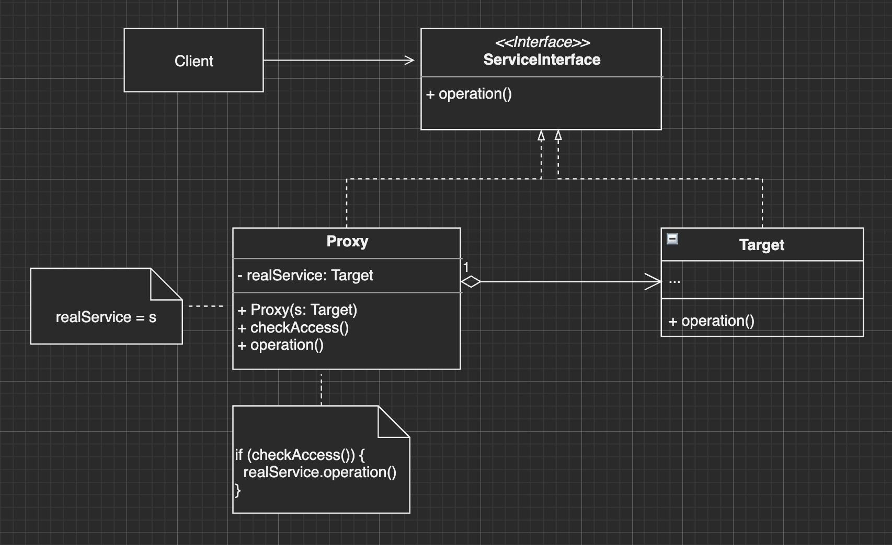

**代理模式** 是一种结构型设计模式， 让你能够提供对象的替代品或其占位符。 代理控制着对于原对象的访问， 并允许在将请求提交给对象前后进行一些处理。

通俗理解就是，本来A要完成的事，由于某种原因，它将这件事委托给B来处理。

优点：

1. 保护代理，用于控制不通权限的对象对目标对象的访问
2. 可以在客户端毫不知觉的情况下控制服务对象，比如将代理对象和目标对象接口设置为一致，这样客户端使用时就不会觉察到不同
3. 延迟初始化，在实际有需要时再创建目标对象，较少开销
4. 符合封闭原则

缺点：

1. 可能需要多个接口，增加复杂性



使用场景：

1. 延迟初始化（虚拟代理）：比如对象比较大，无需一开始就初始化，只有在真正使用到时再进行初始化
2. 访问控制（保护代理）：代理可以在客户端满足要求时，将请求转发给目标对象
3. 记录日志请求（日志记录代理）：在使用目标对象的前后，可以添加日志
4. 缓存请求结果（缓存代理）：代理可对重复请求所需的相同结果进行缓存， 还可使用请求参数作为索引缓存的键值；适用于需要缓存客户请求结果并对缓存生命周期进行管理时， 特别是当返回结果的体积非常大时。

一般示例，比如A送花给C，但是B和C比较要好，B可以代理A的请求，在C心情好的时候，将A的花送给C：

```js
const Flower = function() {}

// 目标对象：被代理的类
const A = {
  sendFlower: function(target) {
    const flower = new Flower()
    target.receiveFlower(flower)
  }
}

// 代理类
// 代理A的请求
const B = {
  receiveFlower: function(flower) {
    console.log('B receiveFlower')
    C.hasGoodMood(function() {
      C.receiveFlower(flower)
    })
  }
}


const C = {
  receiveFlower: function(flower) {
    console.log(`C收到🌹 ` + flower)
  },
  hasGoodMood: function(fn){
    setTimeout(() => { // 假设C过3s之后心情变好
      fn()
    }, 3000)
  }
}

// 客户端代码
A.sendFlower(B)
```

代理在js中的其它应用：


## 1. 虚拟代理实现图片预加载

不使用代理：

```js
var myImage = (function() {
  let img = document.createElement('img')
  document.body.appendChild(img)
  let image = new Image()
  image.onload = function() {
    // 网络图片加载完成后，将占位图替换
    img.src = image.src
  }
  
  return {
    setSrc: function(src) {
      img.src = './placeholder.jpg' // 使用占位图
      image.src = src // 加载网络图片
    }
  }
})()

// 使用
myImage.setSrc('https://www.xx.dog.png')
```

这样写的缺点：

1. 破坏了单一职责的原则，这个类有2个功能点： 给img设置src的同时还要负责预加载图片。这样会形成耦合，假设MyImage之后不需要占位图的功能，则需要更改源码，不符合开闭原则

使用代理的方式：

```js
let myImage = (function() {
  let img = document.createElement('img')
  document.body.appendChild(img)
  
  return {
    setSrc: function(src) {
      img.src = src
    }
  }
})()

// 代理类
let proxyImage = (function() {
  let image = new Image()
  image.onload = function() {
    // 使用Target类
    myImage.setSrc(this.src)
  }
  
  return {
    setSrc: function(src) {
      myImage.setSrc('./placeholder.jpg')
      image.src = src
    }
  }
})()

// 客户端使用
proxyImage.setSrc('https://www.xx.dog.png')
```

通过代理类 **间接** 的访问了被代理的类myImage，请求客户端使用了相同的 `setSrc` 方法，对使用者是透明的，另外这也符合单一职责功能。

上面的写法，返回一个对象，因为js中函数也是对象，我们可以直接的返回函数：

```js
let myImage = (function() {
  let img = document.createElement('img')
  document.body.appendChild(img)
  
  return function(src) {
    img.src = src
  }
})()

// 代理类
let proxyImage = (function() {
  let image = new Image()
  image.onload = function() {
    // 使用Target类
    myImage.setSrc(this.src)
  }
  
  return function(src) {
    myImage.setSrc('./placeholder.jpg')
    image.src = src
  }
})()

// 客户端使用
proxyImage('https://www.xx.dog.png')
```


## 2. 虚拟代理合并HTTP请求

比如有如下checkboxes，用户勾选后，就发送一个请求

```html
<input type="checkbox" id="1" /> 1
<input type="checkbox" id="2" /> 2
<input type="checkbox" id="3" /> 3
<input type="checkbox" id="4" /> 4
<input type="checkbox" id="5" /> 5
```

勾选就发送请求：

```js
const synchronousFile = function(id) {
	console.log(`开始同步文件，id: ${id}`)	
}

const boxes = document.getElementByTagName('input[type="checkbox"]')
for (let i, c; c = boxes[i]; i++) {
  c.onclick = function() {
    if (this.checked) {
      synchronousFile(this.id)
    }
  }
}
```

这样的缺点是，会造成大量的请求，如果需求允许，将所有的勾选项目一起打包请求，则可以使用代理类完成：

```js
const proxySynchronousFile = (function() {
  let cache = []; // 保存一段时间内需要同步的ID
  let timer;
  
  return function(id) {
    cache.push(id)
    if (timer) { // 保证不会覆盖已经启动的定时器
      return
    }
    
    timer = setTimeout(function() {
      synchronousFile(cache.join(',')) // 2s后同步所有ID
      clearTimeout(timer)
      timer = null
      cache.length = 0 // 清空ID集合
    }, 2000)
  }
})

const boxes = document.getElementByTagName('input[type="checkbox"]')
for (let i, c; c = boxes[i]; i++) {
  c.onclick = function() {
    if (this.checked) {
      proxySynchronousFile(this.id)
    }
  }
}
```


##  3 ✨✨✨缓存代理

代理可对重复请求所需的相同结果进行缓存，可以将请求参数作为缓存的key

假设下面计算是一个很耗时的计算

```js
const compute = function() {
  console.log('开始计算')
  let a = 1
  let l = arguments.length
  for (let i = 0; i < l; i ++) {
    a *= arguments[i]
  }
  return a
}

// 上面的耗时操作将执行2次 即使参数完全一致
compute(2, 3, 4)
compute(2, 3, 4)
```

使用代理进行缓存：

```js
const proxyCompute = (function() {
  let cache = {}
  return function() {
    // 使用 ',' 将所有的参数合并成一个字符串 用作key
    var args = Array.prototype.join.call(arguments, ',')
    
    if (args in cache) { // 如果存在在缓存中
      return cache[args] // 直接返回缓存的结果
    }
    
    // 如果不在缓存中， 则使用Target的方法；并将结果添加到缓存中
    return cache[args] = compute.apply(this, arguments)
  }
})()

// 上面的耗时操作只执行1次
compute(2, 3, 4)
// 直接从缓存中读取结果
compute(2, 3, 4)
```

## 4. 使用高阶函数动态创建代理

可以使用一个工厂函数，动态的创建代理：

```js
const createProxy = function(fn) {
  let cache = {}
  return function() {
    let args = Array.prototype.join.call(arguments, ',')
    if (args in cache) {
      return cache[args]
    }
    return cache[args] = fn.apply(this, arguments)
  }
}

const multProxy = createProxy(compute)
```


总结：代理模式是一种很常见的模式，其本质就是A委托B做本该A完成的事(**实际上B中还是会使用A提供的方法完成该事情**)，B可以在将完成任务转交给A之前，自定义一些逻辑。

写代码时，可以不必使用代理，只有当直接使用目标对象不方便时，再考虑使用代理。

另外，ES6中添加了一个原生的 [Proxy](https://developer.mozilla.org/zh-CN/docs/Web/JavaScript/Reference/Global_Objects/Proxy) 类型，我们可以利用它对对象完成更多代理工作，比如Vue和Mobx中就充分利用这个类型，对对象的属性和方法进行代理，动态的监听属性的变化或方法的调用等等。


扩展阅读：

1. [代理模式 - 结构模式@Refactoring guru](https://refactoringguru.cn/design-patterns/proxy)


2021/1/2 16:59:39

