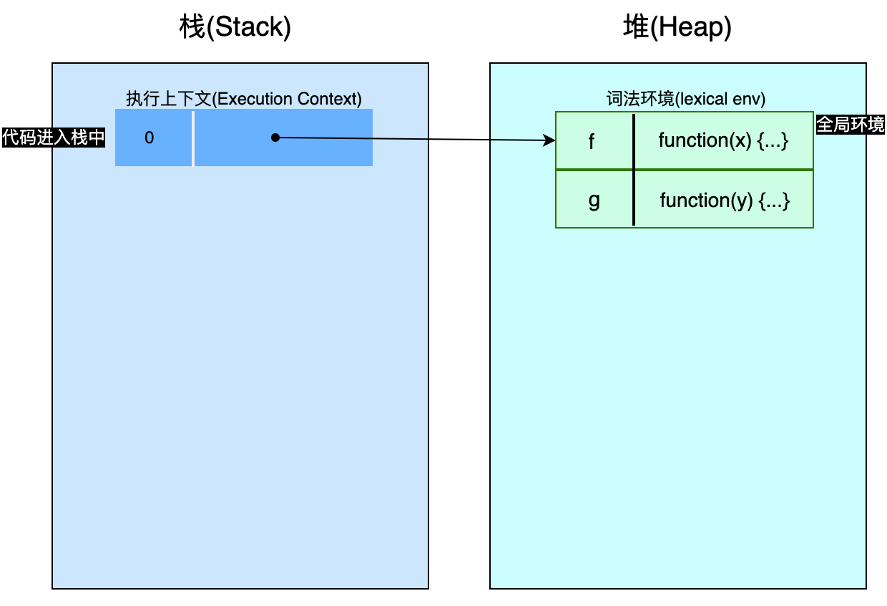
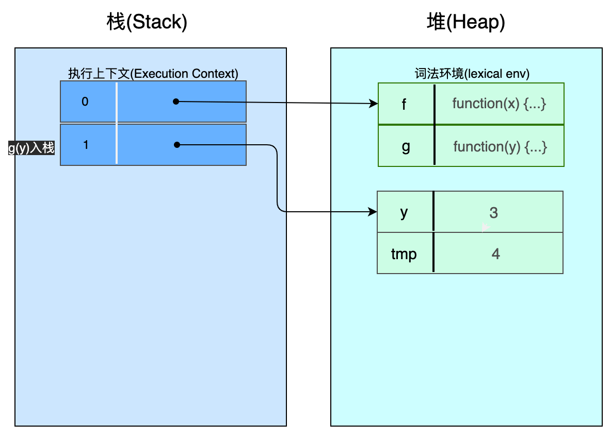
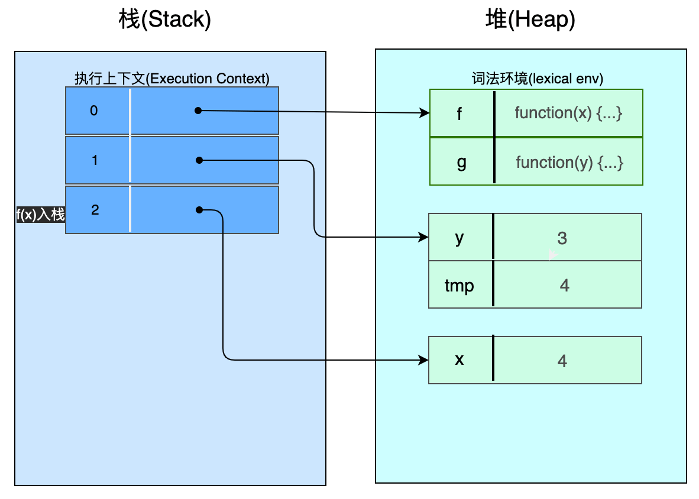
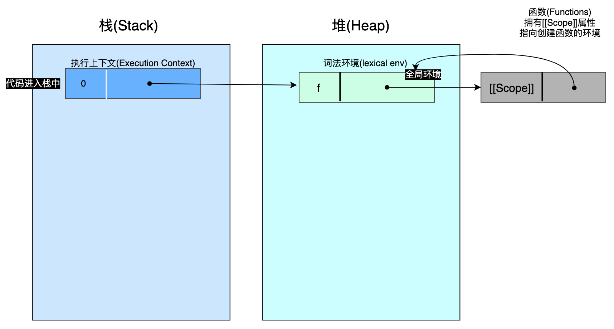
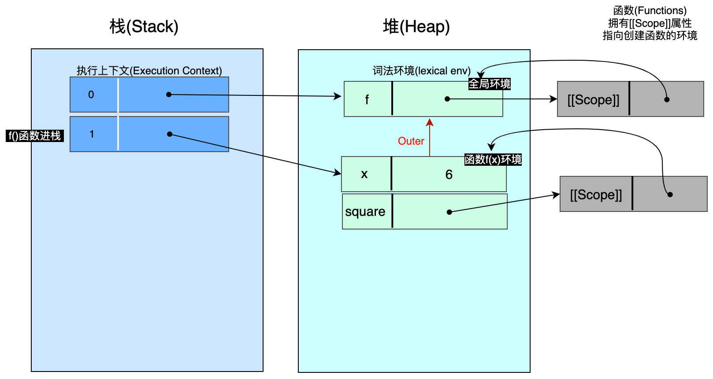
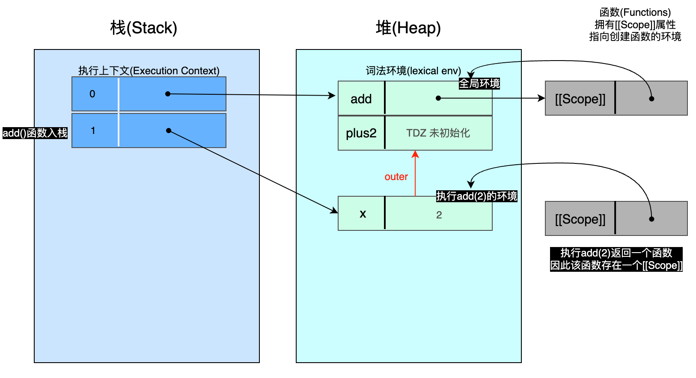
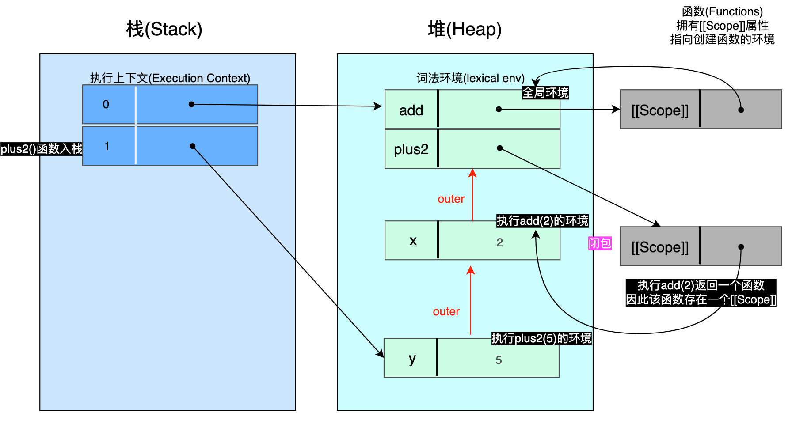

目录：

1. [Envirnment: data structure for managing variables](#1)
2. [Recursion via environments](#2)
   1. [Executing the code](#2.1)
3. [Nested scopes via environments](#3)
   1. [Executing the code](#3.1)
4. [Closures and environments](#4)
   1. [Executing the code](#4.1)


## 1️⃣ 环境：一种管理变量的数据结构

🚀*环境是ECMAScript规范中用于管理变量的一种数据结构*

- 它是一个字典，其keys是变量名，其值是对应变量的值
- 每个作用域（`scope`）都有相关联的环境
- 💡环境必须支持以下与变量相关的现象
  - 递归（`Recursion`）
  - 嵌套作用域（`Nested scopes`）
  - 闭包（`Closures`）

接下来会用示例演示每一种现象是如何完成的。


<p id="2"></p>


## 2️⃣ 通过环境进行递归

我们先处理递归，演示代码：

```js
function f(x) {
  return x * 2
}

function g(y) {
  const tmp = y + 1
  return f(tmp)
}

assert.equal(g(3), 8)
```

对每个函数的调用，你需要为调用的函数的变量（*参数和本地变量*）刷新存储空间。

👩🏻‍🏫

1. 这是通过一种叫做 *执行上下文（`execution contexts`）的**栈**管理的*，这个执行上下文指向环境（`environments`）😎
2. 环境自身是存在于堆（`Heap`）中的。存在于堆中是有必要的，因为在执行离开它们的作用域后，它们偶尔会继续存在（闭包现象）。因此它们不能通过栈就行管理


<p id="2.1"></p>


### 2.1 执行代码

当执行代码时，我们做下面暂停⏸（`pauses`）:

```js
function f(x) {
  // 暂停3
  return x * 2
}

function g(y) {
  const tmp = y + 1
  // 暂停2
  return f(tmp)
}

// 暂停1
assert.equal(g(3), 8)
```

这个过程是：

- 暂停1：在调用 `g()` 之前
- 暂停2：当执行 `g()` 时
- 暂停3：当执行 `f()` 时
- 剩下步骤：每次碰到 `return` 语句时，一个 *执行上下文（`execution context`）* 从栈（`stack`） 中移除

步骤图解：



👆🏻暂停1 - 在调用 `g()` 之前：执行上下文栈有一个条目(`entry`)，指向最顶层的环境（译者注：最顶层环境为全局环境）。在这个环境中有2个条目：一个是`f()`另一个是 `g()`。



暂停2 - 执行 `g()` 时：最顶部的执行上下文栈（译者注：调用g()函数时，g()函数压入栈，位于栈的最顶部）指向为 `g()` 函数创建的环境（新的一个环境）。这个环境包括了参数 `y` 和本地变量 `tmp` 2个条目。



暂停3 - 当执行 `f()` 函数时：最上层的执行上下文（译者注：此时是 `f(x)` 在栈的最上层）指向 `f()` 创建的环境。


<p id="3"></p>


## 3️⃣ 通过环境形成嵌套作用域

使用下面代码探索如何通过环境形成嵌套作用域（`Nestes Scopes`）:

```js
function f(x) {
  function square() {
    const result = x * x
    return result
  }
  
  return sqaure()
}

assert.equal(f(6), 36)
```

这里我们有3个嵌套作用域：最上层的作用域（译者注：全局作用域），`f()` 的作用域，`square()` 的作用域。观察：

- 📚作用域是连在一起的。内部作用域继承所有外部作用域的变量，除了哪些被遮挡（`shadowed`）的变量（译者注：比如外部作用域定义了一个 `const a = 10`, 而内部作用域也定义了一个 `a` 变量，则内部作用域的变量 `a` 会遮挡外部作用域的变量 `a`）
- 嵌套作用域是独立于递归的机制。递归最好由独立的环境堆管理，而嵌套作用域则表示环境与其创建环境之间的关系

🚀 因此，*每个作用域的环境通过一个名为 `outer` 的属性指向它周围作用域的环境*。

- 当我们查询一个变量的值时，我们先在当前环境中搜索该名字的变量
- 如果找不到就在其外部环境（`outer environment`）中查找，如果还找不到，就接着在外部环境的外部环境中查找（译者注：类似原型链）
- 当前环境能访问整个外部环境链中包含的所有变量（除了遮挡的变量）

🚀 *当你调用函数时，就会创建一个新的环境*。当前环境的外部环境是创建该函数的环境📚。为了帮助设置通过函数调用而生成的环境的 `outer` 属性，每个函数内部有一个叫 `[[Scope]]` 的属性会指向其出生环境（`birth environment`） 🤩。


<p id="3.1"></p>


### 执行代码

下面是我们执行代码是的暂停点：

```js
function f(x) {
  function square() {
    const result = x * x
    // 暂停3
    return result
  }
  
  // 暂停2
  return sqaure()
}

// 暂停1
assert.equal(f(6), 36)
```

这个过程是：

- 暂停1 - 在调用 `f()` 函数前
- 暂停2 - 当执行 `f()` 函数时
- 暂停3 - 当执行 `square()` 函数时
- 之后，`return` 语句函数出栈

步骤图解：



👆🏻暂停1 - 在调用 `f()` 函数前：最上层环境（全局环境）有一个条目，即 `f()`。 而 `f()` 函数的出生环境为最上层环境（译者注：即这里的全局环境）。因此 f 函数的 `[[Scope]]` 指向这个全局环境。




暂停2 - 当执行 `f()` 函数时：现在已经存在一个调用 `f(6)` 的环境了（译者注：全局环境）。全局环境是`f()` 函数执行时所生成的环境的出生环境，因此执行 `f()` 函数的环境的 `outer` 属性指向全局环境。而新函数 `square()`  的 `[[Scope]]` 指向创建它的环境（即这里的 f(x)执行生成的环境）。


暂停3 - 当执行 `square()` 函数时：重复先前模式：square函数执行生成的环境的 `outer` 指向其 `[[Scope]]` 指向的环境。*作用域链通过 `outer` 属性创建，包含所有活动的变量📚*。例如，如果我们愿意的话，可以访问 `result` & `square`  & `f` 变量。环境反应了变量的2个方面：

1. 外部环境链反应了嵌套静态作用域
2. 执行上下文栈反应了正在动态调用哪一个函数


<p id="4"></p>


## 4️⃣ 闭包与环境

为了了解环境如何用于实现 [闭包（`closures`）](https://exploringjs.com/impatient-js/ch_variables-assignment.html#closures)，我们使用下面示例：

```js
function add(x) {
  return (y) => { // A
    return x + y
  }
}

assert.equal(add(3)(1), 4) // B
```

这里发生了什么？`add()` 是一个函数，它返回另一个函数。当我们在B行位置调用嵌套函数 `add(3)(1)` 时，第一个参数是给 `add()` 的，第2个参数则是给它返回的函数的。 *这是可行的，因为在A行位置创建的函数在离开出生作用域（`birth scope`）时不会失去与该作用域的连接。* 关联的环境通过这种联系得以存活下来，函数仍可访问变量 那个环境中的 `x`（x在该函数中被释放）。

这种嵌套调用 `add()` 的方式有个优点：你可以先调用第一个函数，得到一个参数已经填充的 `add()` 版本：

```js
const plus2 = add(2)
assert(plus2(5), 7)
```

📚将一个有2个参数的函数转换为参数各1个的2个嵌套的函数，这称之为库里（`currying`）, `add()` 就是一个库里化的函数。

只填充函数的部分参数称之为 *部分应用（`partial application`）* （函数还没有完全应用）。[bind()](https://exploringjs.com/impatient-js/ch_single-objects.html#function-prototype-bind) 函数便执行了部分应用。在上面的例子中，我们可以发现，对一个函数进行库里化，部分应用变得很简单。


<p id="4.1"></p>


### 执行代码

当我们执行上面代码时，添加3个暂停点：

```js
function add(x) {
  return y => {
    // 暂停3：plus2(5)
    return x + y
  } // 暂停1：add(2)
}

const plus2 = add(2)

// 暂停2
assert.equal(plus2(5), 7)
```

这个过程是：

- 暂停1 - 在执行 `add(2)` 过程
- 暂停2 - 在执行 `add(2)` 之后
- 暂停3 - 当执行 `plus2(5)` 时

步骤图解：



👆🏻暂停1 - 在执行 `add(2)` 过程：这里可以看到 `add()` 返回的函数已经存在（右下角），因此返回的函数的内部属性 `[[Scope]]` 指向它的出生环境（`birth environment`）。注意🚨, `plus2` 处于临时死区（`TDZ`） ，未被初始化。


🚀暂停2 - 在执行 `add(2)` 之后：`plus2` 现在指向 `add(2)` 返回的函数。该函数通过 `[[Scope]]` 属性保持它的出生环境（即 `add(2)` 执行环境）在 `add(2)` 执行完成出栈之后仍旧存活。



暂停3 - 当执行 `plus2(5)` 时：执行 `plus2(5)` 产生的新环境的 `outer`属性指向 `plus2` 指向的 ` [[Scope]]` 指向的环境，这也是为什么当前函数能访问 `x` 的原因 😎。


原文链接：

- [4 Environments: under the hood of variables](https://exploringjs.com/deep-js/ch_environments.html)

2022年07月05日01:04:21

PS: 相比于原版配图，自己画的图添加了一些色彩和注解，但整体流程是一致的。