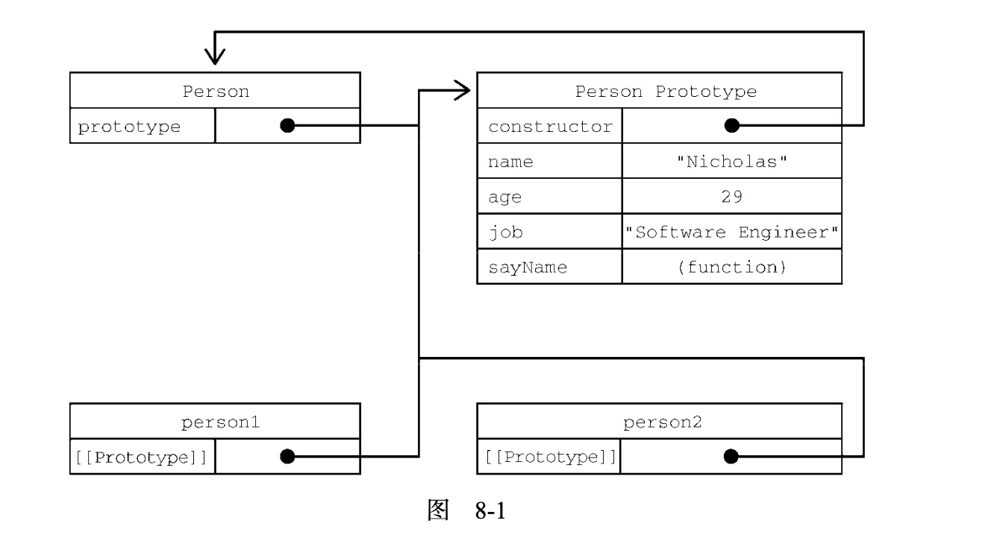
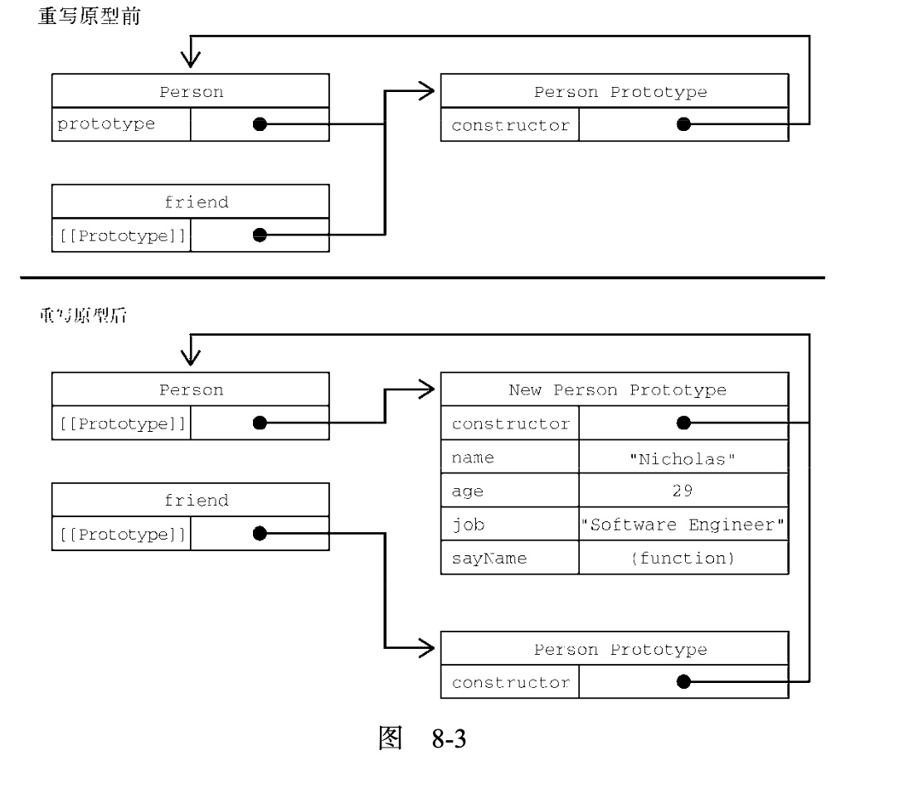
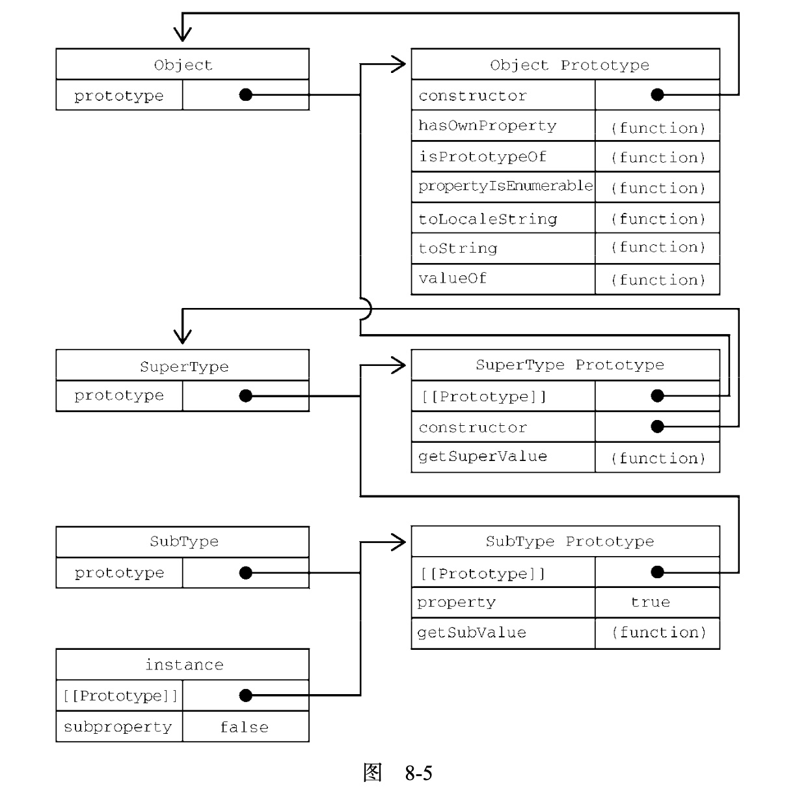

第8章的内容梗概：

1. **Object** 上的部分属性和方法
2. 对象解构的理解
3. 理解原型和原型链
4. 创建对象的几种方式
5. ES6之前的几种继承方式的写法以及优缺点
6. ES6 class语法糖，如何模拟抽象类

## 1.属性的类型

属性分为：

1. 数据属性
2. 访问属性 getter & setter


> 1. 数据属性

包含保存数据值的位置：

1. **`[[Configurable]]`**: 表示属性是否可以通过 `delete` 删除并重新定义，是否可以修改它的特性，以及是否可把它改为访问器属性，默认为 `true`；⚠️如果设置为 `false`, 则之后就不能更改为 `true` 
2. **`[[Enumerable]]`**: 表示属性是否可以通过 `for-in` 循环返回，默认为 `true`
3. **`[[Writable]]`**: 表示属性值是否可以被修改，默认为 `true`
4. **`[[Value]]`**: 包含属性实际的值，默认为 `undefined`

对象字面量：

```js
// 则 [[Configurable]] & [[Enumerable]] & [[Writable]] 都将是默认值 true
// [[Value]] 值则为 'Kobe'
let person = {
  name: 'Kobe'
}
```

如果要修改属性的默认特性，则需要使用下面方法：**如果使用下面方法定义了部分属性，则未定义的默认为 `false`**

- **`Object.defineProperty(o: any, p: PropertyKey, attributes: PropertyDescriptor & ThisType<any>): any;`**: 定义对象上单个属性值
- **`Object.defineProperties(o: any, properties: PropertyDescriptorMap & ThisType<any>): any;`**：同时定义对象多个属性值

示例： **⚠️非严格模式下，没有效果；严格模式下，抛出错误**

```js

// 1. 设置 [[Writable]], 是否能修改属性
// 其余未定义的 enumerable & configurable 则默认为 false
let person = {}
Object.defineProperty(person, 'name', {
  writable: false, // 表示不能再修改
  value: 'Kobe'
})
// 尝试修改
person.name = 'James'

console.log(person.name) // 'Kobe' 不变


// 2. 设置 [[Configurable]]，是否能删除属性
let person = {}
Object.defineProperty(person, 'name', {
  configurable: false, // 表示不能删除
  value: 'Kobe'
})
delete person.name // 没有效果

// 尝试将其再修改为 true，抛出错误
Object.defineProperty(person, 'name', {
  configurable: true,
  value: 'Kobe'
})
```

> 2. 访问器属性

就是 **`Getter & Setter`**, 有4个特性描述它们的行为：

1. **`[[Configurable]]`**: 表示属性是否可以通过 `delete` 删除并重新定义，是否可以修改它的特性，以及是否可把它改为数据属性，默认为 `true`
2. **`[[Enumerable]]`**: 表示属性是否可以通过 `for-in` 循环返回，默认为 `true`
3. **`[[Get]]`**: 读取属性，默认是 `undefined`
4. **`[[Set]]`**: 设置属性，默认是 `undefined`

示例：

```js
let book = {
  year_: 2017, // 私有属性（约定俗成的写法）
  edition: 1
}
Object.defineProperty(book, 'year', {
  get() {
    return this.year_
  },
  set(newValue) {
    if (newValue > 2017) {
      this.year_ = newValue
      this.edition += newValue - 2017
    }
  }
})
```

使用 **`Object.defineProperties()`** 定义多个属性：

```js
let book = {}
Object.defineProperties(book, {
  year_: {
    value: 2017,
  },
  edition: {
    value: 1
  },
  get() {
    return this.year_
  },
  set(newValue) {
    if (newValue > 2017) {
      this.year_ = newValue
      this.edition += newValue - 2017
    }
  }
})
```

上面的 **`year_ & edition`** 属性没有定义 `configurable & enumerable & writable`, 则将默认设置为 `false`


## 2. 读取对象上的属性

主要有以下方法：

1. **`Object.getOwnPropertyDescriptor(o: any, p: PropertyKey): PropertyDescriptor | undefined;`**: 获取指定属性描述符
2. **`Object.getOwnPropertyDescriptors()`**：获取多个属性描述符（ES7）

比如上面的 `book` 对象：

```js
// 获取 'year_' 属性
let descriptor = Object.getOwnPropertyDescriptor(book, 'year_')

// descriptor 如下
{
  configurable: false,
  enumerable: false,
  writable: false,
  value: 2017
}

// 获取多个属性
let descriptors = Object.getOwnProertyDescriptors(book)

// descirptors
{
  edition: {
    configurable: false
		enumerable: false
		value: 1
		writable: false
  },
  get: {
    configurable: false
    enumerable: false
    value: undefined
    writable: false
  },
	set: {
    configurable: false
    enumerable: false
    value: undefined
    writable: false
  },
	year_: {
    configurable: false
    enumerable: false
    value: 2017
    writable: false
  }
}
```

## 3. 合并对象

相关 `Object`静态 方法：

1. **`Object.assign(target: object, ...sources: any[]): any;`**: 将所有 `enumerable` 属性浅拷贝到目标对象
2. **`Object.is(value1: any, value2: any): boolean;`**: 判断2个值是否相等，注意和 `=== || ==` 之间的区别

`Object` 实例方法:

1. **`hasOwnProperty(v: PropertyKey): boolean`**: 属性是否是对象自身定义的，而不是原型链上的
2. **`propertyIsEnumerable(v: PropertyKey): boolean;`**: 属性是否可枚举


示例：

```js
// Object.assign()
let dest = {}
let src = { id: 1, obj: { age: 10 }}
let result = Object.assign(dest, src)
console.log(result === dest)  // true

dest.obj.age = 20
console.log(src.obj.age) // 20 因为浅拷贝
dest.hasOwnProperty('id') // true
dest.propertyIsEnumerable('id') // true
```

如果出错，没有回滚：

```js
let dest = { a: 1 }
let src = {
	a: 2,
	get b() {
		// Object.assign() 在调用这个函数时会抛出错误
		throw new Error()
	},
	c: 3
}
try {
	Object.assign(dest, src)
} catch(e) {}

console.log(dest)
// 未出错前的 a 被修改
{
	a: 2
}
```

**想等性测试**：

```js
+0 === -0 // true
{} === {} // false
"2" === 2 // false
NaN === NaN // false
isNaN(NaN) // true

Object.is(+0, -0)  // false
Object.is({}, {})  // false
Object.is(NaN, NaN) // true
```


##  4. 对象解构

1.解构在内部使用函数 **`TOObject()`**(不能在运行时环境中直接访问这个函数) 把源数据结构转换为对象，这表示在对象解构的上下文中，**原始值会被当成对象， 因此 `null & undefined` 不能被解构，否则抛出错误**

```js
// 在对象解构的上下文中， 原始类型当作对象
let { length } = 'football'
console.log(length) // 6

let { constructor: c } = 4
console.log(c === Number) // true

// 抛出错误
let { _ } = null
let { _ } = undefined
```

**2.解构不要求变量必须声明在表达式中，但是，如果事先声明变量赋值，则赋值表达式必须包含在一对括号中：**

```js
let person = { age: 10, name: 'kobe' }

// 方式1
// 直接声明在表达式中
let { age: personAge, name: personName } = person

// 方式2
let personName, personAge // 事先声明
// 必须包含在一对括号中
({age: personAge, name: personName} = person) 
```

3.解构和 `Object.assign()` 一样，如果出错，则会部分解构，**不会回滚**

```js
let person = { age: 10, name: 'kobe' }

let personName, personAge, personBar

try {
	// person.foo 是 undefined 解构抛出错误
	({name: personName, foo: { bar: personBar }, age: personAge} = person)
} catch(err) {}

console.log(personName, personBar, personAge)
// 部分解构
kobe
undefined
undefined
```


## 5. 创建对象

ES6出现之前有以下几种方式创建对象：（JS中的函数既可以作为普通函数也可以作为构造函数）

1. 工厂模式：使用函数创建对象，缺点就是 **无法推断对象类型**

 	2. **构造函数**： 使用 **`new`** 操作符，调用函数，缺点就是 **定义在其上的方法，会在每个实例上都创建一遍，浪费空间**
 	3. **原型模式**：每个函数都会创建一个 **`prototype`** 对象，可包含共享的属性和方法，这个对象需通过构造函数创建


### 5.1 工厂模式

大致方式：

```js
function createObject(name, age) {
  // 1.创建对象
	let o = new Object()
  // 2.在对象上添加属性和方法
	o.name = name
	o.age = age
	o.sayName = function() {
		console.log(this.name)
	}
  // 返回对象
	return o
}

// 使用
let kobe = createObject('kobe', 24)
let james = createObject('james', 23)
```


### 5.2 构造函数

**按照规定，构造函数名首字母大写，使用 `new` 操作符调用**

```js
function Person(name, age) {
	this.name = name
	this.age = age
	this.sayName = function() { console.log(this.name) }
}
// 等价于
let Person = function(name, age) {
	this.name = name
	this.age = age
	this.sayName = function() { console.log(this.name) }
}

let kobe = new Person('kobe', 24)
let james = new Person('james', 23)
```

和工厂函数的区别：

1. 没有创建一个临时对象
2. 属性和方法直接赋值给 `this`
3. 没有 `return`
4. 函数名首字母大写，并使用 `new` 调用

调用构造函数过程如下：

1. 在内存中创建一个新对象
2. 这个对象内部的 **`[[prototype]]`** 特性被赋值为构造函数的 `prototype` 属性
3. 构造函数内部的 `this` 被赋值为这个新对象（即 `this`  指向新对象）
4. 执行构造函数内部的代码（给新对象添加属性）
5. 如果构造函数返回非空对象， 则返回该对象；否则，返回刚创建的新对象

通过构造函数创建的实例，有一个 **`constructor`** 属性，用来标识对象类型：（**一般使用 instanceof 判定类型**）

```js
kobe.constructor === Person // true
james.constructor === Person // true

// instanceof
kobe instanceof Object // true
kobe instanceof Person // true
```


### 5.3 原型模式 🥕🥕🥕

JS原型编程的基本规则：（来自《Javascript设计模式和开发实战》）

1. 所有的数据都是对象
2. 要得到一个对象，不是通过实例化类，而是找到一个对象作为原型并克隆它
3. 对象会记住它的原型
4. 如果对象无法响应某个请求，它会把这个请求委托给它自己的原型

使用原型的好处是，在上面定义的方法和属性可以被对象实例共享：

```js
function Person() {}

Person.prototype.name = 'Kobe'
Person.prototype.age = 24
Person.prototype.sayName = function() { console.log(this.name) }

let kobe = new Person()
kobe.sayName() // kobe
```

**理解原型**，有3个概念需要区分清楚：

1. 构造函数，比如上面声明的 **`Person`**
2. 实例：使用 `new` 操作符修饰的函数调用，比如 `let kobe = new Person()`, `kobe` 就是 `Person` 的一个实例
3. 原型对象，即 **`Person.prototype`**

调用构造函数有如下结果：

1. 函数会创建一个 **`prototype`** 属性，只想原型对象
2. 原型对象自动获得一个 `constructor` 属性，指回与之关联的构造函数，即 `Person.prototype.constructor === Person`
3. 实例有个内部属性 **`[[Prototype]]`** ，它是一个指针，一般使用 **`__proto__`** 访问 ，会指向原型对象，即 **`kobe.__proto__ == Person.prototype`**

示例：

```js
function Person() {}

// 有如下关系
// 1. 原型的constructor属性指向与之关联的构造函数
Person.prototype.construtor === Person

// 2. 原型的[[prototype]] (用`__proto__`表示) 指向父类（这里父类是Object） 的原型
Person.prototype.__proto__ === Object.prototype
// 3.  原型的[[prototype]] 的 constructor属性指向与之关联的构造函数
Person.prototype.__proto__.constructor === Object

//
Person.prototype.__proto__.__proto__ === null
// 等价于
Object.prototype.__proto__ === null

let kobe = new Person()
let james = new Person()
kobe.__proto__ === Person.prototype
jame.__proto === Person.prototype
kobe.__proto__ === jame.__proto // 实例指向相同的原型

kobe.__proto__.constructor === Person
/// 因为 kobe.__proto__ === Person.prototype
/// 所以等价于
Person.prototype.constructor === Person
```



原型相关的方法：

1. **`isPrototypeOf()`**: 是否是某个实例的原型
2. **`Object.getPrototypeOf(instance)`**: 返回instance内部特性 `[[Prototype]]`(`__proto__`) 值
3. **`Object.setPrototypeOf()`**: 向实例的私有特性 `[[Prototype]]`(`__proto__`)  写入一个新值， **⚠️这个方法可能存在性能问题，请使用 `Object.create()` 来创建一个新对象，并指定其原型** （`Object.create` 是ES5方法）

示例：

```js
function Person() {}

Person.prototype.name = 'Kobe'
Person.prototype.age = 24
Person.prototype.sayName = function() { console.log(this.name) }

let kobe = new Person()

Person.prototype.isPrototypeOf(kobe) // true
Object.getPrototypeOf(kobe) === Person.prototype // true
Object.getPrototypeOf(kobe).name // 'kobe'

// 慎用，存在性能问题
let biped = { legs: 2 }
let person = { name: 'Matt' }
// 将biped设置为 person 的原型
Object.setPrototypeOf(person, biped)
// 则
person.legs // 2
Object.getPrototypeOf(person) === biped // true

// ✨✨✨ 使用 Object.create() 替换上面的方式 推荐使用
let biped = { legs: 2 }
let person = Object.create(biped)
person.name = 'Matt'
```

⚠️⚠️⚠️ ❶：

使用下面方式统一设置原型：

```js
function Person() {}

Person.prototype.name = 'Kobe'
Person.prototype.age = 24
Person.prototype.sayName = function() { console.log(this.name) }

// 改写为
Person.prototype = {
	name: 'Kobe',
	age: 24,
	sayName() { console.log(this.name) }
}
```

**存在的问题， 这样写之后原型（`Person.prototype`）被设置为一个通过对象字面量创建的新对象，原型（`Person.prototype`）的 `constructor` 属性就不再指向构造函数（`Person`）。因为在创建构造函数时，会自动给原型的constructor属性赋值，而上面的写法完全重写了默认的原型，因此constructor属性也指向了完全不同的新对象（`Object` 构造函数）**

```js
let kobe = new Person()
kobe instanceof Object // true
kobe instanceof Person // true
kobe.__proto__.constructor === Person // false
kobe.__proto__.constructor === Object // true
kobe.constructor == Person // false
kobe.constructor == Object // true
```

如果 `constructor` 值很重要，则可以在重写原型对象时专门设置一下它的值：

```js
function Person() {}

// 原型指向一个新的对象字面量
Person.prototype = {
  constructor: Person, // 专门设置一下其指向的构造函数
	name: 'Kobe',
	age: 24,
	sayName() { console.log(this.name) }
}

kobe instanceof Object // true
kobe instanceof Person // true
kobe.__proto__.constructor === Person // true
kobe.__proto__.constructor === Object // false
kobe.constructor == Person // true
kobe.constructor == Object // false
```

这样处理的另一个问题就是，**`[[Enumerable]]`** 将会设置为 `true`, 而原生的 `constructor` 默认是不可枚举的，因此可以使用 `Object.defineProperty()` 设置这个属性：

```js
function Person() {}

// 原型指向一个新的对象字面量
Person.prototype = {
	name: 'Kobe',
	age: 24,
	sayName() { console.log(this.name) }
}

Object.defineProperty(Person.prototype, 'constructor', {
	enumerable: false,
	value: Person
})
```


⚠️⚠️⚠️ ➋：原型的动态性

一般先创建实例，再在原型上定义一些属性和方法是没问题的：

```js
function Person() {}
let kobe = new Person()

Person.prototype.sayHi = function() { console.log('hi') }
kobe.sayHi() // OK
```

但是**如果重写整个原型则会出现问题，实例的 `[[Prototype]]` 指针是在调用构造函数时自动赋值的，这个指针即使把原型修改为不同的对象也不会变**

```js
function Person() {}
let kobe = new Person()

// 原型指向一个新的对象字面量
Person.prototype = {
  constructor: Person, // 专门设置一下其指向的构造函数
	name: 'Kobe',
	age: 24,
	sayName() { console.log(this.name) }
}

kobe.sayHi() // 错误
```





### 5.4 Object上的一些其它方法

1. **`in`** 操作符， 对象或其原型链上是否存在某个属性
2. **`Object.keys(someObject)`**: 枚举对象上的keys
3. **`someObject.hasOwnProperty(someProperty)`**: 对象实例自身是否存在某个属性
4. **`Object.getOwnPropertyNames()`**: 列举出所有的实例属性,无论是否可枚举
5. **`Object.getOwnPropertySymbols()`**：列举出 `Symbol` 作为keys的keys

示例：

```js
function Person() {}

Person.prototype.name = 'Kobe'
Person.prototype.age = 24
Person.prototype.sayName = function() { console.log(this.name) }

let kobe = new Person()

console.log('name' in kobe) // true
console.log(kobe.hasOwnProperty('age')) // true
console.log(Object.keys(Person.prototype)) // ["name", "age", "sayName"]
console.log(Object.getOwnPropertyNames(Person.prototype))
// constructor 不可枚举属性也被列举出来了
// ["constructor", "name", "age", "sayName"]

/// Object.getOwnPropertySymbols()
let k1 = Symbol('k1')
let k2 = Symbol('k2')
let o = {
  // [k1] 计算属性的写法
  [k1]: k1,
  [k2]: k2,
  name: 'jj'
}
Object.getOwnPropertyNames(o) // ['name']
Object.getOwnPropertySymbols(o) // [Symbol(k1), Symbol(k2)]
```

**属性枚举顺序**：

1. **`for-in & Object.keys()`** 顺序不确定
2. **`Object.getOwnPropertyNames() & Object.getOwnPropertySymbols() & Object.assign()`** 先升序枚举数值键，然后插入枚举字符串和Symbol键


## 6. 继承

ES5之前的几种方式：

1. 原型链方式，缺点是原型中包含引用值会在所有实例间共享
2. 盗用构造器函数，即子类中调用父类的构造器，原理是将父类中的属性和方法在每个子类实例中拷贝一份，缺点：必须在构造函数中定义方法，函数不能复用，子类不能访问父类原型上定义的方法
3. 组合继承：综合原型链和盗用构造函数，使用原型链继承原型上的属性和方法，通过盗用构造函数继承实例属性，缺点：需要调用2遍父类构造器，损失性能
4. 原型链继承：类似于 `Object.create()` 方法，缺点：引用值会在所有实例间共享，同原型链方式
5. 寄生式继承：创建一个对象，然后在对象上扩展属性和方法，缺点是难以复用
6. 寄生式组合继承：**推荐🌹** 


### 6.1 原型链方式

✨✨✨ 下面这段话来自 《Javascript设计模式和开发实战》:

- **当对象a需要借用对象b的能力时，可以有选择性的把对象a的构造器的原型指向b，从而达到继承效果**

即：

```js
function SuperType() {
  this.property = true
}
SuperType.prototype.getSuperValue = function() {
  return this.property
}

function SubType() {
  this.subproperty = false
}

/// 
// ✨✨✨ 当对象a需要借用对象b的能力时，可以有选择性的把对象a的构造器的原型指向b，从而达到继承效果
// var obj = {name: 'kl'}
// var A = function() {}
// A.prototype = obj
// var a = new A()
// console.log(a.name) // kl
///

// 子类原型指向 SuperType
// 继承 SuperType
SubType.prototype = new SuperType()
SubType.prototype.getSubValue = function() {
  return this.subproperty
} 
let instance = new SubType()
// 调用父类的方法
instance.getSuperValue() // true
```

请原型链关系如下：




### 6.2 盗用构造器

```js
function SuperType(name) {
  this.name = name
}

function SubType() {
  // 继承SuperType 并传参
  SuperType.call(this, 'Nicholas')
  
  // 实例属性
  this.age = 29
}
```


### 6.3 组合继承

原型链+盗用构造器 结合

```js
function SuperType(name) {
  this.name = name
  this.numbers = [1, 2]
}

SuperType.prototype.sayName = function() {
  console.log(this.name)
}

function SubType(name, age) {
  SuperType.call(this, name)  // 调用2次
  this.age = age
}

// 继承方法
SubType.prototype = new SuperType() // 调用1次

SubType.prototype.sayAge =  function() {
  console.log(this.age)
}

let instance1 = new SubType('kobe', 24)
instance1.numbers.push(3)
console.log(instance1.numbers) // [1, 2, 3]
instance1.sayName() 'kobe'

let instance2 = new SubType('kobe', 24)
console.log(instance2.numbers) // [1, 2]
instance1.sayName() 'kobe'
```

缺点是调用2次父类构造器


### 6.4 原型式继承

创建一个临时构造函数，将传入的对象赋值给这个临时构造函数的原型，然后返回实例， **ES5 对这种方式进行了封装，即 `Object.create()`**

```js
function object(o) {
  function F() {} // 临时构造函数
  F.prototype = o // 对象赋值给临时构造函数的原型
  return new F() // 返回实例
}
```

使用：

```js
let person = {
  name: 'kobe',
  numbers: [1, 2]
}
let person1 = object(person)
person1.name = 'A'
person1.numbers.push(3)

let person2 = object(person)
person1.name = 'B'
person1.numbers.push(4)

// 引用类型会被实例间共享
console.log(person.numbers) // [1, 2, 3, 4]
```


### 6.5 寄生式继承

和原型式继承比较类似，创建一个实现继承的函数，以某种方式增强对象，然后返回该对象

```js
function object(o) {
  function F() {} // 临时构造函数
  F.prototype = o // 对象赋值给临时构造函数的原型
  return new F() // 返回实例
}

function createObject(original) {
  let clone = object(original) // 创建一个新的对象
  // 增强对象
  clone.sayHi = function() { console.log('hi') }
  return clone
}
```


### 6.6 寄生式组合继承😀😀😀

 **推荐使用**

```js
function object(o) {
  function F() {} // 临时构造函数
  F.prototype = o // 对象赋值给临时构造函数的原型
  return new F() // 返回实例
}

function inheritPrototype(subType, superType) {
  let prototype = object(superType.prototype) // 创建对象 创建父类副本
  prototype.constructor = subType // 增强对象， 结局重写原型导致默认constructor丢失问题
  subType.prototype = prototype // 赋值对象
}
```

使用：

```js
function SuperType(name) {
	this.name = name
	this.numbers = [1, 2]
}

SuperType.prototype.sayName = function() {
  console.log(this.name)
}

function SubType(name, age) {
  SuperType.call(this, name)
  this.age = age
}

// 继承方法
inheritPrototype(SubType, SuperType)

SubType.prototype.sayAge =  function() {
  console.log(this.age)
}
```


## 7. 类

类只是函数的语法糖。


### 7.1 原型方法和访问器及静态方法

```js
const symbolKey = Symbol('symbolKey')

class Person {
  constructor() {
    // 添加到this 的所有内容都会存在于不同的实例上
    this.locate = () => console.log('instance method')
  }
  
  locate() {
    console.log('method on prototype')
  }
  
  [symbolKey]() {
    console.log('method on prototype symbolKey')
  }
  
  static locate() {
    console.log('static method')
  }
  
  // 设置访问器
  get name() {
    return this.name_
  }
  
  set name(newName) {
    this.name_ = newName
  }
}

let p = new Person()
p.locate() // instance method
p.prototype.locate() // method on prototype
Person.locate() // static method
```


### 7.2 迭代器和生成器方法

支持在原型和类本身定义生成器方法：

```js
class Person {
	// 在原型上定义生成器方法
	*createNamesIterator() {
		yield 'kobe'
		yield 'james'
	}
	
	// 在类上定义生成器方法
	static *createNumsIterator() {
		yield 1
		yield 2
	}
}

let numIter = Person.createNumsIterator()
numIter.next().value // 1
numIter.next().value // 2
numIter.next().value  // undefined

let p = new Person()
let namesIter = p.createNamesIterator()
namesIter.next().value // kobe
namesIter.next().value // james
namesIter.next().value  // undefined
```

**🤩🤩🤩: 可以添加一个默认的迭代器，把类实例变为可迭代对象**：

```js
class Person {
	constructor() {
    this.names = ['jane', 'lily']
  }
  
  *[Symbol.iterator]() {
    yield *this.names.entries()
  }
}

let p = new Person()
for (let [idx, name] of p) {
  console.log(name)
}
// 打印
jane
lily
```

或者返回迭代器实例：

```js
class Person {
	constructor() {
    this.names = ['jane', 'lily']
  }
  
  [Symbol.iterator]() {
    yield this.names.entries()
  }
}

let p = new Person()
for (let [idx, name] of p) {
  console.log(name)
}
```


### 7.3 继承

不要在调用 `super()` 前使用 `this`:  因为 `super()` 会调用父类构造器，并将返回的实例赋值给 `this`

```js
class Vihicle {}

class Bus extends Vihicle {
  constructor() {
    console.log(this)
  }
}

new Bus() 
// ReferenceError: Must call super constructor in derived class 
// before accessing 'this' or returning form derived constructor
```


### 7.4 🤩🤩🤩 抽象基类

虽然js没有定义这种语法，但是可以使用 **`new.target`** 来实现。`new.target` 保存通过new操作符调用的类或函数。通过实例化时检测 `new.target` 是不是抽象类，可以阻止对抽象类进行实例化“

```js
// 模拟抽象类
class Vihicle {
	constructor() {
    console.log(new.target)
    if (new.target === Vihicle) {
      throw new Error('Vihicle is abstract class, cannot be directly instantiated')
    }
  }
}

class Bus extends Vihicle {}

new Bus() // ok
new Vihicle() // Error Vihicle is abstract class, cannot be directly instantiated
```

**还可以要求子类必须定义某个方法：因为原型方法在调用类构造函数之前就已经存在了，所以可以通过 `this` 关键词来检查相应的方法**

```js
class Vihicle {
	constructor() {
    console.log(new.target)
    if (new.target === Vihicle) {
      throw new Error('Vihicle is abstract class, cannot be directly instantiated')
    }
    
    // 如果子类原型上不存在这个方法 则抛出错误
    if (!this.foo) {
      throw new Error('Sub class must define foo()')
    }
  }
}

class Bus extends Vihicle {
  foo() {}
}

class Van extends Vihicle {}

new Bus() // OK
new Van() // Error: Sub class must define foo()
```


### 7.5 🤩🤩🤩Mixin功能

一般现在通过组合模式将多个功能组合起来，而不是使用继承， **组合胜过继承**。但是了解一下也没有什么坏处

```js
// C 继承 B, B 继承 A, A 继承 Vihicle
class Vihicle {}

let AMixin = (SuperClass) => class extends SuperClass {
  foo() { console.log('A') }
}

let BMixin = (SuperClass) => class extends SuperClass {
  bar() { console.log('B') }
}

let CMixin = (SuperClass) => class extends SuperClass {
  zoo() { console.log('C') }
}

class Bus extends CMixin(BMixin(AMixin(Vihicle))) {}

let b = new Bus()
b.foo()
b.bar()
b.zoo()
```

还可以封装一下：

```js
function mix(BaseClass, ...Mixins) {
	return Mixins.reduce((acc, curr) => curr(acc), BaseClass)
}

class Bus extends mix(Vihicle, CMixin, BMixin, AMixin)
```


2020年12月15日 23:58:19