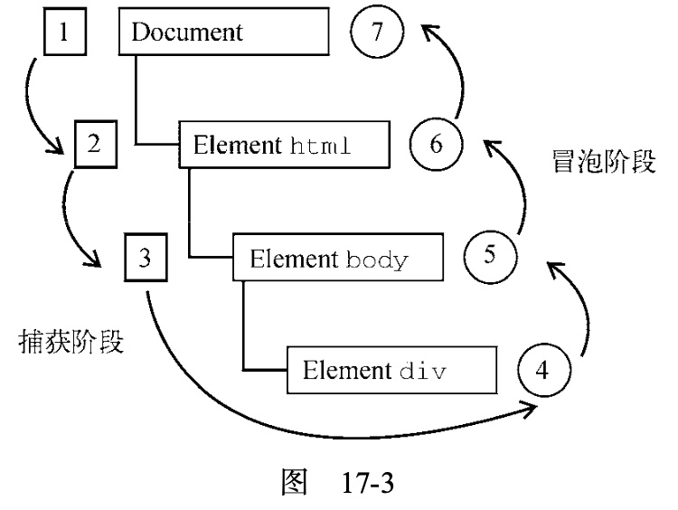

- 事件流: 冒泡和捕获
- 事件处理： **`addEventListener`**
- 事件类型：UIEvents, 鼠标，键盘，输入，焦点事件等
  - **`target` ** vs **`currentTarget`** 区别
  - **`mouseout`** vs **`mouseleave`** & **`mouseenter`** vs **`mouseover`** 区别
  - **`clientX & pageX & screenX & offsetX`** 区别
  - 鼠标事件，包含 **`button`** 属性，可以用来确认是鼠标的哪一个键点击的
  - 如何使用 **`onload`** 下载 image
  - **`hashchange`** 事件
- 事件委托
- 自定义事件: **`CustomEvent()`**

书本中还提到了设备事件和触摸手势，这里没有提到。


🧐🧐🧐  ： 表示提出的思考和Tips

✨✨✨: 表示比较重要的概念

⚡️： 表示重点内容

## 1. 事件流

这个比较常规的2种事件传递方向：

1. 事件冒泡（bubble）（沿着DOM树向上传递）
2. 事件捕获（capture）（从上向下传递）：用于事件拦截




## 2. 事件处理

处理方式有2种：

1. **`elem.oneventtype = function(e) {}`**: 比如 **`div.onclick = function(e){}`**; 移除handler的方式：**`elem.oneventtype = null`**
2. **`elem.addEventListener(eventType, handler, isCapture = false)`**: 默认使用 **冒泡事件流**
   - 特点：对相同的事件类型，可以同时添加多个listeners；上面的 **`oneventtype`** 对同一类型事件只能添加一个listener；
   - 移除listener： **`removeEventListener(eventType, handler, isCapture = false)`**

示例:

```js
const button = document.querySelector('#btn')
button.onclick = function(e) {
  console.log('onclick 1')
}
button.onclick = function(e) {
  console.log('onclick 2')
}

button.addEventListener('click', (e) => {
  console.log('click 1')
})

button.addEventListener('click', (e) => {
  console.log('click 2')
})

// 点击按钮
// onclick 1 并不会被触发
onclick 2
click 1
click 2
```

🧐🧐🧐关于 [addEventListener - MDN](https://developer.mozilla.org/en-US/docs/Web/API/EventTarget/addEventListener) 它还有一些其余的用法， 比如：只触发一次

```js
const btn = document.getElementById('btn')
btn.addEventListener('click', (e) => {
  console.log('fire')
}, {
  once: true // 只触发一次
})
```


## 3. 事件对象

不同类型的事件会包含不同的属性，但是它们都有一个共同的接口 **`Event`**, 有如下一些公用属性：

```ts
interface Event {
    // 只读 事件是否冒泡
    readonly bubbles: boolean;
    
  	// 只读 表示是否可以取消事件的默认行为
    readonly cancelable: boolean;
    /**
     * Returns true or false depending on how event was initialized. True if event invokes listeners past a ShadowRoot node that is the root of its target, and false otherwise.
     */
    readonly composed: boolean;
    
  	// ✨✨✨ 只读 元素类型 当前事件处理程序所在的元素
    readonly currentTarget: EventTarget | null;
    
  	// 只读 true表示已经调用 preventDefault() 方法
    readonly defaultPrevented: boolean;
    
  	// ✨✨✨ 表示调用事件处理程序的阶段： 
  	// 1: CAPTURING_PHASE（捕获阶段）, 2: AT_TARGET（达到目标）, 3: BUBBLING_PHASE（冒泡阶段）
    readonly eventPhase: number;
    
  	// true: 表示事件由浏览器生成的；false：表示事件是开发者自定义的事件
    readonly isTrusted: boolean;
    

    // ✨✨✨元素 事件目标
    readonly target: EventTarget | null;
    
  	// 事件的类型  e.g. "click", "hashchange", or "submit".
    readonly type: string;
    /**
     * Returns the invocation target objects of event's path (objects on which listeners will be invoked), except for any nodes in shadow trees of which the shadow root's mode is "closed" that are not reachable from event's currentTarget.
     */
    composedPath(): EventTarget[];
  	
  	// ✨✨✨创建自定义事件
    initEvent(type: string, bubbles?: boolean, cancelable?: boolean): void;
    
  	// 函数 取消事件的默认行为 只有 cancelable为true时才能调用这个方法
  	// 比如 <a href='xx'></a> 默认会跳转刷新页面 可以使用这个函数阻止这一默认行为
    preventDefault(): void;
    // 用于取消所有后续捕获或事件冒泡 并阻止调用任何后续事件处理程序
    stopImmediatePropagation(): void;
    // 用于取消所有后续捕获或事件冒泡 只有bubbles为true才能调用这个方法
    stopPropagation(): void;
    readonly AT_TARGET: number;
    readonly BUBBLING_PHASE: number;
    readonly CAPTURING_PHASE: number;
    readonly NONE: number;
  
  	cancelBubble: boolean;  // IE 浏览器 only 相当于 stopPropagation()
  	returnValue: boolean;   // IE 浏览器 only 相当于 preventDefault()
  	srcELement: EventTarget // IE 浏览器 only 相当于 target
}
```

可参考：

- [dom events - whatwg](https://dom.spec.whatwg.org/#event)

**🧐🧐🧐注意 `target`vs `currentTarget`的区别 **:  [currentTarget vs target - stackoverflow](https://stackoverflow.com/a/10086501)

- **`target`**: 触发事件的元素
- **`currentTarget`**: 添加监听的元素

在后面的事件委托中，就可以看出区别来：

```html
<div id="div">
	<button id="btn">click</button>
</div>
```

js:

```js
const div = document.getElementById('div')
const button = document.getElementById('btn')

div.addEventListener('click', (e) => {
  console.log(`e.currentTarget: ${e.currentTarget}`)
  console.log(`e.target: ${e.target}`)
})

// 监听事件的元素是 div
e.currentTarget: HTMLDivElement

// 触发事件的元素 button
e.target HTMLButtonElement
```


## 4. ⚡️事件类型

主要有以下几类事件：

1. ⚡️用户界面事件（**`UIEvent`**）: 设计和BOM交互的通用浏览器事件
2. 焦点事件 （**`FocusEvent`**）: 元素获得或失去焦点事件
3. ⚡️鼠标事件（**`MouseEvent`**）
4. 滚动事件（**`WheelEvent`**）: 滚动鼠标滚轮时触发
5. 输入事件 （**`InputEvent`**）: 向文档输入文本时触发
6. ⚡️键盘事件（**`KeyboardEvent`**）: 使用键盘时触发
7. 合成事件（**`CompositionEvent`**）: 使用IME(输入法编辑器)输入字符时触发

所有事件可参考：

- [完整事件类别 - MDN](https://developer.mozilla.org/zh-CN/docs/Web/Events)

### 4.1 用户事件 UIEvent

常用的有以下几个：

1. **`load`**: 页面加载完成后触发，比如 **`<frameset> | <frame> |  | <object>`** 元素加载完成后触发
2. **`unload`**: 当页面完全卸载后触发，从一个页面跳转到另一个页面时触发，**可以清理一些引用**
3. **`abort`**: **`<object>`** 元素上在加载前，用户终止下载时触发
4. **`error`**: **`<frameset> | <frame> |  | <object>`** 元素无法完成时触发
5. **`select`**: 在文本框（**`<input> | <textarea>`**） 上用户选择了一个或多个字符时触发
6. **`resize`**: 在window或frame被缩放时触发
7. **`scroll`**： 当用户滚动包含滚动条的元素时在元素上触发，一般用来获取 `scrollTop` 数据来做一些动画效果之类的

以 **`load`** 事件为例：

对于 **``** 元素：

```js
// html
// 
const img = document.getElementById('src')
img.addEventListener('load', function(e) {
  console.log('图片加载完成')
})
```

**🧐🧐🧐 有时候我们需要下载某个图片，可以使用下面的方式**： 使用 **`Image`** 对象实现

```
// Image定义
declare var Image: {
    new(width?: number, height?: number): HTMLImageElement;
};
```

实现：

```js
window.addEventListener('load', () => {
  let image = new Image()
  image.addEventListener('load', (event) => {
    console.log('图片下载完成')
  })
  // 设置这个属性后 浏览器就会自动开始下载图片
  image.src = 'some-pic.jpg'
})

// 或者
window.addEventListener('load', () => {
  let img = document.createElement('img')
  img.addEventListener('load', (event) => {
    console.log('图片下载完成')
  })
  document.body.appendChild(img) // 这个和图片下载没有关系
  // 设置这个属性后 浏览器就会自动开始下载图片
  img.src = 'some-pic.jpg'
})
```


### 4.2 焦点事件 FocusEvent

获取或者失去焦点相关的方法：

- **`blur() & focus()`**
- **`document.hasFocus()`**: 是否有获取焦点的元素
- **`document.activeElement`**: 当前获取焦点的元素

事件：

1. **`blur`**: 失去焦点，**不冒泡**
2. **`focusout`**: 失去焦点， **冒泡**
3. **`focus`**: 获取焦点， **不冒泡**
4. **`focusin`**: 获取焦点，**冒泡**

当焦点从A元素一到B元素时，事件顺序：

1. A元素 focusout
2. B元素 focusin
3. A元素 blur
4. B元素 focus

```js
// html
// <input id="input" type="text" />
const input = document.getElementById('input')
input.focus()

// 使用冒泡版本事件
document.addEventListener('focusin', (e) => {
	console.log(document.hasFocus())
  console.log(document.activeElement)
})

// 打印
true
HTMLInputElement // <input />
```


### 4.3 鼠标事件和滚轮事件

这个是PC端最常见的一类事件。主要有：

1. **`click`**: 鼠标单击或者键盘enter键触发
2. **`dbclick`**: 双击时触发
3. **`mousedown`**: 按下任意鼠标键时触发
4. **`mouseenter`**:  鼠标光标从元素外部移到元素内部时触发， **不冒泡**
5. **`mouseleave`**:  鼠标光标从元素内部移到元素外部时触发， **不冒泡**
6. **`mousemove`**: 鼠标光标在元素上移动时反复触发
7. **`mouseout`**: 用户把鼠标光标从一个元素移到另一个元素上时触发。**移到的元素可以是原始元素的外部元素或者其子元素**。 包含 **`relatedTarget`** 属性
8. **`mouseover`**: 在用户把鼠标光标从元素外部移动到元素内部时触发， 包含 **`relatedTarget`** 属性
9. **`mouseup`**: 在用户释放鼠标时触发
10. **`mousewheel`**: 鼠标滚动事件


**🧐🧐🧐 关于 `mouseout` vs `mouseleave` 区别**：

- `mouseleave` 不冒泡， `mouseout` 冒泡
- `mouseout` 移到的元素可以是原始元素，也可以是其子元素

示例：

```html
<style type="text/css">
#outer {
  width: 300px;
  height: 300px;
  background: #727333;
  display: flex;
  align-items: center;
  justify-content: center;
}

#inner {
  width: 100px;
  height: 100px;
  background: #733;
}
</style>
<div id="outer">
	<div id="inner" />
</div>
<script>
const outer = document.getElementById("outer");
const inner = document.getElementById("inner");

outer.addEventListener("mouseout", e => {
  console.log("mouseout");
});

outer.addEventListener("mouseleave", e => {
  console.log("mouseleave");
});
</script>
```

当鼠标从 **outer** 移动到 **inner** 子元素时，会触发 `mouseout`  事件，而不会触发 `mouseleave` 事件。


**🧐🧐🧐  `mouseenter` vs `mouseover` 事件区别**： 

- `mouseenter` 不冒泡， `mouseover` 冒泡

使用上面的例子：

```js
// ...
outer.addEventListener("mouseover", e => {
  console.log("mouseover");
});

outer.addEventListener("mouseenter", e => {
  console.log("mouseenter");
});

// 当鼠标移动到 outer元素上时 会触发
mouseover
mouseenter

// 当鼠标从 outer 移动到其子元素 innner 时， 因为 mouseover 会冒泡 会触发
mouseover
```

相关阅读：

- [Moving the mouse: mouseover/out, mouseenter/leave](https://javascript.info/mousemove-mouseover-mouseout-mouseenter-mouseleave)
- [mouseenter与mouseover为何这般纠缠不清？ - 掘金](https://juejin.cn/post/6844903480470028302)


> 1.鼠标的几个坐标

鼠标位置有几个坐标：

1. **`clientX & clientY`** : 鼠标距离浏览器窗口坐标
2. **`pageX & pageY`**: 页面距离顶部的坐标，包含滚动条部分
3. **`screenX & screenY`**: 鼠标在电脑屏幕中的坐标
4. **`offsetX & offsetY`**: 鼠标距离当前元素坐标系中的坐标

可以参考：

- [✨✨✨ clientX vs pageX vs screenX - segmentfault](https://segmentfault.com/a/1190000002405897)


> 2.修饰键

主要是 **`shiftKey & ctrlKey & altKey & metaKey`**


> 3.鼠标按键 ✨✨✨

**`event`** 中包含 **`button`** 属性，主要包含3个值：

1. **`0`**: 鼠标主键(一般左键)
2. **`1`**: 鼠标中键(一般滚轮键)
3. **`2`**: 鼠标副键(一般右键)


> 4.滚轮事件

滚轮事件(**`mousewheel`**)中有一个 **`wheelDelta`** 属性:

- 鼠标向上推，这个值为 **负数**
- 鼠标向下滑，这个值为 **正数**

```js
document.addEventListener('mousewheel', e => {
  console.log(e.wheelDelta)
})
```


### 4.4 键盘和输入事件

主要有3个事件：

- **`keydown`**
- **`keypress`**
- **`keyup`**

输入事件：

- **`textinput`**

事件上的部分属性：

- **`keyCode`**: 键码，每个键都有一个相对应的值，比如回车键的值为 `13`
- **`key`**: 包含的字符串，比如 `shift + a` 会输出大写 `A` (DOM3 不推荐使用)


### 4.5 HTML5事件

这个是H5中添加的一些事件，比较重要的几个：

1. **`contextmenu`** 事件，上下文菜单
2. **`beforeunload`** 事件：**可以用作路由拦截，比如编辑文章时，要离开页面时，提示用户是否保存之后再退出当前页面**
3. **`DOMContentLoaded`** 事件： DOM树构建完成后立即触发，不用等待图片，JS，CSS等资源加载完成，**这一点要和 `load` 事件区分开来**
4. **`hashchange`** 事件：当hash发生变化时触发， **这个是现在单页面路由中经常用到的**，包含 `oldURL & new URL` 属性


示例1: 

```js
const outer = document.getElementById("app");

outer.addEventListener("contextmenu", e => {
  e.preventDefault();
  let menu = document.getElementById("myMenu");
  menu.style.left = event.clientX + "px";
  menu.style.top = event.clientY + "px";
  menu.style.visibility = "visible";
});

outer.addEventListener("click", e => {
  if (e.button === 2) { // 如果使用的是鼠标右键 则显示contextmenu
    document.getElementById("myMenu").style.visibility = "visible";
  } else {
    document.getElementById("myMenu").style.visibility = "hidden";
  }
});
```

可参考： [实现自定义右键菜单（Context Menu） contextmenu](https://cloud.tencent.com/developer/article/1656903)


扩展阅读：

1. [hashchange事件 - 简书](https://www.jianshu.com/p/100242c095e7)


## 5. 事件委托

事件委托主要利用 **事件冒泡**，可以用一个父元素来监听其子类事件。可以减少事件监听数量，提高性能。

```html
<ul id="links">
  <li id="link-1">item 1</li>
  <li id="link-2">item 2</li>
  <li id="link-3">item 3</li>
</ul>
```

事件委托：

```js
const links = document.getElementById('links')
links.addEventListener('click', e => {
  let target = e.target // 事件触发的元素
  
  switch(target.id) {
    case 'link-1':
      // ...
      break
    case 'link-2':
      // ...
      break
    case 'link-3':
      // ...
  }
})
```

扩展阅读：

- [JavaScript 事件委托详解 - 掘金](https://juejin.cn/post/6844903475470417928)


## 6. 模拟事件

事件实际上是一种发布订阅模式，可以用来解藕，我们根据需求，自定义事件。

一般做法根据事件类型来创建已经存在的事件类型： **`createEvent()`** 创建事件； **`dispatchEvent()`**: 触发事件

- **`MouseEvent`**: 对应 `initMouseEvent()`
- **`KeyboardEvent`**: 对应 `initKeyboardEvent()`
- **`HTMLEvents`**

```js
const div = document.getElementById('box')
// 自定义鼠标事件 MouseEvent
const clickEvent = document.createEvent('MouseEvent')
clickEvent.initMouseEvent('click', true, true, document.defaultView)
div.dispatchEvent(clickEvent) // 触发事件
```

使用 `Event` 方式：

```js
const event = new Event('look', {
  bubbles: false, // 不支持冒泡
  cancelable: false // 不可取消
})
document.dispatchEvent(event)
myDiv.dispatchEvent(event)
```


**`CustomEvent()`** 自定义事件，**可以通过 `detail` 传递信息**，其它属性：

- **`type`**: 自定义事件名

- **`bubbles`**: 是否允许冒泡
- **`cancelable`**: 事件是否可取消
- **`detail`**: 对象，默认值是null

示例：

```js
const loginEvent = new CustomEvent('login', {
  bubbles: true,
  cancelable: true,
  detail: {
    username: 'lili',
    password: '123456'
  }
})
document.dispatchEvent(loginEvent)

myDiv.addEventListener('login', e => {
  console.log(e.detail) // {username: 'lili',password: '123456'}
})


// 以前的写法
const loginEvent = document.createEvent('CustomEvent')
loginEvent.initCustomEvent('login', true, true, { username: 'lili', password: '123456'})
document.dispatchEvent(loginEvent)
```

相关文档和文章：

1. [CustomEvent - MDN](https://developer.mozilla.org/zh-CN/docs/Web/API/CustomEvent)
2. [Document.createEvent() - MDN](https://developer.mozilla.org/en-US/docs/Web/API/Document/createEvent#Notes)
3. [Event() - MDN](https://developer.mozilla.org/zh-CN/docs/Web/API/Event/Event)
4. [✨✨✨ javascript自定义事件功能与用法实例分析 - 掘金](https://juejin.cn/post/6844903590906036232)
5. [JavaScript Pattern: Using Custom Events - youtube](https://www.youtube.com/watch?v=KuEVmf-Fxk0&ab_channel=AllThingsJavaScript%2CLLC)
6. [How to Make Custom Event Listeners in JavaScript - blog](https://www.webtips.dev/how-to-make-custom-event-listeners-in-javascript)


总体来说，事件用得是比较多的，一些概念进行区分还是很有用的。自定义事件用的比较少，一般在自定义库中比较常见，了解它，可以更好的去实现自定义目标。


2020-12-16 21:46:56