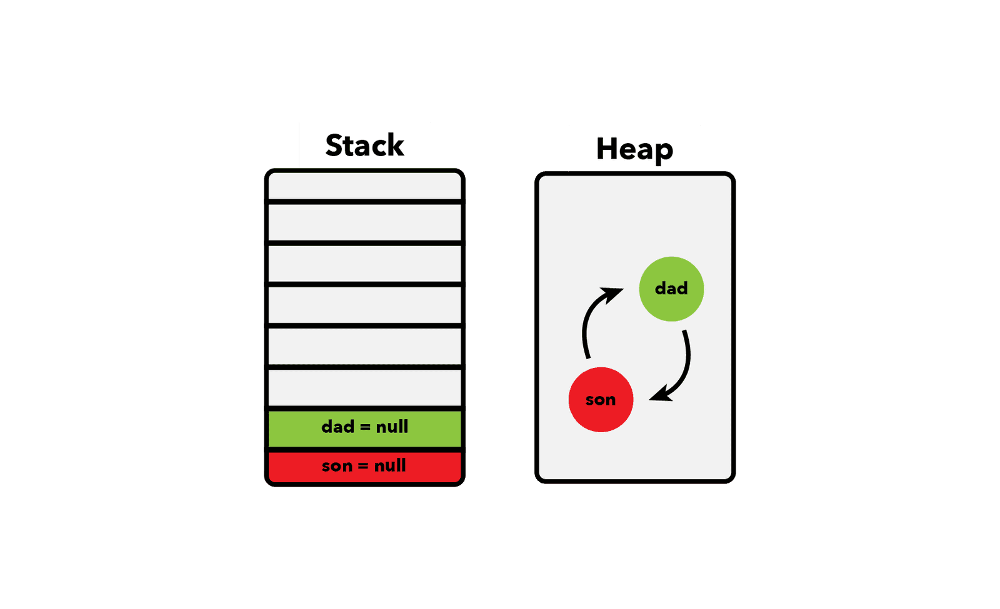

大多数时候，作为js开发者，我们可能无需对内存管理有所了解，毕竟，js引擎都帮我们处理好了。

但有时候，可能遇到内存泄漏这种问题，你只有知道了内存分配和垃圾回收（`GC`）是如何运作的才能很好的解决这类问题。

下面，我将介绍 **内存分配** 和 **GC** 运作机制，以及如何避免常见的内存泄漏。

目录结构：

1. [内存生命周期](#1)
2. [内存堆与栈](#2)
   1. [栈：静态内存分配](#2.1)
   2. [堆：动态内存分配](#2.2)
   3. [示例](#2.3)
3. [JS中的引用](#3)
   1. [示例](#3.1)
4. [垃圾回收](#4)
   1. [引用计数垃圾回收](#4.1)
   2. [标记清除算法](#4.2)
   3. [权衡](#4.3)
5. [内存泄漏](#5)
   1. [全局变量](#5.1)
   2. [被遗忘的计时器和回调](#5.2)
   3. [DOM引用](#5.3)
6. [总结](#6)


<p id="1"></p>


## 1 内存生命周期

在js中，当创建变量，函数，和任意你能想到的类型，js引擎都会给他们分配内存，一旦创建的这些变量，对象不再被需要，js引擎就会释放他们。

**分配内存** 是在内存中保留空间的过程，而 **释放内存** 是释放空间，然后空间另做他用的过程。

每次我们分配一个变量或者创建一个函数，内存总是经历下面相同的阶段


- **分配内存**： js替我们处理这些，js将分配我们创建的对象所需的内存空间
- **使用内存**：使用内存是我们在代码中显式完成的过程，读写内存就是读写变量的过程
- **释放内存**： 这一步同样也是js引擎帮我们完成的。一旦分配的内存被释放，则该内存空间就可用于其它目的

💡*在内存管理的上下文环境中，`Objects` 不仅包含JS objects，同时也包含函数和函数作用域*


<p id="2"></p>


## 2 内存堆与栈

现在我们已经知道了，我们在js中定义的一切，js引擎都会分配空间，当我们不再需要时释放空间。

下一个出现在我脑海中的问题是：**这些定义的内容将存放在哪里呢？🤔**

js引擎有2个地方用于存储数据：**内存堆** 和 **内存栈**。

堆和栈是引擎用于不同作用的2种数据结构。


<p id="2.1"></p>


### 2.1 栈：静态内存分配

*你可能从这个系列的第一部分 [callstack and event loop](https://felixgerschau.com/javascript-event-loop-call-stack/)中知道了栈，那篇文章我们关注栈是如何用于追踪js编译器要调用的函数*。


📚栈是js用于存储静态数据的一种数据结构。静态数据是指引擎再编译时就知道数据大小的一种数据。在JS中，静态数据包括 **原始值类型**（`strings,numbers,booleans,undefined null`） 和 **引用类型**（用于指向对象和函数）。

因为引擎知道数据的大小不会发生变化，引擎将给每个值都分配 **固定大小的内存**。

在执行之前就分配内存的过程称之为 **静态内存分配**😎。

因为引擎给这些值分配固定大小的空间，因此 **原始值有多大是有限制的**。

而这些值和整个栈大小的限制会根据浏览器的不同而不同。


<p id="2.2"></p>


### 2.2 堆： 动态内存分配

堆则是JS用于存储 `objects & functions` 的另一个空间。

📚 不同于栈，引擎不会给这些对象分配固定大小的内存，而是按需分配。

这种分配方式也称之为 **动态内存分配😎**。

下面是2种存储方式特定的比对：

| 栈（Stack）            | 堆（Heap）             |
| ---------------------- | ---------------------- |
| 原始值和引用值         | Objects & functions    |
| 在编译时就知道大小     | 在运行时才能知道大小   |
| 分配固定大小的内存空间 | 每个对象没有固定的大小 |


<p id="2.3"></p>


### 2.3 🌰 示例

下面看看代码示例：

JS给这个对象在堆中分配内存，实际值仍然是原始类型，这也是为什么它们存储在栈中

```js
const person = {
  name: 'John',
  age: 24
}
```

数据也是对象，因此也存储在堆中：

```js
const hobbies = ['hiking', 'reading']
```

📚原始值是不可变的，意味着改变它们，不会改变原始的值，js会重新创建一个新的值：

```js
let name = 'John' // 给字符串分配内存
const age = 24 // 给number分配内存

name = 'John Doe' // 给新的字符串分配内存
const firstName = name.slice(0,4) // 给新的字符串分配内存
```


<p id="3"></p>


## 3 👉 JS中的引用

所有变量都指向栈中，对于非原始类型的值，栈包含对该对象在堆中的引用。

📚堆内存没有特定的顺序，因此我们需要在栈中保持对它的引用。你可以把引用理解为一个地址，在堆中的对象则是该地址指向的房子。

*记住：JS将objects和functions存储在堆中，原始值和引用存储在栈中🤩*.


图中，我们可以观察到，值存储的差异性。注意 `person` 和 `newPerson` 指向相同的对象。


<p id="3.1"></p>


### 3.1 🌰示例

这在堆中创建一个新的对象，并在栈中创建一个引用

```js
const person = {
  name: "John",
  age: 24
}
```

*📚 引用时JS运作的核心概念。*


<p id="4"></p>


## 4 ♻️ 垃圾回收

我们已经知道了JS如何给各种对象分配内存，根据内存生命周期，最后一步便是：**内存释放**。

和内存分配一样，JS引擎会帮我们完成这一切。更具体的讲，**垃圾回收（`GC`）** 负责这一切。

一旦JS引擎识别到给定的变量或者函数不再被需要了，它就会释放它锁占据的内存空间。

**这一切的关键在于，是否某块内存仍被需要是不能判定的，这也意味着，不可能有一种算法能将所有不再需要的内存立马就都收集起来**。

一些算法提供了近似的解决办法：引用计数回收和标记清除算法。


<p id="4.1"></p>


### 4.1 引用计数垃圾回收

这是最简单的近似处理方式，它会收集 **没有任何引用指向** 的对象😎。


> 循环引用

这种算法的问题是没有考虑循环引用的问题。当一个或多个对象相互引用，但是彼此不能再通过代码访问：

```js
let son = {
  name: 'John'
}

let dad = {
  name: 'Johnson'
}

son.dad = dad
dad.son = son

son = null
dad = null
```

因为 `son` 和 `dad` 对象相互引用，算法将无法释放分配的内存，并且我们也无法再访问这2个对象了



将它们设置为 `null` 不会让引用计数算法识别到它们彼此不再被使用，因为它们内部彼此引用。


<p id="4.2"></p>


### 4.2 标记清除算法

标记清除可以用于解决循环依赖的问题。除了简单的计算给定对象引用的数量外，它还 **检测是否对象可以被根对象（`root object`）访问**.😎

在浏览器环境中，根对象是 `window`, 在Node.js中,跟对象 `global`。

算法将不可访问的对象标记为垃圾，之后将其清理掉，根对象永远也不会被清理：


以这种方式，循环依赖不再是一个问题。上面示例中， `dad` 和 `son` 都不能被跟对象访问到。

直到2012年，这种算法已经应用到所有的现代浏览器中了。

是在性能和实现上进行了提升，而不是算法核心思想本身。


<p id="4.3"></p>


### 4.3 权衡

自动垃圾回收让我们关注应用本身，而不用花时间去处理内存管理。然而，有一些权衡我们需要注意。


> 内存使用

由于自动垃圾回收算法不能准确的知道内存什么时候不需要，**因而导致js应用要花费比实际更多内存**😭。

即使对象被标记为了要被回收，但是什么时候回收是由垃圾回收器决定的。

如果你想应用尽可能的高效使用内存， 则应选择更底层的语言。但这也会带来一些复杂性。


> 性能

垃圾回收会间隔性的回收清理未使用的对象。

但作为开发者我们不知道这一切什么时候去执行。收集太多或者收集太频繁都会影响性能，因为算法是需要一定计算的。

但是，这种影响对开发者是透明的。


<p id="5"></p>


## 5 内存泄漏

已经学习了这些内存管理的知识，下面让我们看看最常见的内存泄漏。

你如果理解了背后的原理，这些泄漏是很容易避免的。


<p id="5.1"></p>


### 5.1 全局变量

将变量存储在全局作用域，是最常见的一种内存泄漏。

比如，在浏览器中，如果使用 `var` 或者完全不使用, 而不是 `const | let` 定义变量，则js引擎将变量添加到 `window` 对象上。

使用 `function` 定义函数也是一样的：

下面 `user & secondeUser & getUser` 都将添加到 `window` 对象上，针对全局作用域。

```js
user = getUser()
var secondUser = getUser()

function getUser() {
  return 'user'
}
```

💡我们可以使用 `strict mode` 避免这种情况。

除开不小心将变量添加到根对象上，有很多时候你可能特意这样做。

当然，你完全可以使用全局变量，**但是记住，不再使用该数据时，请清理该数据**。

可以将全局变量设置为 `null` 来释放内存：

```js
window.users = null
```


<p id="5.2"></p>


### 5.2 被遗忘的定时器和回调

如果忘记定时器和回调，会让你的应用内存上升。特别在单页应用中，**当你动态添加事件监听和回调时，一定要特别的小心。**


> 忘记定时器

```js
const object = {}
const intervalId = setInterval(function() {
  // 这里使用的一切在interval被清理之前，是不能被回收的
  doSomething(object)
}, 2000)
```

上面代码每2s执行一次，如果在项目中存在这样的代码，你可能不需要它一直运行。

interval中应用的对象，在interval取消前，是不会被回收的。

确保在不需要interval时，对其进行清理：

```js
clearInterval(intervalId)
```

这对SPAs非常的重要。即使你导航到其它页面，如果不清理，interval仍会在背景中执行。


> 忘记回调

假设你给button添加了一个 `onclick` 监听器，稍后将被移除。

在不需要时，请将其移除：

```js
const element = document.getElementById('button')
const onClick = () => alert('hi')

element.addEventListener('click', onClick)

element.removeElementListener('click', onClick)
element.parentNode.removeChild(element)
```


<p id="5.3"></p>


### 5.3 DOM引用

这里的内存泄漏和上面类似：当使用js存储DOM时，可能出现。

```js
const elements = []
const element = document.getElementById('button')
elements.push(element)

function removeAllElements() {
  elements.forEach(item => {
    document.body.removeChild(document.getElementById(item.id))
  })
}
```

当你移除任意一些这些元素时，你可能想确保将其从数组中也移除。

否则，这些DOM元素不会被收集：

```js
const elements = []
const element = document.getElementById('button')
elements.push(element)

function removeAllElements() {
  elements.forEach(item => {
    document.body.removeChild(document.getElementById(item.id))
    // 💡 确保将数组中的也移除
    elements.splice(index, 1)
  })
}
```

因为每个DOM元素都持有对其父节点的引用。 **这将阻止垃圾回收器收集元素的父元素和其子元素🚨**。


<p id="6"></p>


## 6 总结

在这篇文章中，我总结了js内存管理的核心概念。

写这篇文章帮助我理清了一些我完全不理解的概念，我希望将其作为js内存管理如何运作的手册。


参考资料：

- [Memory Management - MDN Web Docs](https://developer.mozilla.org/en-US/docs/Web/JavaScript/Memory_Management)
- [🔥 Memory Management in V8](https://deepu.tech/memory-management-in-v8/)

其它一些文章：

- [Javascript Event Loop And Call Stack Explained](https://felixgerschau.com/javascript-event-loop-call-stack/)
- [My 9 favorite topics of The Pragmatic Programmer](https://felixgerschau.com/pragmatic-programmer-20th-anniversary-favorite-topic-summary/)
- [Javascript Heap Out of Memory Error](https://felixgerschau.com/javascript-heap-out-of-memory-error/)


原文链接：

- [JavaScript's Memory Management Explained - @felixgerschau.com](https://felixgerschau.com/javascript-memory-management/)

2022年06月04日22:49:38