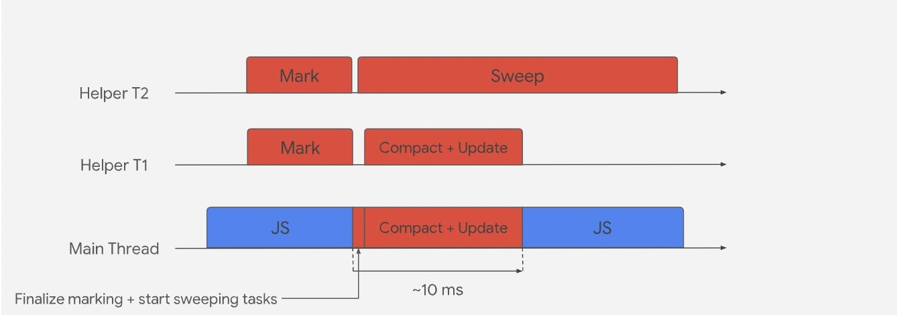

本文将剖析 [V8引擎](https://v8.dev/) 内存管理，V8引擎用于ECMAScript, WebAssembly，和Node.js,Deno, Electron, 浏览器等运行时。因为JS是解释型语言，它需要引擎解释和执行代码。V8引擎解释JS，然后将其编译为机器码。V8是C++写的，可以嵌入到任何C++应用中。


文章目录：

1. [V8 Memory Structure](#1)
2. [Heap Memory](#2)
3. [Stack](#3)
4. [V8 memory usage (stack vs Heap)](#4)
5. [V8 Memory Management: Garbage collection](#5)
   1. [Minor GC(Scavenger)](#5.1)
   2. [Major GC](#5.2)
6. [Conclution](#6)


<p id="1"></p>


## V8内存结构

我们先看看V8引擎内存结构。因为JS是单线程的，V8对每个JS上下文都使用一个单一的进程，如果你使用 service worker,V8将对每个worker都开启一个新的V8进程。一个正在运行的程序总是由 V8 进程中分配的一些内存来表示，称之为 **`Resident Set`(居民集)**，可以进一步划分为以下不同块：


这和 [jvm内存结构](https://deepu.tech/memory-management-in-jvm/) 相似，下面看看不同的区间。


<p id="2"></p>


## 堆内存

堆内存是V8存储对象或者动态数据的地方，**也是最大的内存区域，垃圾回收♻️也发生在堆内存中。** 不是整个堆内存都会被回收，只有 **`Young Space` (新生代)** & **`Old Space`（老生代）** 才会被GC。

堆可以进一步划分为如下空间：

1. `New Space | Young Generation`（新生代）： 新对象存放的地方，大多数对象都是短生命周期的。这个空间很小，有2个 **`semi-space`(半空间)** 组成，类似JVM中的 `S0 & s1`。这个空间通过 **辅助GC(`Scavenger`)** 管理。这块空间大小通过V8的2个标志控制： `--min_semi_space_size` (初始化) 和 `--max_semi_space_size` (最大)
2. `Old Space | Old Generation` （老生代）： 这里是上面新生代空间中经过2轮辅助GC存活下来的对象转移过来的。这块空间由 **主GC(`Mark-Sweep & Mark-Compact`)** 管理。空间大小通过V8的2个标志管理：`--initial_old_space_size`（初始化） 和 `--max_old_space_size`。这块区域又划分为2块区域：
   1. **`Old pointer space`（老指针空间）**：包含指向其它对象而存活的指针对象
   2. **`Old data space`（老数据空间）**：只包含数据（没有指向其它对象的指针）的对象。**新生代空间** 中，经历2轮GC，还存活下来的字符串，装箱的numbers,拆箱的double数组都将移到这块空间中
3. **`Large object space`（大对象空间）**：这里存放大的对象，它们的尺寸大于其它空间能接受的大小。每个对象都将获得自己的 [mmap](https://en.wikipedia.org/wiki/Mmap) 内存区域。**大对象永远不会被垃圾回收器移动。😎**
4. **`Code-space`（代码空间）**：这里用于即时编译器（`JIT`）存储编译后的代码块。**这是唯一具有可执行内存的空间**（注意🚨，代码可能被分配到大对象空间，它们也将变得可执行）
5. **`Cell space, property cell space & map space`（单元格空间，属性单元格空间，map空间）**：这些空间分别存放 `Cells, PropertyCells & Maps`。这些空间用于存放相同大小的对象，并且对它们指向的对象有一些限制，这样可以简化收集。

上面的这些空间都由一组页（`pages`）组成。**👩🏻‍🏫 页是操作系统（unix | windows）通过 `mmap | MapViewOfFile` 分配的连续内存块。除了大对象空间，每一页为 `1MB`**


<p id="3"></p>


## 栈

👩🏻‍🏫 每个V8进程都有一个栈空间。这里用于存放 **静态数据，包括方法或函数帧（`frame`），原始类型值，和指向对象的指针。** 栈空间大小通过V8 `--stack_size` 标志设置。


<p id="4"></p>


## V8内存使用（栈 vs 堆）

上面清除了内存如何分块的，下面看看应用运行时，内存是如何使用的。

假设下面JS程序，看看栈和对内存使用：

🌰

```js
class Employee {
  constructor(name, salary, sales) {
    this.name = name
    this.salary = salary
    this.sales = sales
  }
}

const BONUS_PERCENTAGE = 10

function getBonusPercentage(salary) {
  const percentage = (salay * BONUS_PERCENTAGE) / 100
  return percentage
}

function findEmployeeBonus(salary, noOfSales) {
  const bonusPercentage = getBonusPercentage(salary)
  const bonus = bonusPercentage * noOfSales
  return bonus
}

let john = new Employee('John', 5000, 5)
john.bonus = findEmployeeBonus(john.salary, john.sales)
console.log(john.bonus)
```

🎉 下面逐步看看栈和堆内存分配过程（原文是slides，这里拆解为图片）

1️⃣ 3个对象指针(`Employee & getBonusPercentage & findEmployeeBonus`)存储在 `Stack` 的 `Global Frame` 中，对应指向 `Heap` 中的3个对象


2️⃣ 静态数据（`BONUS_PERCENTAGE`）存储在 `Global Frame` 中


3️⃣ 实例化对象，传入的参数先在栈中分配，**对象指针在栈中，指向堆中的对象**


下面是赋值过程，即调用构造器函数的过程，逐步将栈中的值拷贝到堆中


可以看到 `bonus` 属性也被添加到Object上了，这是因为在执行之前，V8会对代码进行扫描


实例化完成后，构造器函数出栈，实例对象指针 `john` 添加到 `Global Frame` 中，并指向Heap中的对象


4️⃣ 调用 `findEmployeeBonus` 函数，函数调用进栈


5️⃣ 上面函数内部又调用了 `getBonusPercentage` 函数，`getBonusPercentage` 函数进栈


6️⃣ `getBonusPercentage` 调用结束，出栈，返回到 `findEmployeeBonus` 函数：


7️⃣ `findEmployeeBonus` 函数调用结束，出栈，返回值赋值给 `john` 的 `bonus` 属性


至此，整个内存分配结束。

🚀以下是这个过程的知识点：

- **全局作用域（`Global Scope`）** 保存在栈中的 `Global Frame` （全局帧）
- 每个函数调用都以 **帧块（`Frame-block`）** 添加到栈空间中
- 所有局部变量，包括参数和返回值都保存在栈中的函数帧块中
- 所有原始类型，比如 `int & string` 都直接保存在栈中。这也适用于全局作用域
- 所有的对象类型，比如 `Employee & Function` ，都在堆中创建，然后通过栈指针进行引用。JS中函数也是对象。这也适用于全局作用域
- 当前函数调用另一个函数，该函数将被推到栈顶
- 当函数返回它的帧，就会从栈中被移除
- **一旦主进程完成，堆中那些不被栈中任何指针引用的对象，都会变成孤儿对象（`Orphan Objects`）**
- 除非你显式的拷贝，所有的对象引用都是通过引用指针的形式完成的

**💡 栈空间是由操作系统自动管理的，而不是V8引擎**。而堆空间不会通过操作系统自动管理。因为它是最大的内存空间，持有动态数据，可能随着时间呈指数增长导致内存溢出。**同时随着时间的推移，碎片化（`fragment`） 也会降低应用效率**， 这就需要垃圾回收了♻️。

区分堆中的指针和数据对于垃圾回收很重要，V8使用 **`Tagged pointers`(标记指针)** 的方式完成。这种方式是，通过在每个字（`word`, 计算机术语）尾部保留一位（`a bit`）来表示是否是指针还是数据。这种方式需要编译器的支持，但是这是最简单且高效的实现方式。


<p id="5"></p>


## V8内存管理：垃圾回收

上面我们知道了V8如何分配内存，下面我们看看它如何自动管理堆内存，这对应用性能很重要。当一个程序尝试在堆中获取的内存超过堆中剩余内存时，会出现 `Out of memory errors`。不正确的堆内存管理，可能导致内存泄漏。

V8通过垃圾回收的方式管理堆内存。简单讲，垃圾回收会释放那些不被栈直接或间接引用的孤儿对象（`Orphan Objects`），给新对象的创建腾出空间。


*`Orinoco` 是V8 GC项目的代号，利用并行，增量和并发技术进行垃圾回收，以释放主线程的压力*。


V8 中的垃圾收集器负责回收未使用的内存以供 V8 进程重用。

V8 垃圾收集器是分代的（堆中的对象按其年龄分组并在不同阶段清除）。V8 用于垃圾收集的 **两个阶段** 和 **三种不同的算法**：


<p id="5.1"></p>


### 辅助GC（Scavenger）

**这种类型的GC用于保持新生代空间紧凑和干净😎**。分配在新生代空间的对象一般很小（取决于行为启发式 `1~8MB`）。在新生代中分配很廉价：**每当我们想为新对象保留空间时，我们都会增加一个分配指针（`allocation pointer`），当分配指针到达新生代空间的尾端，辅助GC就会被触发，这个过程称之为 `Scavenger`🤩**,它实现了 [Cheney算法](https://en.wikipedia.org/wiki/Cheney's_algorithm)。 

这个GC会频繁触发，使用 **并发辅助线程（`paralle helper threads`）**, 这个算法非常的快。

下面看看辅助GC的过程：

1. 新生代空间被划分为2个大小相同的 **半空间（`semi-spaces`）**: `from-space` & `to-space`
2. 大多数分配(除了特定类型的对象，比如可执行代码总是分配在老生代空间)发生在 `from-space`
3. 当 `from-space` 被填充满时，辅助GC会被触发

🎉 下面是整个过程的图解：

1️⃣ 假设在 `to-space` 中已经存在一些对象 `Block01-06`，进程创建一个新的对象 `07`， V8尝试从 `from-space` 中获取所需的内存，但是 `from-space` 内存不够了，这时会触发 **第一次** 辅助GC


2️⃣ minor GC 将部分对象从 `from-space` 移到 `to-space` 中


3️⃣ minor GC 将未被栈直接或间接引用的对象，标记为 `Orphan Objects` 等待被清除


4️⃣ minor GC完成后， `from-space` 和 `to-space` 进行交换 🤩，`from-space` 变为 `to-space` （此时 to-space 已经干净了）， `to-space` 变为 `from-space` （此时 from-space 空间进行了压缩，减少碎片化），`Block 07` 会分配到交换后的 `from-space` 中


5️⃣ 假设随着时间的推移，`from-space` 存在更多的对象（`Block07-09`）, 现在进程要创建一个新的对象（`Block 10`）, V8尝试从 `from-space` 中获取所需的内存，但是 `from-space` 内存不够了，这时会触发 **第2次** 辅助GC


6️⃣ 2次GC都存活来的数据（`Block 05`）或者指针（`Block 01`） 被移动到 `Old-space` 中，1次GC的对象 （`Block07 & Block09`）从 `from-space` 移动到 `to-space`


而 `Block03 & Block08` 标记为 `Orphan Object`:


`from-space` 和 `to-space` 进行交换:


 新对象 `Block10` 添加到新的去碎片化之后的 `from-space` 空间：


下面对整个过程：

1. 🤔 假设 `from-space` 已经存在 `Block01-06` 内存被使用
2. 进程创建新的对象 `07`
3. V8尝试从 `from-space` 获取所需内存，发现内存不够给新的对象 `07`， 触发 **第一次minor GC**
4. 👩🏻‍🏫 Minor GC 从栈指针（`GC Roots`） 开始递归遍历 `from-space` 中的对象图，找出存活的对象。将这些对象移动到 `to-space` 中的 **页(`page`)** 中。栈中对这些对象的指针引用也移动到 `to-space`, 并更新指针地址。这是一个重复的过程，直到 `from-space` 中所有的对象都被扫描到。扫描完成后，`to-space` 自动压缩，减少碎片化。
5. Minor GC会清空 `from-space`， 因为没有被移动到 `to-space` 的剩余对象会被垃圾回收
6. Minor GC 交换 `to-space` 和 `from-space`。现在所有的对象又都在 `from-space` 中， `to-space` 为空的
7. 新的对象会在 `from-space` 中分配内存
8. 🤔 假设随着时间推移，`from-space` 中存在更多的对象，`Block07-09` 标记为为已使用的内存
9. 应用创建新的对象 `10`
10. V8尝试从 `from-space` 获取所需内存，发现内存不够给新的对象 `10`， 触发 **第2次minor GC**
11. 上面过程是周而复始的，在第2次minor GC中存活的对象，将移动到 `Old-space` 中。第一次存活者，移动到 `to-space` 中，`from-space` 中剩余的是 `Orphan Objects`, 被垃圾回收器回收
12. Minor GC 交换 `to-space` 和 `from-space`。现在所有的对象又都在 `from-space` 中， `to-space` 为空的 （重复上面的步骤6）
13. 新的对象会在 `from-space` 中分配内存


上面的过程便是 minor GC如何在 **新生代空间** 中重新认领新的空间，并使空间变得紧凑。这是一个 `stop-the-world`（暂停一切） 的过程，但是这个算法很快且高效，大多数时候可以忽略不计。因为这个过程不会扫描 `old-space` 中的对象以查找 `new-space` 中的任何引用，因此它使用从老生代到新生代的所有指针的寄存器。**这通过 写屏障（`write barrier`）的过程记录到 存储缓冲（`stored buffer`）中**。


<p id="5.2"></p>


### Major GC

这个类型的GC用于保持 老生代空间 紧凑和干净。

👩🏻‍🏫 当V8根据动态计算的限制确定没有足够的 `Old-space` 时触发，因为老生代空间会被 minor GC 周期填满。

Scavenger算法对小数据处理很完美，但是对老生代中的大堆却不太合适，因为它对内存开销很大。因此 **major GC是通过 `Mark-Sweep-Compact` 算法完成的**。这个算法使用 **3色（`white-grey-black`） 标记系统**，因此主GC是一个 **3步过程**，第3步则是依据碎片化程度来执行的。


步骤:

1. **`Marking`（标记）**： 第一步，对2个算法都是通用的，垃圾回收器找出哪些对象正在使用，哪些对象已经不在使用。**正在使用的对象或者被GC roots（Stack pointers）引用的对象会被标记为存活。** 这是一种 **堆的深度优先搜索，可以认为是一种有向图（`directed graph`）**
2. **`Sweeping`（清除）**：垃圾收集器遍历堆并记下任何未标记为活动的对象的内存地址。这个空间现在在空闲列表中被标记为空闲，可以用来存储其他对象
3. **`Compacting`（压缩）**：在清理之后，如果需要，所有存货对象会被移动到一起，这会降低碎片化和增加新对象分配效率。

这种类型的GC也是一种 `stop-the-world`(暂停一切) 的GC，当执行GC时会导致进程的暂停。为了避免这种现象，V8使用以下技术：



1. **`Incremental GC`（增量GC）**：GC是通过多次增量步骤完成的，而不是一次性就完成的
2. **`Concurrent marking`（并发标记）**： 标记是通过多个辅助线程（`helper threads`）并发标记完成的，而不会影响到JS主线程。写屏障用于跟踪js在辅助线程同时标记时创建的对象之间的新引用
3. **`Concurrent Sweeping/Compacting`**: 清除和压缩也是在辅助线程中并发的完成的，也不会影响到JS主线程
4. **`Lazy Sweeping` （懒清除）**： 即延迟垃圾的删除，当用到该页（`page`）中的内存时再去删除

下面总结一下主GC的过程：

1. 假设经过多轮minor GC周期，`old-space` 几乎满了，`V8` 决定触发主GC
2. 主GC从栈指针开始递归遍历对象图，标记使用的对象（使用的内存），其余对象则 `Old-space` 中的 `Orphan Objects`。这通过多个辅助线程并发完成，每个辅助线程跟随一个指针。这个过程不会影响主线程
3. 当并发标记完成或如果达到内存限制，GC 使用主线程执行标记完成步骤。**这会导致一小段暂停时间**
4. 主GC现在将所有的 `Orphan Objects` 的内存标记为可释放空间。并行压缩任务同时触发，将相关内存块移动到相同的页中，避免碎片化。在这些步骤中，指针也会跟着更新。


<p id="6"></p>


## 总结

这篇文章应该会对V8内存结构和内存管理有个总体的了解。这没有列举所有和内存管理相关的高级概念，可以通过 [V8.dev](https://v8.dev/blog/trash-talk) 了解更多。

但是对于大多数JS/WebAssembly开发者来说，这些信息已经足够了。


参考资料：

- [v8.dev/blog/trash-talk](https://v8.dev/blog/trash-talk)
- [A tour of V8: Garbage Collection](http://jayconrod.com/posts/55/a-tour-of-v8-garbage-collection)
- [Understanding Garbage Collection and Hunting Memory Leaks in Node.js](https://blog.codeship.com/understanding-garbage-collection-in-node-js/)
- [Memory Management - MDN](https://developer.mozilla.org/en-US/docs/Web/JavaScript/Memory_Management)
- [how javascript works memory management how to handle 4 common memory leaks](https://blog.sessionstack.com/how-javascript-works-memory-management-how-to-handle-4-common-memory-leaks-3f28b94cfbec)


原文链接：

- [🚀 Visualizing memory management in V8 Engine (JavaScript, NodeJS, Deno, WebAssembly) - @deepu.tech](https://deepu.tech/memory-management-in-v8/)

2022年06月21日14:56:42