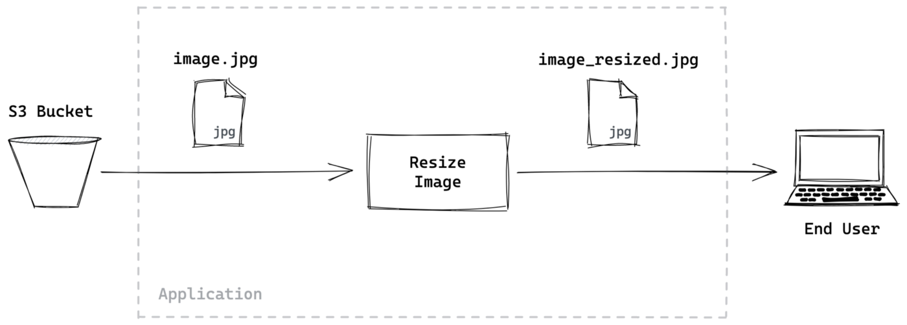
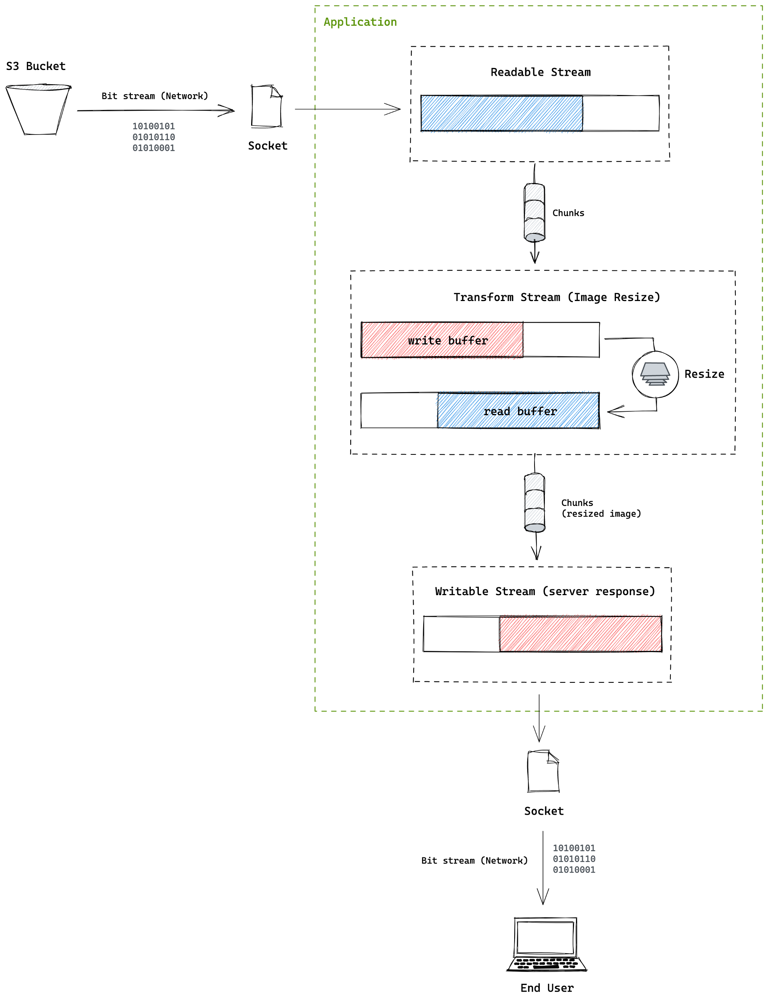

想象你有一堆砖，你想用这些砖砌一面墙。假设你有一个朋友帮助你移动这些砖块。为了砌这面墙，你现在有2个选择：

1. 等你朋友将这堆砖全部搬给你之后，再开始砌墙
2. 你朋友边帮你搬，你有砖后就开始砌

哪一种更高效呢？显然第2种方式更加的高效，**这其实是 `stream` （这里实例是砖块流）提升效率的一个很形象的比喻**。另一个常见的场景就是，看电影时，边看边缓存，而不是将整部电影下载好之后再去看。

维基百科对 **流** 的定义是： *在计算机科学中，流是一系列随时间获取的数据元素，流就像传送带上的物件，一次被处理部分，而不是一次性大批量的被处理*。

在Node.js中，[stream模块](https://nodejs.org/api/stream.html) 提供了很多处理流的工具。即使你没有显式的使用过流模块，但是Node.js应用底层功能很多都会用到流。流是一个简单的概念，但是如果你之前没接触过流的概念，会觉得它很复杂。因此，这里我用可视化的形式来描述Node.js中流的一些关键概念，希望能帮助你理解。


## 1. 水流和信息流（Water flows, Information flows）

信息就像液体，它以 `bits` 流的形式从一个地方流向另一个地方。例如，当2个人通过网络聊天时，流从一个地方流向另一个地方，即使你的应用可能通过磁盘或者外设通信。但这种形式的 **I/O** 出现时，信息从一个设备读取，然后流向应用，反之亦然。

然后，有可能出现，一个终端在上述的事务中比另一个设备更慢。因此，一些数据可能需要在中间进行“缓冲”，而接收端已准备好接受更多数据。

如下图所示，2个尺寸不一样大的水龙头通过一个罐子连接，上面注入水的速度比下面排除水的速度更快。因此，罐子必须暂时存储（**缓冲**）多余的水。

这就是Node.js中流的基本思想。**流模块提供了使用流数据时，实现这种行为的功能**，Node.js中提供了2中简单的流类型：

1. **可读流（`Readable Stream`s）**
2. **可写流（`Writable Streams`）**

然后还有2中混合了上面2种流的混合类型流，用于特殊的功能：

1. **双工流（`Duplex Streams`）**
2. 转换流（`Transform Streams`）

下面我们了解更多的细节。


### 1.1 Readable Stream

一个可读流可用于从底层源（比如 `file descriptor`） 读取数据。如果应用使用到的数据速度比操作系统读取的数据要慢，可以使用 [Buffer](https://nodejs.org/api/stream.html#stream_buffering) 对数据进行缓存:


NodeJS中几种最常见的可读流是：

1. [process.stdin](https://nodejs.org/api/process.html#process_process_stdin)
2. [fs.createReadStream](https://nodejs.org/api/fs.html#fs_fs_createreadstream_path_options)
3. HTTP服务中的 [IncomingMessage](http://nodejs.cn/api/http.html#http_class_http_incomingmessage) 对象


### 1.2 Writable Stream

一个可写流用于从应用中写数据到特定的目的地。在目的地比写入应用程序慢的情况下，为了防止数据丢失或目的地过载，数据可以存储在内部 [Buffer](https://nodejs.org/api/stream.html#stream_buffering)  中:


你平时最常用的可写流，可能就是 [process.stdout](https://nodejs.org/api/process.html#process_process_stdout), `console.log` 底层就是用到的它，除了它以外，另外2个最常见的写入流是：

1. [process.stderr](https://nodejs.org/api/process.html#process_process_stderr)
2. [fs.createWriteStream](http://nodejs.cn/api/fs.html#fs_fs_createwritestream_path_options)


### 1.3 Duplex Stream

正如上面提到的，双工流是可读流和可写流的混合体。一个连接双工流的应用，能工同时在双工流中读和写。最常见的双工流就是  [net.Socket](http://nodejs.cn/api/net.html#net_class_net_socket)。在双工流中，读和写是独立的部分，它们都各自拥有自己的buffers:


### 1.4 Transform Stream

转换流也是特殊的混合体，它的可读部分以某种方式连接到它的可写部分。最常见的形式，可能是 **`Cipher`** 类创建的加密流（crypto stream）。这种形式中，应用将普通数据写入流中，然后从相同的流中读取加密后的数据:


可能最简单的转换流就是 [stream.PassThrough](http://nodejs.cn/api/stream.html#stream_class_stream_passthrough), 其输入的数据不经过任何转换就传递给输出。虽然听起来没什么用，但是可用它实现对流的自定义行为。


### 1.5 Piping Streams

在很多情形下，将多个流连接起来会更有用。我们称之为 **管道 （`piping`）**。你可以将一个可读流使用可读流提供的 **`pipe()`** 方法将其连接到另一个可写流或者双工流或者转换流上：


比较常见的一个例子就是，将 `fs.createReadStream()` 和 `fs.createWriteStream()` 通过管道连接起来，实现将文件从一个地方拷贝到另一个地方的功能。


> Copying Data with Streams

管道的另一个有趣的地方就是，可以将同一个流使用管道多次连接起来，这对需要2次读取相同流的情况很有用，因为在另一个消费者完全读取后，您无法再次从可读流中读取。然而，通过管道多次读取可读流，多个消费者可以通过从原始可读流复制数据来读取同一个流。

下面的简单示例中，我们拷贝2次 `original.txt` 文件：

```js
const fs = require('fs')

const original = fs.createReadStream('./original.txt')
const copy1 = fs.createWriteStream('./copy1.txt')
const copy2 = fs.createWriteStream('./copy2.txt')

original.pipe(copy1)
original.pipe(copy2)
```

上面示例，用图形表示如下：


## 2. 被压（Backpressure）

现在我们返回和回顾一下我们水箱的比喻，在上面的比喻中，上流以更快的速度注水，下流消费速度更慢。这种情形下，水面会持续上涨，直到某时刻可能溢出水箱，造成水流的浪费。

如果我们能 **检测** 正在发生什么，从而让上流的水停止注入呢？我们可以标记水箱的最高面，当水流当道水箱的最高面时，要求上流停止继续注水。


这和流的工作原理很类似。可读流和可写流能内部缓冲数据，缓冲数据量的大小是依据系统可获得内存大小而定的。因此，流有个阈值称之为 **`highWaterMark`**, 它可用于检测数据传入流的速率是否远高于数据从流中清除的速率。

举个例子，当一个可读流连接一个可写流时，当可写流的缓存超过 `highWaterMark`时， 可写流能够要求可读流停止读取数据


然而 `highWaterMark` 不是一个硬性的限制，而只是一个阈值，但是在构建自定义流时遵守该阈值很重要，以避免数据丢失或不受欢迎的内存使用。


## 3. 小结

目前我们套路拿了不同类型的流，以及如何使用它们，下面对其进行可视化小结。

下面是一个简单图片服务的设计。在这个服务中，图片从S3 bucket取回，然后作为一个可变尺寸的图片提供给终端用户：



如果我们不使用流，我们将整个文件从S3 bucket中获取，然后将其保留到内存中，一次性的调整图片的尺寸，然后将调整好的尺寸发送给用户。

然而，如果我们使用流，可以将上面的过程高效的连接起来，提升应用速度和优化内存的使用。

因为来自S3 bucket的数据流是一种可读流，我们可以以某种方式通过管道将其和一个用于转换图片尺寸的转换流连接起来。因为转换流也是可读的，我们可以直接将其通过管道传输到响应流，以便调整来自 S3 bucket的数据块的大小并将其发送给用户，而无需等待来自 S3 bucket的整个文件




按照这个思路，你可以自己对上面的过程进行实现。图片尺寸转换可以使用 [sharp](https://sharp.pixelplumbing.com/) 这个库，它是一个双工流，而不是转换流。


原文链接：

- [A Visual Guide to NodeJS Streams - Deepal Jayasekara @medium](https://blog.insiderattack.net/a-visual-guide-to-nodejs-streams-9d2d594a9bf5)


2021年07月30日22:44:30