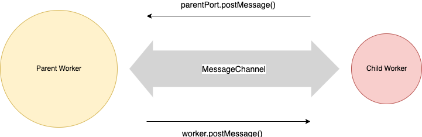
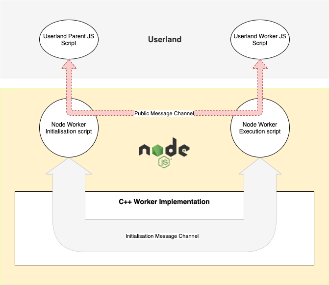
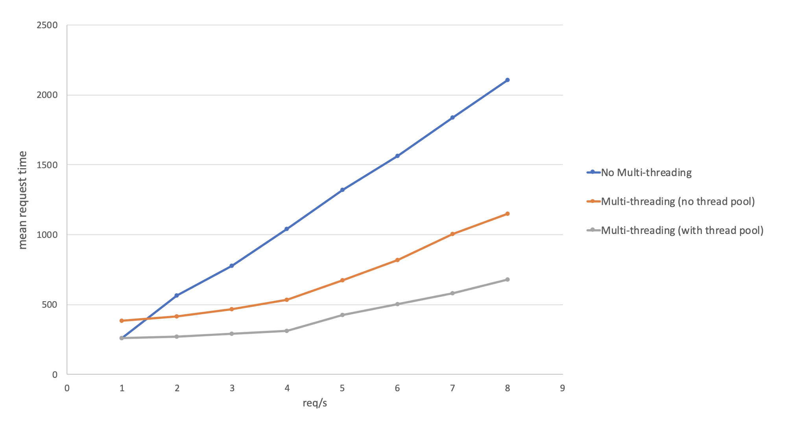

这些年来，使用Node.js去实现高CPU密集型应用一直不是最佳选择。因为Node.js使用的是JS，而JS是单线程的。为了解决这个问题，Node.js `v10.5.0` 版本通过 [worker_threads](http://nodejs.cn/api/worker_threads.html) 模块引入了 **工作线程** 的概念。这篇文章，我将详细的解释其实现细节，以及如何使用它获得最佳性能。

## 1. Node.js中CPU密集应用历史

在工作线程之前，有多种方式实现CPU密集应用的方式，比如：

- 使用 [child_process](http://nodejs.cn/api/child_process.html) 模块，将CPU密集的代码运行在子进程中
- 使用 [cluster](http://nodejs.cn/api/cluster.html) 模块，在多个进程中运行多个CPU密集的操作
- 使用第三方模块，比如微软的 [Napa.js](https://github.com/microsoft/napajs)

但终因性能，复杂性，文档缺失等问题，没有哪一种方案被广泛的采用。


## 2. 使用工作线程处理CPU密集的操作

尽管 `worker_threads` 对js中的并发问题是一种优雅的解决方案，但它并不是在JS中引入多线程的语言功能。而是，`worker_threads` 实现通过允许应用程序使用多个隔离的 JavaScript 工作线程来提供并发性，其中工作线程和父工作线程之间的通信由 Node.js 提供。听起来很困惑，是吧？

**在Node.js中，每个worker将拥有自己的V8引擎实例和Event Loop.但是不同于子进程，Workers之间能够共享内存。**

我们先快速的看一下如何使用工作线程，原生的工作线程使用方式类似下面的例子：

```js
// work-simple.js
const { Worker, isMainThread, parentPort, workerData } = require('worker_threads')
if (isMainThread) {
  const worker = new Worker(__filename, {workerData: { num: 5 }})
  woker.once('message', (result) => {
    console.log('square of 5 is: ', result)
  })
} else {
  parentPort.postMessage(workerData.num * workerData.num)
}
```

上面的代码中，我们对单独的worker传入一个数字用于计算其平方。计算完后，子worker将其结果发送给主工作线程。这听起来很简单，但是你如果之前没了解过Node.js工作线程，这听起来会很困惑。


## 3. 工作线程是如何工作的？

js语言并没有多线程的功能。因此Node.js的工作线程和其它语言中的传统的多线程实现上有很多不一样的地方。

在Node.js中，一个worker的职责就是执行一些由父worker提供的代码（worker script）。worker代码会独立于其它workers中执行，通过和父worker之间进行消息传递。worker代码既可以是单独的文件，也可以是能够被 `eval`ed 的文本格式。在我们例子中，我们提供了 `__filename` 作为worker代码，因为父worker和子worker代码是通过 `isMainThread` 属性来决定的同一代码中。

每个worker都通过 [message channel](http://nodejs.cn/api/worker_threads.html#worker_threads_class_messagechannel) 与父worker进行连接。子worker可使用 `parentPort.postMessage` 方法写入到消息通道中，而父worker则可以使用worker实例的 `worker.postMessage()` 方法写入到消息通道中。如下图所示：




(**消息通道是一种简单的通信通道，它有2个端，被称之为端口`ports`。在Node.js中，消息通道的2端被定义为 `port1 & port2`**)


### 3.1 Node.js的workers如何并行的运行的？

那么问题来了，JS没有直接提供并发的能力，那么2个Node.js workers是如何并行的运行的呢？答案就在 [V8 Isolates](https://v8docs.nodesource.com/node-0.8/d5/dda/classv8_1_1_isolate.html).

一个 `V8 isolate` 是一个独立的chrome V8运行时实例，它拥有自己独立的JS堆和一个微任务队列。这使得Node.js workers之间能够完全独立的运行各自的js代码。这样的缺点就是，workers之间不能直接访问其它workers的堆。

正因如此，每个worker将拥有libuv event loop的独立拷贝，它独立于其它workers和父workers的event loop。


### 3.2 跨越JS/C++边界

新worker的实例化，以及同父worker之间的通信，是使用C++  worker实现的。目前是在 [worker.cc](https://github.com/nodejs/node/blob/921493e228/src/node_worker.cc) 中实现的。

Worker 实现使用 `worker_threads`  模块暴露给用户态 JavaScript 脚本。这个JS实现分为两个脚本：

1. [Worker Initialisation script](https://github.com/nodejs/node/blob/921493e228/lib/internal/worker.js) ： 负责实例化worker实例，设置初始的父子worker通信，开启父worker向子worker传递元数据
2. [Worker Execution script](https://github.com/nodejs/node/blob/921493e228/lib/internal/main/worker_thread.js): 使用用户提供的 `workerData` 以及父worker提供的元数据，执行用户的worker js脚本

如下图所示：



基于此，可将worker的设置过程划分为2个阶段：

1. worker的初始化阶段
2. 运行worker阶段

下面深入了解这2个阶段的细节：


> 1.初始化阶段（Initialization Step）

1. 用户空间通过 `worker_threads` 创建一个worker实例
2. Node的父worker初始化脚本调用C++代码，然后创建一个空的worker对象实例。此时，创建的worker啥都不是，只是一个简单的C++对象而已
3. 但C++ worker对象创建完成，它会生成一个线程ID,并将其赋值给它自己
4. 一个空的消息通道在worker对象创建后被父worker创建（我们在这称之为 `IMC`），即上图中的 `Initialisation Message Channel`
5. 与此同时，worker初始化呢脚本会创建一个公共的消息通道（我们在这称之为 `PMC`）。这个消息通道将用于用户空间中，父子worker之间使用 `*.postMessage()` 方法进行消息通信。
6. Node 父初始化脚本调用C++,然后将 **初始化元数据** 写入到 `IMC` 中，它将发送给worker的执行脚本


*什么是初始化元数据？它是worker执行脚本启动worker时需要知道的数据，包括作为worker运行的脚本名称、worker数据、`PMC` 的 `port2` 以及其他一些信息*。上例中，初始化元数据仅仅是一条这样的消息：（口语化表述方式）

```
你好 worker执行脚本,你能用worker data `{num: 5}`运行 `worker-simple.js` 脚本吗?
另外，请将 PMC的 `port2` 发送给它，以便worker可以读取和写入PMC
```

下面是部分展示初始化元数据如何写入到 `IMC` 的代码片段：

```js
// passing_worker_data.js
const kPublicPort = Symbol('kPublicPort')

const { port1, port2 } = new MessageChannel()
this[kPublicPort] = port1
this[kPublicPort].on('message', (message) => this.emit('message', message))

this[kPort].postMessage({
  type: 'loadScript',
  filename,
  doEval: !!options.eval,
  cwdCounter: cwdCounter || workerIo.sharedCwdCounter,
  workerData: options.workerData,
  publicPort: port2,
  // ...redacted...
  hasStdin: !!options.stdin
}, [port2])
```

上面代码中，`this[kPort]`是 IMC 的初始化脚本的结尾。即使worker初始化脚本写入 `IMC`，worker执行脚本仍然无法访问此数据，因为它尚未运行。


> 2.运行步骤（Running Step）

此时，初始化的过程已经完成。然后worker初始化的脚本在C++中被调用，并开启工作线程：

1. 一个新的 `v8 isolate` 被创建，并将其赋值给worker。v8 isolate是一个独立的v8运行时实例。这使得工作线程的执行上下文独立于其它应用代码
2. [libuv](https://github.com/libuv/libuv) 被初始化。这使得工作线程拥有自己独立的event loop
3. worker execution脚本被执行，worker的event loop  被开启
4. [Worker execution script](https://github.com/nodejs/node/blob/921493e228/lib/internal/main/worker_thread.js) 在C++中被调用，并从 `IMC` 中读取初始化元数据
5. Worker execution脚本执行的文件或代码被当做worker运行，这里的示例中，即 `worker-simple.js`

请参阅以下有关worker execution script的部分片段：

```js
const publicWorker = require('worker_threads')

// ...

port.on('message', (message) => {
  if (message.type === 'loadScript') {
    const {
      cwdCounter,
      filename,
      doEval,
      workerData,
      publicPort,
      manifestSrc,
      manifestURL,
      hasStdin
    } = message
    
    // ...
    initialCJSLoader()
    initialESMLoader()
    
    publicWorker.parentPort = publicPort
    publicWorker.workerData = workerData
    
    //...
    port.unref()
    port.postMessage({ type: UP_AND_RUNNING })
    if (doEval) {
      const { evalScript } = require('internal/process/execution')
      evalScript('[worker eval]', filenam)
    } else {
      process.argv[1] = filename // scripe filename
      require('module').runMain()
    }
  }
  // ...
})
```

> 有趣的发现

你是否注意到了上面的代码片段中，`workerData & parentPort` 属性是通过 worker execution script中的 `require('worker_threads')` 设置的？

这也是为什么 `workerData & parentPort` 属性只在子工作线程中可以访问的原因，而不是在父工作线程的代码中。

如果你在父worker的代码中访问这2个属性，都将返回 `null`。


## 4. 充分利用工作线程

现在我们理解了Node.js 工作线程如何运作的。理解其内部工作原理，能帮助我们充分的利用工作线程的最佳性能。当写比 `worker-simple.js` 更复杂的应用时，我们需要记住下面关于工作线程的2个主要关注点：

1. 即使工作线程比实际的进程要轻量，但是如果我们频繁的切换workers，可能引发跟严重的性能问题
2. 使用工作线程并行 I/O 操作并不划算，因为使用 Node.js 原生 I/O 机制比从头开始启动工作线程要快得多

为了克服第一个问题，我们需要实现 **线程池**


### 4.1 线程池（Worker Thread Pooling）

Node.js 工作线程池是一组正在运行的工作线程，可用于传入任务。当一个新任务进来时，它可以通过父子消息通道传递给一个可用的工作线程。一旦worker完成任务，它可以通过相同的消息通道将结果传回父worker。

一旦正确实施，线程池可以显着提高性能，因为它减少了创建新线程的额外开销。还值得一提的是，创建大量线程也效率不高，因为可以有效运行的并行线程数量始终受硬件限制。

下图是三个 Node.js 服务器的性能比较，它们接受一个字符串并返回一个经过 12 次salt的 Bcrypt 哈希。这三个不同的服务器是：

- 一个是没有多线程的服务
- 使用了多线程，但是没有使用线程池的服务
- 线程池大小为4的服务

正如我们第一眼看到的，随着工作负载的增加，使用线程池的开销显着降低：



但是，写这篇文章的时候（2019-12-23），Node.js并没有自身提供线程池的功能，因此，你可能需要依赖第三方的实现或者你自己实现一个线程池。


我希望你现在了解工作线程底层是如何工作的，并且可以开始试验和使用工作线程编写 CPU 密集型应用程序。


参考：

- [V8 wrapped objects lifecycle](https://itnext.io/v8-wrapped-objects-lifecycle-42272de712e0)

原文链接：

- [Deep Dive into Worker Threads in Node.js](https://blog.insiderattack.net/deep-dive-into-worker-threads-in-node-js-e75e10546b11)


2021年07月31日22:32:46


